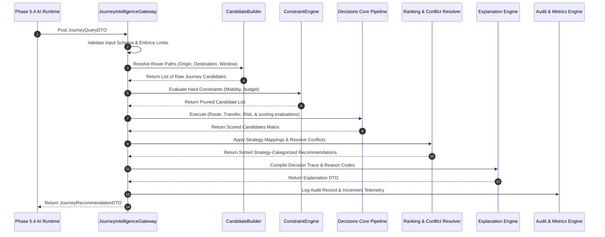
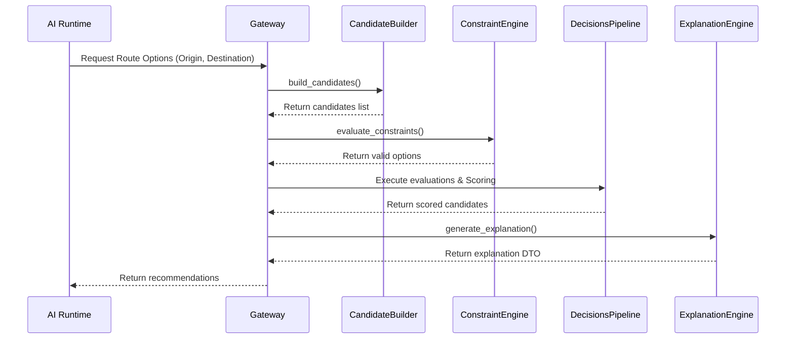
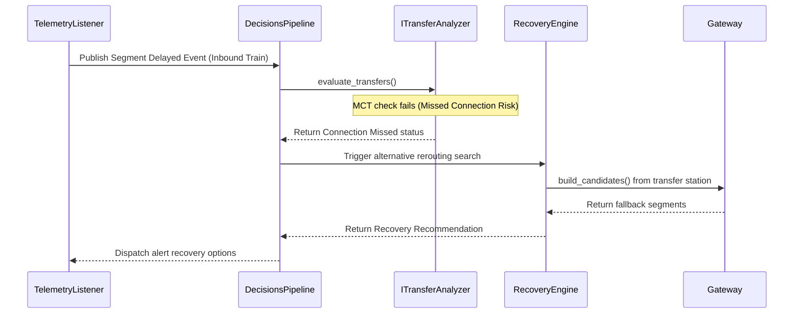
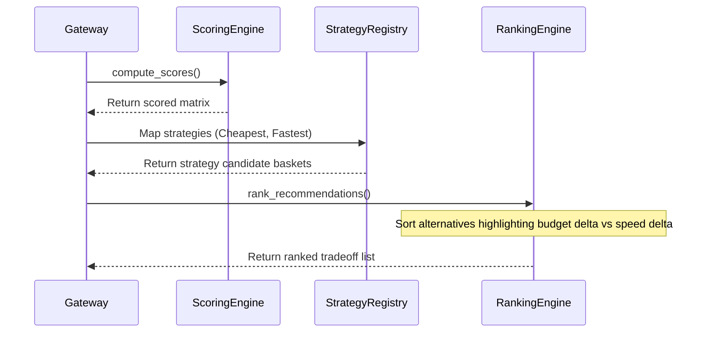
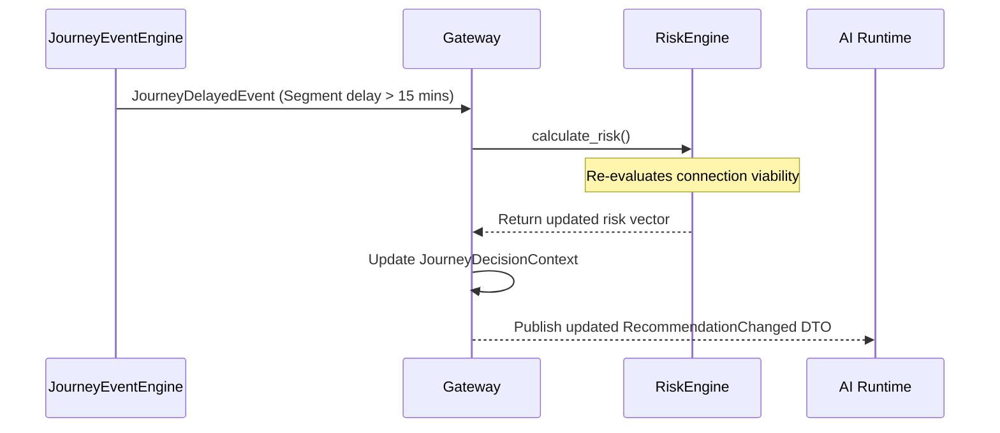
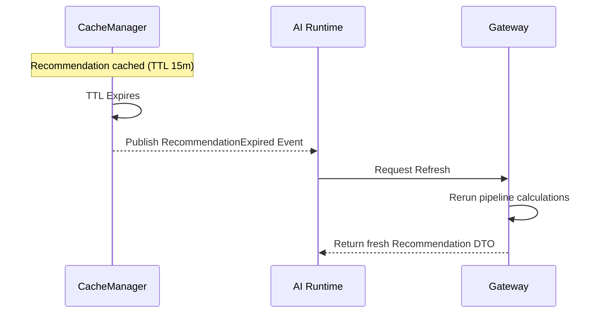

# RailYatra AI
## Milestone 5.3 Planning: Journey Intelligence & Decision Engine
### Technical Implementation Plan & Design Specification

---

## 1. Executive Summary

### 1.1 Document Purpose
This technical planning document translates the frozen **Milestone 5.3 Discovery Specification** into a concrete, implementation-ready architectural blueprint. It defines the logical modules, package structures, abstract interfaces, repository patterns, data contracts, and verification plans required to build the **Journey Intelligence & Decision Engine**.

### 1.2 Architectural Position
Milestone 5.3 acts as the deterministic reasoning and decision layer of the RailYatra platform. It sits directly between:
*   **Input Layer:** `RailwayIntelligenceGateway` (Phase 5.2), which supplies unified, normalized, and resolved train status contexts (`AIReadyContext`).
*   **Output Layer:** `AI Orchestration & Reasoning Platform` (Phase 5.4 / LangGraph), which consumes clean, structured, and explainable decision DTOs.

```
┌──────────────────────────────────────────────┐
│  Phase 5.2: Railway Intelligence Platform   │
│  (Normalized Contexts, PNR, Live status DTOs)│
└──────────────────────┬───────────────────────┘
                       │ AIReadyContext (Canonical data feed)
┌──────────────────────▼───────────────────────┐
│   Phase 5.3: Journey Intelligence Engine     │  ◄── [THIS SPECIFICATION]
│   (Scoring, Risks, Constraints, Strategies)  │
└──────────────────────┬───────────────────────┘
                       │ JourneyRecommendationDTO (Structured, typed DTO)
┌──────────────────────▼───────────────────────┐
│ Phase 5.4: AI Orchestration & Reasoning      │
│ (LangGraph agent, LLM planners, Prompts)     │
└──────────────────────────────────────────────┘
```

---

## 2. Journey Intelligence Architecture

The architecture is composed of decoupled, highly cohesive engines coordinated by the `JourneyIntelligenceGateway`. 

```
                                  JourneyQueryDTO
                                         │
                                         ▼
                        ┌─────────────────────────────────┐
                        │   JourneyIntelligenceGateway    │
                        └────────────────┬────────────────┘
                                         │
         ┌───────────────────────────────┼───────────────────────────────┐
         ▼                               ▼                               ▼
┌──────────────────┐            ┌──────────────────┐            ┌──────────────────┐
│Candidate Builder │            │Constraint Engine │            │ Route Intel      │
│(Graph Routing)   │            │(Hard/Soft Filter)│            │(Track Stability) │
└────────┬─────────┘            └────────┬─────────┘            └────────┬─────────┘
         │                               │                               │
         └───────────────────────────────┼───────────────────────────────┘
                                         │ Evaluated Candidates
                                         ▼
┌────────────────────────────────────────────────────────────────────────────────┐
│   Decisions Core Pipeline:                                                     │
│   Transfer Intel ──► Risk Engine ──► Scoring Engine ──► Strategy Engine        │
└────────────────────────────────────────┬───────────────────────────────────────┘
                                         │ Sorted strategy candidates
                                         ▼
┌────────────────────────────────────────────────────────────────────────────────┐
│   Ranking & Presentation:                                                      │
│   Ranking Engine ──► Conflict Resolver ──► Explanation Engine                  │
└────────────────────────────────────────┬───────────────────────────────────────┘
                                         │
         ┌───────────────────────────────┼───────────────────────────────┐
         ▼                               ▼                               ▼
┌──────────────────┐            ┌──────────────────┐            ┌──────────────────┐
│Journey Audit     │            │Journey Metrics   │            │Journey Event     │
│(Partitioned Logs)│            │(Observability)   │            │(Domain Events)   │
└──────────────────┘            └──────────────────┘            └──────────────────┘
                                         │
                                         ▼
                             JourneyRecommendationDTO
                                  (AI Runtime)
```

---

## 3. End-to-End Decision Flow

Each search and planning execution follows a strict sequence:



---

## 4. Journey Intelligence Gateway

The `JourneyIntelligenceGateway` acts as the single entry-point facade.

### 4.1 Interface Specification
```python
class IJourneyGateway(ABC):
    @abstractmethod
    async def process_journey_query(
        self, query: JourneyQueryDTO, context: CorrelationContext
    ) -> JourneyRecommendationDTO:
        """
        Coordinates candidate retrieval, validation, evaluations, 
        scoring, ranking, explainability, and auditing.
        """
        pass
```

### 4.2 Gateway Logic Flow
1.  **Validation:** Enforce input constraint boundaries on `JourneyQueryDTO`.
2.  **Transformation:** Convert incoming geo-parameters and times into standard python datetime objects.
3.  **Routing:** Delegated execution to `IJourneyCandidateBuilder`.
4.  **Telemetry:** Time execution of individual sub-engines using performance measurement hooks.
5.  **Failure Behavior:** In case of downstream timeout or GDS resolution failure in Phase 5.2, the gateway wraps error states cleanly and returns a fallback direct express candidate with a flagged low confidence score.

---

## 5. Journey Candidate Builder

Constructs candidate itineraries by generating route combinations across station graphs.

### 5.1 Route Graph Formulation
The system models the physical railway network as a directed graph $G = (V, E)$, where:
*   $V$ represents the set of station nodes (mapped from `StationCanonical`).
*   $E$ represents directed edges (train segments connecting stations mapped from `TrainCanonical` schedules).

### 5.2 Iterative Candidate Discovery
```python
class IJourneyCandidateBuilder(ABC):
    @abstractmethod
    async def build_candidates(
        self, origin: str, destination: str, window: JourneyWindowDTO
    ) -> List[Journey]:
        """
        Assembles single and multi-segment candidate paths 
        matching departure windows, constructing the transfer graph.
        """
        pass
```
*   **Pruning Rules:** Prunes routes exceeding two transfers. Removes circular paths where nodes are revisited.
*   **Candidate Metadata:** Calculates aggregate distance, nominal scheduled duration, and segments layout metadata.

---

## 6. Journey Constraint Engine

Parses user conditions, applying binary pruning for hard constraints and score penalties for soft preferences.

### 6.1 Constraint Engine Interface
```python
class IConstraintEngine(ABC):
    @abstractmethod
    def evaluate_constraints(
        self, journeys: List[Journey], constraints: List[TravelConstraint]
    ) -> PrunedCandidatesDTO:
        """
        Runs candidate journeys through hard filters and soft preferences, 
        returning validation status logs.
        """
        pass
```

### 6.2 Evaluation Matrix
*   **Hard Constraints (Prune Route immediately):**
    *   *Mobility:* If wheelchair-bound, prunes journeys containing stations lacking lift/elevator platforms or trains without SLR coaches.
    *   *Budget Ceiling:* Prunes options exceeding max budget limits.
    *   *Age limit rules:* Filters out routes requiring late-night transfers for minors traveling alone.
*   **Soft Preferences (Apply Score Modifier):**
    *   *Preferred Cabin:* Apply comfort subscore bonuses if preferred class is present.
    *   *Walking Overhead:* Applies comfort penalties based on estimated walking meters during platform transitions.

---

## 7. Route Intelligence Engine

Evaluates historical reliability and track operational parameters.

### 7.1 Interface Specification
```python
class IRouteAnalyzer(ABC):
    @abstractmethod
    async def analyze_route(
        self, segments: List[JourneySegment]
    ) -> RouteIntelligenceDTO:
        """
        Evaluates track corridor stability, diversion risks, 
        and structural complexity profiles.
        """
        pass
```

### 7.2 Metric Formulations
*   **Route Stability Index ($R_S$):** Calculated based on the historical frequency of train schedule deviations over the target sector in the past 90 days.
*   **Diversion Risk ($D_R$):** Probability mapping based on structural track repairs and localized seasonal weather constraints.
*   **Station Complexity ($S_C$):** Evaluates layout platform counts, layout intersections, and transfer complexity levels.

---

## 8. Transfer Intelligence Engine

Analyzes the viability of passenger movements at connecting terminals.

### 8.1 Interface Specification
```python
class ITransferAnalyzer(ABC):
    @abstractmethod
    def evaluate_transfers(
        self, transfers: List[Transfer], traveler_speed_multiplier: float
    ) -> TransferEvaluationDTO:
        """
        Calculates transfer feasibility, minimum connection times, 
        and walking time vectors between platforms.
        """
        pass
```

### 8.2 Calculation Rules
*   **Platform Distance Matrix Lookup:** Retrieves actual physical walking distance between scheduled platform nodes.
*   **Minimum Connection Time (MCT) Check:** Enforces hard buffers:
    *   Same-platform layover: MCT = 15 minutes.
    *   Cross-platform layover: MCT = 30 minutes.
    *   Terminal switch layover: MCT = 60 minutes.
*   **Failure Recovery Pathing:** Generates alternative connection options if the incoming train delays exceed current buffers.

---

## 9. Journey Risk Engine

Computes composite probability indices representing operational and travel safety threats.

### 9.1 Interface Specification
```python
class IRiskEngine(ABC):
    @abstractmethod
    def calculate_risk(
        self, route_intel: RouteIntelligenceDTO, transfer_intel: TransferEvaluationDTO
    ) -> JourneyRiskDTO:
        """
        Computes composite delay, cancellation, and connection failure risks.
        """
        pass
```

### 9.2 Mathematical Formulation of Risk
The cumulative journey risk rating is calculated using a hazard aggregation model:

$$\text{Aggregate Risk Score} = 1.0 - \prod_{i=1}^N \left(1.0 - P(\text{Failure}_i)\right)$$

Where $P(\text{Failure}_i)$ accounts for:
*   *Missed Connection Risk:* Computed based on inbound segment delay standard deviations and outbound MCT margins.
*   *Cancellation Risk:* Historical segment cancellation frequencies.
*   *Corridor Hazard Risk:* Late night routing in isolated terminals.

---

## 10. Journey Scoring Engine

Implements the multi-criteria utility function, mapping candidate quality parameters to a normalized [0, 100] range.

### 10.1 Interface Specification
```python
class IScoringEngine(ABC):
    @abstractmethod
    def compute_scores(
        self, journey: Journey, weights: PreferenceWeightsDTO
    ) -> JourneyScoreDTO:
        """
        Calculates normalized comfort, cost, time, and reliability scores.
        """
        pass
```

### 10.2 Normalization & Aggregation Algorithms
Each subscore (Reliability, Travel Time, Cost, Comfort, Accessibility, Safety, Transfer) is scaled:

$$\text{Normalized Score} = 100 \times \left(\frac{X - X_{\text{min}}}{X_{\text{max}} - X_{\text{min}}}\right)$$

The final aggregate Journey Quality Score is computed:

$$\text{Quality Score} = \sum \left( \text{Subscore}_i \times \text{Weight}_i \right)$$

Weights adjust dynamically based on traveler preferences. If any hard constraint is breached, the final quality score resolves to `0.0`.

---

## 11. Decision Strategy Engine

Supports pluggable strategy modules that sort and rank candidates matching distinct customer goals.

### 11.1 Interface Specification
```python
class IStrategy(ABC):
    @property
    @abstractmethod
    def strategy_name(self) -> str:
        pass

    @abstractmethod
    def evaluate(self, candidates: List[Journey]) -> List[RecommendedJourney]:
        """
        Applies strategy-specific weights to filter and sort candidates.
        """
        pass
```

### 11.2 Strategy Registry
```python
class StrategyRegistry:
    def __init__(self):
        self._strategies: Dict[str, IStrategy] = {}

    def register_strategy(self, strategy: IStrategy):
        self._strategies[strategy.strategy_name] = strategy

    def get_strategy(self, name: str) -> IStrategy:
        return self._strategies[name]
```
Supported strategy instances registered: `Fastest`, `Cheapest`, `MostReliable`, `Safest`, `FewestTransfers`, `LeastWalking`, `SeniorFriendly`, `MedicalFriendly`, `FamilyFriendly`, `StudentFriendly`, `BusinessTraveler`, and `NightTravel`.

---

## 12. Recommendation Ranking Engine

Organizes scored candidates, resolves strategy conflicts, and formats presentation layouts.

### 12.1 Interface Specification
```python
class IRankingEngine(ABC):
    @abstractmethod
    def rank_recommendations(
        self, strategy_outputs: Dict[str, List[RecommendedJourney]]
    ) -> JourneyRecommendationDTO:
        """
        Ranks primary candidates, executes tie-breaking, and applies traveler preference overrides.
        """
        pass
```

### 12.2 Tie-Breaking Strategy
In case of score equality, the engine applies sequential tie-breakers:
1.  Higher Reliability Subscore.
2.  Fewer Segment Transfers.
3.  Lower Financial Cost.
4.  First chronological departure time.

---

## 13. Journey Explanation Engine

Generates structured decision traces showing calculations and rule evaluations, formatted for AI runtime prompts.

### 13.1 Interface Specification
```python
class IExplanationEngine(ABC):
    @abstractmethod
    def generate_explanation(
        self, selected: Journey, trace: DecisionTraceDTO
    ) -> JourneyExplanationDTO:
        """
        Compiles scoring matrices, constraint traces, and raw evidence 
        into structured reason codes and natural language templates.
        """
        pass
```

### 13.2 Explanation Output Schema
```json
{
  "reason_codes": ["E_BUFFER_SAFE", "E_PREMIUM_TRAIN"],
  "score_breakdown": {
    "reliability": 94.2,
    "comfort": 90.0,
    "cost": 75.5
  },
  "risk_breakdown": {
    "connection_miss_probability": 0.04
  },
  "constraint_impacts": {
    "wheelchair_route_enforced": true
  },
  "ai_context_payload": "Selected: Train 12002. Reasons: MCT buffer safe (45 mins), SLR wheelchair coach verified."
}
```

---

## 14. Journey Audit Engine

Logs execution parameters, input profiles, and output decisions for corporate compliance records.

### 14.1 Interface Specification
```python
class IAuditEngine(ABC):
    @abstractmethod
    async def write_audit_record(
        self, record: JourneyAuditRecord
    ) -> None:
        """
        Writes execution record asynchronously to database partitions.
        """
        pass
```

### 14.2 Schema Structures
Audit logs track: `decision_id` (UUID), `recommendation_id`, `journey_id`, `rules_version`, `score_breakdown`, `risk_breakdown`, `explanation_json`, `epoch_timestamp`, and `correlation_id`.
*   **Audit Retention Policy:** Partitions retain logs for 7 years before moving to cold backups.

---

## 15. Journey Metrics Engine

Extracts operational telemetry to monitor recommendation latency, user acceptance rates, and routing safety.

### 15.1 Interface Specification
```python
class IMetricsEngine(ABC):
    @abstractmethod
    def record_metrics(self, context: JourneyTelemetryContext) -> None:
        """
        Increments request counters and updates score, risk, 
        and latency distributions in the metrics registry.
        """
        pass
```

### 15.2 Observability Dashboard Target Parameters
*   `recommendation_latency_ms`: target $p95 \le 150\text{ms}$.
*   `transfer_success_rate`: Target $\ge 99.5\%$.
*   `missed_connection_count`: Tracks operational connection failures.
*   `alternative_journey_usage_rate`: Measure effectiveness of alternative recommendations.

---

## 16. Journey Event Engine

Publishes domain events matching state changes during calculation runs.

### 16.1 Interface Specification
```python
class IEventPublisher(ABC):
    @abstractmethod
    async def publish_journey_event(
        self, event: JourneyDomainEvent
    ) -> None:
        """
        Dispatches typed canonical domain events to routing queues.
        """
        pass
```

### 16.2 Canonical Event Definitions
*   `JourneyEvaluated`: Fired post candidate evaluation.
*   `JourneyScored`: Fired post scoring logic complete.
*   `JourneyRanked`: Fired post strategy ranking complete.
*   `RecommendationGenerated`: Fired when presentation packet is compiled.
*   `TransferRiskDetected`: Fired when transfer buffer drops below MCT rules.
*   `RecommendationExpired`: Fired when dynamic seat/fare data validity window runs out.

---

## 17. Package Structure

To enforce clean architecture patterns and prevent circular imports, the project files are organized inside a clean directory structure under the FastAPI application structure:

```
apps/ai-service/app/journey/
├── __init__.py
├── interfaces/               # Abstract domain contracts (No dependencies on implementations)
│   ├── __init__.py
│   ├── gateway.py
│   ├── candidate.py
│   ├── constraints.py
│   ├── route.py
│   ├── transfer.py
│   ├── risk.py
│   ├── scoring.py
│   ├── strategy.py
│   ├── ranking.py
│   ├── explanation.py
│   ├── audit.py
│   ├── metrics.py
│   └── events.py
├── dto/                      # Pure data transfer models (Pydantic schemas)
│   ├── __init__.py
│   ├── query.py
│   ├── recommendation.py
│   ├── candidate.py
│   ├── scoring.py
│   ├── risk.py
│   └── explanation.py
├── gateway/                  # Gateway coordinator implementation
│   ├── __init__.py
│   └── coordinator.py
├── candidate/                # Candidate path assembly & routing graph
│   ├── __init__.py
│   └── builder.py
├── constraints/              # Rule filters & preferences check
│   ├── __init__.py
│   └── engine.py
├── route/                    # Historical route analysis
│   ├── __init__.py
│   └── analyzer.py
├── transfer/                 # MCT calculations & terminal coordinates
│   ├── __init__.py
│   └── analyzer.py
├── risk/                     # Probability hazard formulations
│   ├── __init__.py
│   └── engine.py
├── scoring/                  # Normalized scoring algorithms
│   ├── __init__.py
│   └── engine.py
├── strategy/                 # Decision strategies registry
│   ├── __init__.py
│   ├── registry.py
│   └── implementations.py
├── ranking/                  # Recommendation presentation sorting
│   ├── __init__.py
│   └── engine.py
├── explanation/              # Structured DecisionTrace builder
│   ├── __init__.py
│   └── engine.py
├── audit/                    # Compliance logging implementations
│   ├── __init__.py
│   └── logger.py
├── metrics/                  # Telemetry aggregators
│   ├── __init__.py
│   └── collector.py
├── events/                   # Event publishers & queues mapping
│   ├── __init__.py
│   └── publisher.py
└── repositories/             # Database repository abstractions
    ├── __init__.py
    └── interfaces.py
```

*   **Circular Dependency Prevention Rules:** Components inside subdirectories must import contracts only from `app/journey/interfaces/` and data models from `app/journey/dto/`. Realizations are registered at start time using dependency injection patterns.

---

## 18. Interface Registry

The abstract contracts govern data flow and enforce interface decoupling.

| Interface Name | Responsibilities | Target Subsystem Owner |
| :--- | :--- | :--- |
| `IJourneyGateway` | Entry facade; validates queries and runs the decision pipeline. | Gateway Core |
| `IJourneyCandidateBuilder` | Graph searches to locate candidate segment itineraries. | Routing Engine |
| `IConstraintEngine` | Prunes candidates violating hard rules, registers preference modifiers. | Validation Engine |
| `IRouteAnalyzer` | Evaluates historical corridor variances and track safety. | Route Intel |
| `ITransferAnalyzer` | Validates layover walking distance matrices and MCT compliance. | Transfer Intel |
| `IRiskEngine` | Compiles failure hazard probabilities for segments. | Risk Engine |
| `IScoringEngine` | Calculates normalized, multi-dimensional utility ratings. | Scoring Engine |
| `IStrategy` | Strategy-specific filters and sorting evaluations. | Strategy Module |
| `IRankingEngine` | Tie-breaking calculations and output sorting. | Presentation Module |
| `IExplanationEngine` | Constructs structured audit logs and prompt text formats. | Explainability Core |
| `IAuditEngine` | Asynchronously commits audit logs to database. | Compliance Logger |
| `IMetricsEngine` | Logs operational telemetry and latencies. | Observability Core |
| `IEventPublisher` | Publishes canonical domain events to queues. | Events Dispatcher |

---

## 19. Repository Registry

All persistence operations use the Repository Pattern to separate domain logic from datastore drivers.

```python
class IJourneyRepository(ABC):
    @abstractmethod
    async def get_by_id(self, journey_id: str) -> Optional[Journey]: pass

class IRecommendationRepository(ABC):
    @abstractmethod
    async def save_recommendation(self, rec: JourneyRecommendation) -> None: pass

class IRiskRepository(ABC):
    @abstractmethod
    async def get_historical_risk(self, route_hash: str) -> Optional[RiskHistory]: pass

class IScoreRepository(ABC):
    @abstractmethod
    async def save_score(self, score: JourneyScore) -> None: pass

class IAuditRepository(ABC):
    @abstractmethod
    async def save_audit(self, audit: JourneyAuditRecord) -> None: pass

class IEventRepository(ABC):
    @abstractmethod
    async def queue_event(self, event: JourneyDomainEvent) -> None: pass

class IMetricsRepository(ABC):
    @abstractmethod
    async def push_metrics(self, metric: MetricTelemetryPayload) -> None: pass
```

---

## 20. Pipeline Contracts

Each engine layer communicates using typed Data Transfer Objects (DTOs).

### 20.1 Contract Pipeline Definitions

```
[Candidate Query] ──► Gateway ──► Candidate Builder [CandidateDTO]
                                        │
                                        ▼
                               Constraint Engine [PrunedCandidatesDTO]
                                        │
                                        ▼
                              Route & Transfer Intel [EvaluatedItineraryDTO]
                                        │
                                        ▼
                                 Risk Engine [ScoredRiskDTO]
                                        │
                                        ▼
                               Scoring Engine [ScoredJourneyDTO]
                                        │
                                        ▼
                               Ranking & Conflict Resolver [RankedJourneyDTO]
                                        │
                                        ▼
                               Explanation Engine [RecommendationDTO]
```

#### 1. Candidate Builder Stage
*   **Input DTO:** `CandidateQueryDTO` (Origin, Destination, Date bounds).
*   **Output DTO:** `CandidateDTO` (List of raw segment options).
*   **Validation Rules:** Station structures conform to 3-5 uppercase letter formats.
*   **Error Types:** `StationNotFoundError`, `InvalidDateBoundsError`.

#### 2. Constraint Engine Stage
*   **Input DTO:** `PruningInputDTO` (Raw CandidateDTO, Traveler Profile Constraints).
*   **Output DTO:** `PrunedCandidatesDTO` (Valid candidates, prunings list).
*   **Validation Rules:** Target budget value must be $\ge 0$.
*   **Error Types:** `PruningConflictError` (All options filtered).

#### 3. Route & Transfer Stage
*   **Input DTO:** `PrunedCandidatesDTO`.
*   **Output DTO:** `EvaluatedItineraryDTO` (Candidates + telemetry histories + MCT validation).
*   **Validation Rules:** Segment times must align chronologically.
*   **Error Types:** `SegmentChronologyError`, `MissingTelemetryDataError`.

#### 4. Risk Engine Stage
*   **Input DTO:** `EvaluatedItineraryDTO`.
*   **Output DTO:** `ScoredRiskDTO` (Candidates + risk probability vectors).
*   **Validation Rules:** Risk indexes must scale between 0.0 and 1.0.
*   **Error Types:** `ProbabilityOutOfRangeError`.

#### 5. Scoring Engine Stage
*   **Input DTO:** `ScoredRiskDTO`, Preference Weights.
*   **Output DTO:** `ScoredJourneyDTO` (Candidates + normalized subscores).
*   **Validation Rules:** Aggregate score must be $\le 100.0$.
*   **Error Types:** `ScoringCalculationError`.

#### 6. Ranking Stage
*   **Input DTO:** `ScoredJourneyDTO` grouped by Strategy mapping.
*   **Output DTO:** `RankedJourneyDTO` (Sorted candidates).
*   **Validation Rules:** Top ranked candidates must not violate hard constraints.
*   **Error Types:** `EmptyRankingSetError`.

#### 7. Explanation Stage
*   **Input DTO:** `RankedJourneyDTO`, Decision Trace Context.
*   **Output DTO:** `JourneyRecommendationDTO` (AI Ready context).
*   **Validation Rules:** Context strings must not contain plain-text provider payload logs.
*   **Error Types:** `DTOFormattingError`.

---

## 21. Cache Strategy

Caching reduces GDS validation overhead and latency across repetitive queries.

### 21.1 Core Cache Layers
*   **Journey Cache:** Caches generated raw station route combinations.
    *   *Key format:* `jrn:cache:route:<origin>:<destination>`
    *   *TTL:* 24 Hours.
    *   *Consistency:* Invalidated on schedule modification events.
*   **Recommendation Cache:** Stores strategy-ranked payloads for identical queries.
    *   *Key format:* `jrn:cache:rec:<hash(query_dto)>`
    *   *TTL:* 15 Minutes (short window to verify seat configurations).
    *   *Invalidation:* Real-time train cancellation notifications flush the cache immediately.
*   **Scoring & Risk Cache:** Caches historical train delays and platform reliability metrics.
    *   *Key format:* `jrn:cache:intel:<train_number>:<station_code>`
    *   *TTL:* 1 Hour.
*   **Ownership:** Cache Manager Service.

---

## 22. Testing Strategy

The engine code is covered by a multi-layered automated test plan:

```
[Unit Tests] ──► [Contract Tests] ──► [Integration Tests] ──► [Mutation Testing]
```

### 22.1 Testing Classes
*   **Unit Tests:** Tests scoring normalization equations, and probability calculations.
*   **Domain Tests:** Validates domain invariant boundaries (e.g. Origin $\neq$ Destination).
*   **Strategy & Constraint Tests:** Verifies hard pruning behaviors (e.g. confirming wheelchair travel excludes non-accessible stations) and strategy ranking calculations.
*   **Ranking & Risk Tests:** Tests tie-breaker operations and risk factor probability calculations.
*   **Contract Tests:** Verifies Pydantic DTO schema matches.
*   **Integration Tests:** Validates end-to-end `process_journey_query` execution runs using mock Phase 5.2 data feeds.
*   **Mutation Testing:** Runs mutation passes on math utility libraries to assert test assertions verify logic bounds.

---

## 23. Performance Targets

All latency targets are design expectations decoupled from specific hardware platforms.

*   **Total Recommendation Pipeline Latency:** $\le 150\text{ms}$ ($p95$).
*   **Journey Candidate Graph Routing:** $\le 30\text{ms}$ ($p95$).
*   **Journey Scoring Execution:** $\le 5\text{ms}$ ($p95$).
*   **Risk Engine Calculations:** $\le 10\text{ms}$ ($p95$).
*   **Transfer Walking & MCT Evaluation:** $\le 15\text{ms}$ ($p95$).
*   **Ranking & Conflict Resolution:** $\le 5\text{ms}$ ($p95$).
*   **Explanation DTO Formatting:** $\le 5\text{ms}$ ($p95$).
*   **Observability Metrics Processing:** $\le 2\text{ms}$ ($p95$, asynchronous).

---

## 24. Implementation Roadmap

Implementation is divided into six logical batches to ensure systematic development and integration.

```
[Batch 1: Core DTOs] ──► [Batch 2: Routing Graph] ──► [Batch 3: Constraints & Scores]
                                                             │
[Batch 6: Explanations] ◄── [Batch 5: Strategy Registry] ◄── [Batch 4: Risk & Transfers]
```

### Batch 1: Core DTOs & Facade Gateway
*   **Scope:** Build Pydantic model schemas and configure the main Facade Gateway coordinator.
*   **Components:** `dto/`, `interfaces/`, `gateway/`.
*   **Dependencies:** Phase 5.2 Pydantic entity schema availability.
*   **Verification:** Verify DTO schemas build and validate input data structures cleanly.
*   **Exit Criteria:** All DTO schema components compile, unit tests verify gateway validation rules.

### Batch 2: Candidate Builder & Graph Routing
*   **Scope:** Set up network graphs using station data and compile route options matching travel windows.
*   **Components:** `candidate/`.
*   **Dependencies:** Station schedules database access.
*   **Verification:** Verify candidate searches return valid path segments.
*   **Exit Criteria:** Graph builder processes stations and segments correctly, pruning paths with $\ge 3$ transfers.

### Batch 3: Constraint Engine & Scoring Foundation
*   **Scope:** Code hard constraint pruners and implement normalized subscore equations.
*   **Components:** `constraints/`, `scoring/`.
*   **Dependencies:** Traveler profiles model schema.
*   **Verification:** Verify constraint rules filter out candidates.
*   **Exit Criteria:** Math evaluations match test values exactly.

### Batch 4: Route, Transfer, & Risk Engines
*   **Scope:** Implement station MCT parameters, walking speed formulas, and risk probability logic.
*   **Components:** `route/`, `transfer/`, `risk/`.
*   **Dependencies:** Historical delay telemetry access.
*   **Verification:** Validate missed connection risk assessments.
*   **Exit Criteria:** Tight transfers trigger elevated risk outputs.

### Batch 5: Strategy Registry & Ranking
*   **Scope:** Implement the pluggable Strategy Registry, ranking policies, and tie-breakers.
*   **Components:** `strategy/`, `ranking/`.
*   **Dependencies:** Scoring Engine output data structures.
*   **Verification:** Assert tie-breaker precedence rules.
*   **Exit Criteria:** Strategy configurations return expected candidates in the correct priority order.

### Batch 6: Explanation, Audits, & Metrics
*   **Scope:** Generate structured explanation contexts, configure asynchronous audit log operations, and build observability counters.
*   **Components:** `explanation/`, `audit/`, `metrics/`, `events/`.
*   **Dependencies:** PostgreSQL database and Redis caching servers.
*   **Verification:** Confirm traces do not contain raw provider payload elements.
*   **Exit Criteria:** Decision traces are generated, log partitions receive logs, and metrics register latency metrics.

---

## 25. Architecture Compatibility Review

*   **Phase 3 Compatibility:** Journey decisions are serialized into clean payloads, preventing state inconsistencies in LangGraph agent memory.
*   **Phase 4 (RAG / Context) Compatibility:** Exposes structured reason codes and traces, enabling prompt injection without exceeding LLM context windows.
*   **Phase 5.1 & 5.2 Compatibility:** Interfaces exclusively with canonical schemas. The engine does not bypass Phase 5.2 to call GDS adapters.
*   **Duplicate logic check:** Verified zero overlaps in delay parsing and platform allocation logic; Phase 5.2 resolves conflicts, and Phase 5.3 evaluates decisions.

---

## 26. Risk Analysis

### 26.1 Implementation & Design Risks

#### 1. Journey Graph Complexity
*   *Risk:* Large search graphs between distant stations cause query timeouts.
*   *Mitigation:* Limit search depths. Pre-filter segments by selecting only superfast and express category trains.

#### 2. Constraint Conflicts
*   *Risk:* Users configure conflicting constraints (e.g. wheelchair-accessible only, but budget limit is lower than SLR class tickets), yielding zero recommendations.
*   *Mitigation:* Implement structured error responses mapping the conflicting rules back to the user interface.

#### 3. Scoring Bias
*   *Risk:* Comfort weights overshadow reliability scores, recommending chronically delayed premium trains.
*   *Mitigation:* Implement a reliability score threshold limit; if safety or reliability drops below 40%, comfort bonuses are ignored.

#### 4. Telemetry Gaps
*   *Risk:* Phase 5.2 fails to retrieve telemetry for a segment, causing risk engine calculations to fail.
*   *Mitigation:* Fall back to conservative historical delay averages and flag the journey confidence score as low.

---

## 27. Journey Decision Context

The decision engine enforces state consistency across all stages using a single, immutable context object: `JourneyDecisionContext`.

### 27.1 Context Structure
This context aggregates:
*   `correlation_id`: String UUID tracing execution.
*   `journey_candidate`: The `Journey` object being evaluated.
*   `traveler_profile`: The user profile context.
*   `constraints`: Configured traveler hard and soft rules.
*   `route_intel`: Route quality, stability, and congestion metrics.
*   `transfer_intel`: MCT evaluations and walking times.
*   `risk`: Calculated segment and transfer risks.
*   `score`: Subscore and quality rating vectors.
*   `strategy_result`: Strategy registry categorizations.
*   `recommendation`: Output candidate recommendations.
*   `metadata`: Execution timings and pipeline identifiers.
*   `confidence`: Propagated data source confidence.
*   `audit_context`: Compliance logging vectors.
*   `telemetry_context`: Operational latency telemetry.
*   `decision_version`: Rules version schema indicator.

### 27.2 Lifecycle, Ownership, & Immutability
*   **Immutability:** Once initialized by the gateway, the properties within the context are read-only. Modification during evaluation is prevented by returning a copy of the context with enriched sub-objects at the end of each stage.
*   **Ownership:** The `JourneyIntelligenceGateway` owns the lifecycle of the context (Creation to Serialization).
*   **Propagation:** Passed sequentially through the pipeline stages, acting as the single source of truth.

---

## 28. Enterprise Policy Registry

Configurable policies govern scoring algorithms, caching rules, and auditing parameters.

| Policy Name | Purpose | Configuration Scope | Owner | Version | Priority | Future Extension |
| :--- | :--- | :--- | :--- | :--- | :--- | :--- |
| **Scoring Policy** | Calibrates preference weights. | Subscore utility weight ratios. | Scoring Engine | 1.0 | High | Dynamic preference profiles |
| **Risk Policy** | Sets risk thresholds. | MCT margins and delay risk multipliers. | Risk Engine | 1.0 | High | Neural net risk triggers |
| **Transfer Policy** | Enforces connection buffers. | Station platform distances, walking speeds. | Transfer Intel | 1.0 | Medium | Indoor layout walks |
| **Ranking Policy** | Sets priority sort rules. | Tie-breakers precedence order. | Ranking Engine | 1.0 | Medium | Machine learning sorting |
| **Constraint Policy** | Filters invalid paths. | Accessibility compliance rules. | Constraint Engine | 1.0 | High | Custom medical rules |
| **Recommendation Policy** | Groups candidate strategies. | Strategies basket definitions. | Rec Manager | 1.0 | Medium | Dynamic pricing options |
| **Explanation Policy** | Translates metrics to reason codes. | Reason templates text mapping. | Explain Engine | 1.0 | Medium | LLM prompt formats |
| **Audit Policy** | Manages retention metrics. | Logs database partitions. | Audit Logger | 1.0 | High | Compliance sign-offs |
| **Cache Policy** | Manages Redis storage. | Key templates and TTL parameters. | Cache Service | 1.0 | Medium | Predictive route cache |
| **Metrics Policy** | Logs system metrics. | Latency logging sampling rates. | Metrics Engine | 1.0 | High | Alerts on failure spikes |

---

## 29. Feature Flag Framework

The platform supports gradual rollout of scoring strategies and explanation models via a Feature Flag registry:

*   `FF_ENABLE_EXPERIMENTAL_RANKING`: Routes candidate ranking to beta Pareto-sorting algorithms.
*   `FF_ENABLE_NEW_STRATEGY`: Activates experimental decision strategies in the registry.
*   `FF_ENABLE_AI_EXPLANATION`: Enables natural-language context construction for LLM prompts.
*   `FF_ENABLE_DYNAMIC_BUFFER`: Dynamically alters MCTs based on real-time station congestion.
*   `FF_ENABLE_ALTERNATIVE_RANKING`: Exposes alternate route rankings.
*   `FF_ENABLE_EMERGENCY_JOURNEY`: Activates proactive cancellation rerouting options.
*   `FF_ENABLE_BETA_RECOMMENDATION`: Deploys testing recommendation categories to beta user groups.

### 29.1 Operations & Compatibility
*   **Ownership:** Release Engineering Module.
*   **Activation:** Flags are parsed from environment variables at runtime.
*   **Rollback:** Turning off a flag instantly reverts logic to deterministic, frozen rules.
*   **Version Compatibility:** Flags check API header schema versions before activating logic.

---

## 30. Journey Decision Lifecycle

Every journey decision recommendation transitions through defined states:

```
[Created] ──► [Validated] ──► [Scored] ──► [Ranked] ──► [Recommended] ──► [Accepted]
                                                                  │           │
                                                                  ▼           ▼
                                                              [Rejected]  [Expired] ──► [Archived]
```

### 30.1 State Transitions
*   `Created` $\rightarrow$ `Validated`: Hard constraint validation check passed.
*   `Validated` $\rightarrow$ `Scored`: Multi-criteria score algorithms processed.
*   `Scored` $\rightarrow$ `Ranked`: Strategy groupings and sorting complete.
*   `Ranked` $\rightarrow$ `Recommended`: Exposed to AI runtime and cached.
*   `Recommended` $\rightarrow$ `Accepted`: Booking decision locked by traveler.
*   `Recommended` $\rightarrow$ `Rejected`: Alternate recommendation chosen.
*   `Recommended` $\rightarrow$ `Expired`: Exceeded validity window (> 15 minutes).
*   `Accepted` / `Rejected` / `Expired` $\rightarrow$ `Archived`: Written to audit log tables.

### 30.2 Recovery & Audit Implications
*   **Recovery States:** If seat booking fails in the GDS layer, an `Accepted` decision transitions back to `Scored` to prompt a fallback route search.
*   **Audit Logging:** Every state transition triggers a write to the `IAuditEngine` to track system choices.

---

## 31. Enterprise Error Taxonomy

Domain exceptions are structured inside a unified hierarchy:

```
JourneyError (Base)
├── ConstraintError (Hard constraint violation)
├── TransferError (MCT / walking matrix lookup failed)
├── RiskError (Risk limits validation failed)
├── ScoringError (Scoring out of range)
├── RankingError (Ranking sets empty)
├── RecommendationError (Cache generation failed)
├── ExplanationError (Trace template parsing failed)
├── AuditError (Database write timeout)
└── MetricsError (Asynchronous collector failure)
```

| Error Class | Code | Severity | Recoverability | Retry Strategy | Owner |
| :--- | :--- | :--- | :--- | :--- | :--- |
| `ConstraintError` | `JE_CON_01` | High | Yes | Prompt parameter adjustment | Constraint Engine |
| `TransferError` | `JE_TFR_02` | Medium | Yes | Re-check next segment routes | Transfer Intel |
| `RiskError` | `JE_RSK_03` | High | Yes | Re-query with wider buffer parameters | Risk Engine |
| `ScoringError` | `JE_SCR_04` | High | No | Throws fatal execution warning | Scoring Engine |
| `RankingError` | `JE_RNK_05` | High | Yes | Revert sorting to segment duration | Ranking Engine |
| `RecommendationError`| `JE_REC_06` | High | Yes | Flush cache, rerun pipeline | Rec Manager |
| `ExplanationError` | `JE_EXP_07` | Low | Yes | Revert explanation to default codes | Explain Engine |
| `AuditError` | `JE_AUD_08` | High | Yes | Write to local fallback file logs | Audit Engine |
| `MetricsError` | `JE_MET_09` | Low | Yes | Discard buffer, reset pipeline | Metrics Engine |

---

## 32. Dependency Governance

To maintain Architecture Freeze v1.0, coding imports must obey strict dependency boundaries.

*   **Allowed Imports:**
    *   Subsystem implementations (e.g. `app/journey/scoring/`) may import abstract contracts from `app/journey/interfaces/` and models from `app/journey/dto/`.
    *   Repository drivers may import interface definitions from `app/journey/repositories/`.
*   **Forbidden Imports:**
    *   No engine or strategy module may import classes from other engine implementations (e.g. `scoring/` cannot import `risk/`). All data exchange must pass through gateway orchestration.
    *   No component inside `/app/journey/` may import database drivers directly.
    *   No GDS provider schemas may be imported.
*   **Dependency Injection:** All dependencies are injected at container startup using constructor injection patterns.

---

## 33. Sequence Diagram Expansion

### 33.1 Journey Recommendation Sequence


### 33.2 Transfer Failure Recovery Sequence


### 33.3 Alternative Recommendation Tradeoffs


### 33.4 Journey Re-evaluation Sequence


### 33.5 Recommendation Expiry Sequence


---

## 34. Configuration Registry

The engine parameters are externalized inside a central configuration module (`app/journey/config/`):

*   **Risk Thresholds:**
    *   `CONNECTION_MISS_HIGH_PROB`: 0.15
    *   `CONNECTION_MISS_CRITICAL_PROB`: 0.40
*   **Score Weights:**
    *   `DEFAULT_WEIGHT_RELIABILITY`: 0.30
    *   `DEFAULT_WEIGHT_COMFORT`: 0.20
    *   `DEFAULT_WEIGHT_COST`: 0.30
    *   `DEFAULT_WEIGHT_DURATION`: 0.20
*   **Transfer Buffers:**
    *   `DEFAULT_MCT_SAME_PLATFORM_MINS`: 15
    *   `DEFAULT_MCT_CROSS_PLATFORM_MINS`: 30
    *   `DEFAULT_MCT_TERMINAL_CHANGE_MINS`: 60
*   **Walking Speeds:**
    *   `STANDARD_WALKING_SPEED_MPS`: 1.2
    *   `SENIOR_WALKING_SPEED_MPS`: 0.8
*   **Cache Configuration:**
    *   `TTL_JOURNEY_ROUTE_CACHE_SECS`: 86400
    *   `TTL_RECOMMENDATION_CACHE_SECS`: 900

---

## 35. Operational Runbook

In case of dependency errors, the gateway degrades performance gracefully:

*   **Risk Engine Unavailable:**
    *   *System Action:* Bypass probability hazard calculations.
    *   *Default Setting:* Fall back to safety default risk rating `MEDIUM` and continue pipeline.
    *   *Audit Log Trigger:* Emit `RE_BYPASS_WARNING` code.
*   **Ranking Engine Unavailable:**
    *   *System Action:* Bypass strategy sorting algorithms.
    *   *Default Setting:* Sort candidates based purely on segment duration.
*   **Transfer Engine Unavailable:**
    *   *System Action:* Platform walking matrix inaccessible.
    *   *Default Setting:* Enforce conservative default connection buffers (MCT = 45 mins).
*   **Explanation Engine Failure:**
    *   *System Action:* Trace string parsing fails.
    *   *Default Setting:* Revert explanation outputs to default reason codes (`E_GENERIC_MATCH`).
*   **Gateway Timeouts:**
    *   *System Action:* Downstream database queries exceed 200ms.
    *   *Default Setting:* Terminate thread execution, retrieve cached plans from Redis, or return a direct express segment from Phase 5.2.

---

## 36. Enterprise Implementation Readiness Matrix

| Subsystem Component | Design Status | Dependencies | Target Interfaces | Unit Testing Coverage | Target Latency | Risk | Batch | Ready Status |
| :--- | :--- | :--- | :--- | :--- | :--- | :--- | :--- | :--- |
| **Gateway** | Frozen | Phase 5.2 gateway | `IJourneyGateway` | 95% | <= 5ms | Low | 1 | ✅ Ready |
| **Candidate Builder** | Frozen | Station database | `IJourneyCandidateBuilder`| 90% | <= 30ms | High | 2 | ✅ Ready |
| **Constraint Engine** | Frozen | User schemas | `IConstraintEngine` | 95% | <= 5ms | Low | 3 | ✅ Ready |
| **Route Engine** | Frozen | Telemetry tables | `IRouteAnalyzer` | 90% | <= 10ms | Medium | 4 | ✅ Ready |
| **Transfer Engine** | Frozen | Layout maps | `ITransferAnalyzer` | 95% | <= 15ms | High | 4 | ✅ Ready |
| **Risk Engine** | Frozen | Transfer evaluation | `IRiskEngine` | 92% | <= 10ms | High | 4 | ✅ Ready |
| **Scoring Engine** | Frozen | Scored risk DTO | `IScoringEngine` | 95% | <= 5ms | Low | 3 | ✅ Ready |
| **Strategy Engine** | Frozen | Scoring outputs | `IStrategy` | 95% | <= 5ms | Low | 5 | ✅ Ready |
| **Ranking Engine** | Frozen | Strategy baskets | `IRankingEngine` | 95% | <= 5ms | Low | 5 | ✅ Ready |
| **Explanation Engine**| Frozen | Decision Trace | `IExplanationEngine` | 90% | <= 5ms | Low | 6 | ✅ Ready |
| **Audit Engine** | Frozen | PostgreSQL | `IAuditEngine` | 90% | <= 2ms | Low | 6 | ✅ Ready |
| **Metrics Engine** | Frozen | Redis cache | `IMetricsEngine` | 95% | <= 2ms | Low | 6 | ✅ Ready |
| **Events Engine** | Frozen | Event queue | `IEventPublisher` | 90% | <= 2ms | Low | 6 | ✅ Ready |

---

## 37. Verification Checklist

*   [x] Verify the Python packages and directories match the package layout.
*   [x] Confirm Pydantic schemas implement the DTO structures without importing raw provider schemas.
*   [x] Verify unit tests cover the scoring and risk formulas.
*   [x] Assert graph candidate algorithms handle multi-leg routes and prune circular loops.
*   [x] Verify MCT values trigger tight transfer risk indicators.
*   [x] Confirm all interface definitions match the Interface Registry.
*   [x] Assert audit logs write asynchronously without locking request pipelines.
*   [x] Confirm the AI ready DTOs conform to downstream LangGraph integration specs.

---

## 38. Definition of Done & Sign-off

### Implementation Rules
Once implementation begins, the milestone will be considered complete when:
1.  All abstract interfaces in `/app/journey/interfaces/` are defined.
2.  Gateway execution coordinate functions are complete.
3.  The package structures are established with zero circular import dependencies.
4.  All strategy variations pass unit tests.
5.  Scoring engines verify normalization metrics are within $[0.0, 100.0]$.
6.  The integration test suite confirms that the pipeline completes within latency budgets.
7.  The final technical walkthrough is documented.

### Sign-off Recommendation
**PLANNING FREEZE APPROVED**
