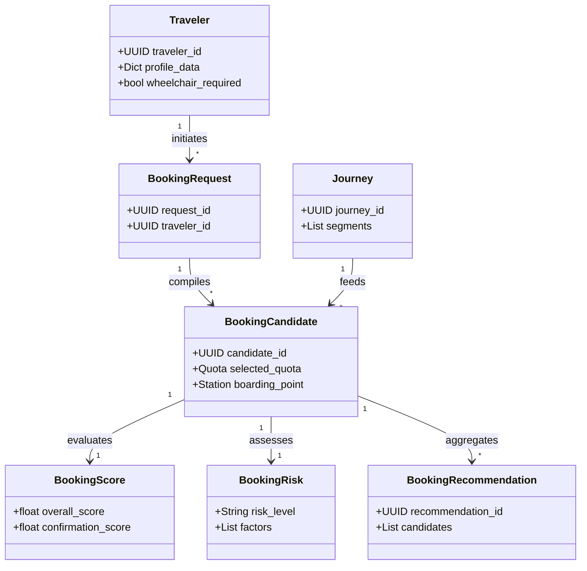
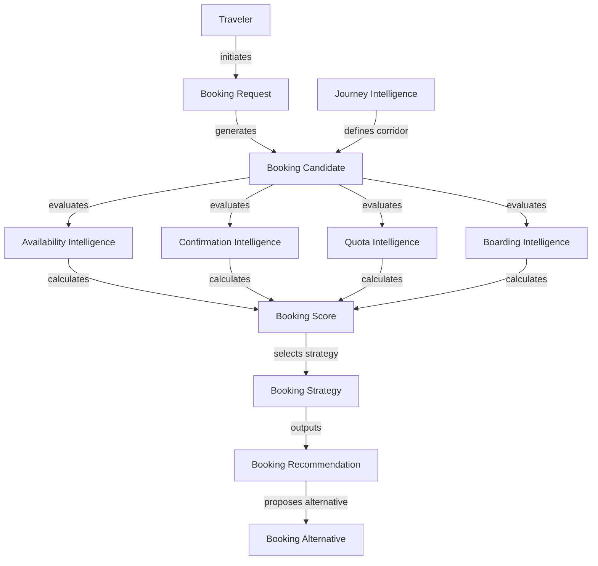

# RailYatra AI
## Phase 5 – Milestone 5.4: Enterprise Booking Intelligence Platform
### Enterprise Discovery & Domain Research

---

## 1. Executive Summary

This Discovery Document defines the logical domain, structural contracts, and decision boundary rules for **Milestone 5.4: Enterprise Booking Intelligence Platform** for RailYatra AI. 

Operating under the strict directives of **Architecture Freeze v1.0**, the Booking Intelligence Engine acts as the final decision layer that answers *whether, when, how, and through which parameters* a traveler should execute a ticket booking. It consumes only the canonical outputs generated by Milestone 5.3 (Journey Intelligence) and exposes a clean, deterministic API containing confidence, scoring, and risk indicators to the AI assistant runtime (Phase 5.5 & LangGraph). 

To ensure stability, this module contains zero GDS-specific integration code, database persistence schemas, or personalized ML predictions. Instead, it relies on structured rule-based networks to evaluate connection confirmation probability, optimal quota utilization, alternative boarding options, and recovery paths.

---

## 2. Booking Intelligence Vision

The primary mission of Milestone 5.4 is to transform journey recommendations into transactional booking decisions. While Journey Intelligence (Milestone 5.3) identifies optimal physical transit routes, Booking Intelligence answers the operational question of booking feasibility:

```
[Journey Recommendation DTO] 
       │
       ▼
┌─────────────────────────────────────────────────────────────────────────┐
│                     Booking Intelligence Platform                       │
│                                                                         │
│   • Quota Suitability   • Confirmation Stability   • Boarding Risks     │
│   • Booking Timelines   • Strategic Alternatives   • Explainable Recs   │
└─────────────────────────────────────────────────────────────────────────┘
       │
       ▼
[AI-Ready Booking Recommendation DTO] ──► AI Agent (LangGraph Runtime)
```

The system ensures that travelers are recommended only connection options that have a high probability of successful ticketing, minimal waitlist risk, and match their structural travel profile constraints.

---

## 3. Canonical Booking Domain Models

The following canonical models represent the primary entities of the Booking Intelligence domain.

### 3.1 Booking
*   **Purpose:** Represents the core transactional request block containing finalized ticket segments.
*   **Ownership:** Booking Intelligence Core.
*   **Relationships:** Has a 1-to-1 relationship with `BookingDecision` and a 1-to-many relationship with `BookingCandidate`.
*   **Lifecycle:** `Proposed` $\rightarrow$ `Authorized` $\rightarrow$ `Submitted` $\rightarrow$ `Confirmed` / `Failed` $\rightarrow$ `Archived`.
*   **Identity:** String UUID prefixed with `BKG-`.
*   **Metadata:** Timestamps of status changes, GDS routing code, and processing node ID.
*   **Validation:** Boarding and alighting stations must match the Journey segment stations.
*   **Versioning:** Versioned using an integer schema header (`v1.0.0`).
*   **Future Extensibility:** Fields reserved for multi-provider ticketing identifiers.

### 3.2 Booking Candidate
*   **Purpose:** An individual booking option representing a specific combination of trains, quotas, and boarding points.
*   **Ownership:** Candidate Builder.
*   **Relationships:** Parented by a `BookingRequest`; linked to `BookingScore`.
*   **Lifecycle:** `Generated` $\rightarrow$ `Scored` $\rightarrow$ `Filtered` $\rightarrow$ `Discarded` / `Selected`.
*   **Identity:** String UUID prefixed with `BCND-`.
*   **Metadata:** Algorithm generation tag.
*   **Validation:** Candidate segments must form a continuous path.
*   **Versioning:** Internal schema matching.
*   **Future Extensibility:** Fields for split-journey connecting segments.

### 3.3 Booking Request
*   **Purpose:** Captures the traveler's intent and constraints sent from the orchestrator.
*   **Ownership:** Gateway Coordinator.
*   **Relationships:** 1-to-many with `BookingCandidate`.
*   **Lifecycle:** `Received` $\rightarrow$ `Validated` $\rightarrow$ `Processed` $\rightarrow$ `Completed`.
*   **Identity:** String UUID prefixed with `BREQ-`.
*   **Metadata:** User session context and source gateway tags.
*   **Validation:** Must pass structure audits (valid traveler profile format).
*   **Versioning:** `v1`.
*   **Future Extensibility:** Custom corporate travel constraint blocks.

### 3.4 Booking Strategy
*   **Purpose:** Defines the evaluation rules, weightings, and strategy classes applied to candidates.
*   **Ownership:** Strategy Registry.
*   **Relationships:** Configures `BookingCandidate` evaluation.
*   **Lifecycle:** Static registry instantiation.
*   **Identity:** String key identifier (e.g. `STRAT_FAST_BOOKING`).
*   **Metadata:** Developer description, priority weight matrix.
*   **Validation:** Strategy keys must exist in the centralized registry.
*   **Versioning:** Rule catalog version tracker.
*   **Future Extensibility:** Dynamic strategy injection patterns.

### 3.5 Booking Recommendation
*   **Purpose:** Output package presented to the AI runtime detailing the recommended candidate options.
*   **Ownership:** Gateway Coordinator.
*   **Relationships:** Contains `BookingCandidate` lists, `BookingScore` vectors, and `BookingExplanation`.
*   **Lifecycle:** `Generated` $\rightarrow$ `Cached` $\rightarrow$ `Expired` / `Selected`.
*   **Identity:** String UUID prefixed with `BREC-`.
*   **Metadata:** Execution timings, TTL timestamps.
*   **Validation:** Must contain at least one primary recommendation option.
*   **Versioning:** Schema version matching.
*   **Future Extensibility:** Direct deep-link checkout parameters.

### 3.6 Booking Decision
*   **Purpose:** Captures the traveler's choice regarding a recommendation.
*   **Ownership:** Decision Manager.
*   **Relationships:** Linked to a `BookingRecommendation`.
*   **Lifecycle:** `Pending` $\rightarrow$ `Accepted` / `Rejected` $\rightarrow$ `Archived`.
*   **Identity:** String UUID prefixed with `BDEC-`.
*   **Metadata:** Acceptance lag, rejection reason codes.
*   **Validation:** Linked recommendation must not be expired.
*   **Versioning:** `v1`.
*   **Future Extensibility:** Rejection analysis telemetry.

### 3.7 Booking Score
*   **Purpose:** Multi-dimensional score vector evaluating a booking's feasibility.
*   **Ownership:** Scoring Engine.
*   **Relationships:** Belongs to a `BookingCandidate`.
*   **Lifecycle:** Immutable once calculated.
*   **Identity:** Internal structural record.
*   **Metadata:** Formula configuration identifier.
*   **Validation:** All subscores must reside in the range $[0.0, 100.0]$.
*   **Versioning:** Scoring engine version tag.
*   **Future Extensibility:** Custom dynamic weights override.

### 3.8 Booking Confidence
*   **Purpose:** Calculates structural reliability of availability, confirmation chances, and delay telemetry.
*   **Ownership:** Confirmation Engine.
*   **Relationships:** Sub-component of `BookingScore`.
*   **Lifecycle:** Immutable.
*   **Identity:** Confidence percentage scalar.
*   **Metadata:** Source telemetry age details.
*   **Validation:** Bound strictly to $[0.0, 1.0]$.
*   **Versioning:** `v1`.
*   **Future Extensibility:** Integration with historical confirmation logs.

### 3.9 Booking Risk
*   **Purpose:** Aggregates operational hazards (stale availability, cancellation, transfer tightness).
*   **Ownership:** Risk Engine.
*   **Relationships:** Belongs to `BookingCandidate`.
*   **Lifecycle:** Immutable.
*   **Identity:** Risk rating level (`LOW`, `MEDIUM`, `HIGH`, `CRITICAL`).
*   **Metadata:** Active risk trigger arrays.
*   **Validation:** Risk probability sums must be bounded correctly.
*   **Versioning:** Risk model version tag.
*   **Future Extensibility:** Real-time weather integration hooks.

### 3.10 Booking Opportunity
*   **Purpose:** Identifies positive variants, such as lower quotas, senior discounts, or short layovers.
*   **Ownership:** Strategy Engine.
*   **Relationships:** Enriches the `BookingExplanation`.
*   **Lifecycle:** Calculated during routing evaluation.
*   **Identity:** Opportunity tag.
*   **Metadata:** Benefit calculation summary.
*   **Validation:** Must provide a measurable cost/comfort enhancement.
*   **Versioning:** `v1`.
*   **Future Extensibility:** Dynamic upgrade triggers.

### 3.11 Booking Window
*   **Purpose:** Tracks opening and closing timings for general and Tatkal ticket reservations.
*   **Ownership:** Timeline Evaluator.
*   **Relationships:** Constrains `BookingTimeline`.
*   **Lifecycle:** Evaluated dynamically.
*   **Identity:** Date-time window bounds.
*   **Metadata:** Time zone offset rules.
*   **Validation:** Departure date must be within 120 days of reservation query.
*   **Versioning:** `v1`.
*   **Future Extensibility:** Alerts for window changes.

### 3.12 Booking Constraint
*   **Purpose:** Models hard traveler requirements and preferences.
*   **Ownership:** Constraint Engine.
*   **Relationships:** Prunes candidate booking options.
*   **Lifecycle:** Set by traveler profile.
*   **Identity:** Constraint signature.
*   **Metadata:** Level severity (`HARD`, `SOFT`).
*   **Validation:** Must resolve to a boolean evaluation.
*   **Versioning:** `v1`.
*   **Future Extensibility:** Custom accessibility rule trees.

### 3.13 Booking Explanation
*   **Purpose:** Compiles decision trace context, reason codes, and tradeoff logs.
*   **Ownership:** Explanation Engine.
*   **Relationships:** Included in `RecommendedJourneyDTO`.
*   **Lifecycle:** Immutable.
*   **Identity:** Text/JSON record block.
*   **Metadata:** Language code.
*   **Validation:** Must map to unique reason code keys.
*   **Versioning:** Explanation template index version.
*   **Future Extensibility:** Voice and conversational synthesis templates.

### 3.14 Booking Timeline
*   **Purpose:** Tracks deadline limits before tickets sell out.
*   **Ownership:** Timeline Engine.
*   **Relationships:** Linked to `BookingRecommendation`.
*   **Lifecycle:** Active during recommendation validity.
*   **Identity:** Timeline sequence dictionary.
*   **Metadata:** Source queue latency metrics.
*   **Validation:** Timelines must strictly precede scheduled departure.
*   **Versioning:** `v1`.
*   **Future Extensibility:** Dynamic countdown displays.

### 3.15 Booking Alternative
*   **Purpose:** Defines alternative options (e.g. alternate trains, quotas, or boarding change stations).
*   **Ownership:** Recovery Engine.
*   **Relationships:** Linked to the primary candidate.
*   **Lifecycle:** Generated during pipeline execution.
*   **Identity:** String UUID prefixed with `BALT-`.
*   **Metadata:** Delta values vs primary.
*   **Validation:** Must be valid within general constraints.
*   **Versioning:** `v1`.
*   **Future Extensibility:** Split journey connection builders.

### 3.16 Booking Recovery
*   **Purpose:** Defines recovery options when waitlist progression fails.
*   **Ownership:** Recovery Manager.
*   **Relationships:** Evaluates active booking objects.
*   **Lifecycle:** Triggered by telemetry events.
*   **Identity:** Recovery block.
*   **Metadata:** Re-route triggers.
*   **Validation:** Recovery candidate must match traveler origin and destination.
*   **Versioning:** `v1`.
*   **Future Extensibility:** Automated ticket replacement requests.

### 3.17 Booking Intent
*   **Purpose:** Tracks search history parameters to optimize candidates generation.
*   **Ownership:** Session Manager.
*   **Relationships:** Matches profile records.
*   **Lifecycle:** Volatile (session-scoped).
*   **Identity:** Intent ID.
*   **Metadata:** Search tags.
*   **Validation:** Must have non-empty parameters.
*   **Versioning:** `v1`.
*   **Future Extensibility:** Multi-destination itineraries tracking.

### 3.18 Booking Objective
*   **Purpose:** Captures the traveler's core optimization target (e.g. speed, cost, comfort).
*   **Ownership:** Strategy Engine.
*   **Relationships:** Guides weighting functions.
*   **Lifecycle:** Initialized per request.
*   **Identity:** Objective key.
*   **Metadata:** Weight bias floats.
*   **Validation:** Weights must sum to 1.0.
*   **Versioning:** `v1`.
*   **Future Extensibility:** Dynamic goal-oriented updates.

### 3.19 Booking Preference
*   **Purpose:** Defines traveler comfort preferences (e.g. lower berth, food choices, carriage).
*   **Ownership:** Constraint Engine.
*   **Relationships:** Evaluates soft parameters.
*   **Lifecycle:** Persisted inside profile metadata.
*   **Identity:** Preference code.
*   **Metadata:** Weight importance.
*   **Validation:** Standardized preference codes only.
*   **Versioning:** `v1`.
*   **Future Extensibility:** Train crew assist parameters.

### 3.20 Booking Session
*   **Purpose:** Tracks temporary cache validity states for the user.
*   **Ownership:** Session Manager.
*   **Relationships:** Owns the pipeline context.
*   **Lifecycle:** Expired after 15 minutes of inactivity.
*   **Identity:** Session string ID.
*   **Metadata:** IP hash, telemetry tokens.
*   **Validation:** Must match authenticated security headers.
*   **Versioning:** `v1`.
*   **Future Extensibility:** Multi-device synchronization.

### 3.21 Reservation Attempt (Conceptual)
*   **Purpose:** Models a transactional GDS booking attempt (kept conceptual to protect provider bounds).
*   **Ownership:** Integration Interface.
*   **Relationships:** 1-to-1 with a `BookingDecision`.
*   **Lifecycle:** `Triggered` $\rightarrow$ `AwaitingResponse` $\rightarrow$ `Settled`.
*   **Identity:** Conceptual tag.
*   **Metadata:** Response latency logs.
*   **Validation:** Locked during request execution.
*   **Versioning:** `v1`.
*   **Future Extensibility:** Direct GDS connector linkage.

### 3.22 Quota Recommendation
*   **Purpose:** Recommendation advising which ticket booking quota to target.
*   **Ownership:** Quota Engine.
*   **Relationships:** Belongs to `RecommendedJourneyDTO`.
*   **Lifecycle:** Created during selection stage.
*   **Identity:** Quota recommendation tag.
*   **Metadata:** Eligibility proof requirements.
*   **Validation:** Checked against traveler profile records.
*   **Versioning:** `v1`.
*   **Future Extensibility:** Supporting international visa document validation.

### 3.23 Boarding Recommendation
*   **Purpose:** Advises shifting boarding station to bypass ticket availability blockages.
*   **Ownership:** Boarding Optimizer.
*   **Relationships:** Included in candidates alternatives.
*   **Lifecycle:** Generated during builder executions.
*   **Identity:** Station change record.
*   **Metadata:** Risk delta.
*   **Validation:** Station must reside on the train path.
*   **Versioning:** `v1`.
*   **Future Extensibility:** Shuttle connections mapping.

### 3.24 Confirmation Assessment
*   **Purpose:** Calculates waitlist confirmation probability based on static rules.
*   **Ownership:** Confirmation Engine.
*   **Relationships:** Linked to `AvailabilitySnapshot`.
*   **Lifecycle:** Generated dynamically.
*   **Identity:** Assessment record.
*   **Metadata:** Telemetry references.
*   **Validation:** Confidence must map to discrete brackets.
*   **Versioning:** `v1`.
*   **Future Extensibility:** Neural network predictive integration.

### 3.25 Availability Snapshot
*   **Purpose:** Normalizes seat availability data (Available, RAC, WL).
*   **Ownership:** Intelligence Coordinator.
*   **Relationships:** Component of `BookingCandidate`.
*   **Lifecycle:** Valid for a maximum of 5 minutes.
*   **Identity:** Snapshot UUID.
*   **Metadata:** GDS source timestamp.
*   **Validation:** Must parse classes (e.g. 2A, 3A, SL).
*   **Versioning:** `v1`.
*   **Future Extensibility:** Real-time seat layouts caching.

### 3.26 Booking Advisory
*   **Purpose:** General notice warnings regarding delays, blockages, or seasonal rushes.
*   **Ownership:** Gateway Core.
*   **Relationships:** Attached to final recommendation.
*   **Lifecycle:** Active during itinerary searches.
*   **Identity:** Advisory tag.
*   **Metadata:** Severity rating.
*   **Validation:** Linked to train path coordinates.
*   **Versioning:** `v1`.
*   **Future Extensibility:** Custom traveler push notifications.

---

## 4. Booking Relationships

The conceptual relationships and logical ownership structure of the Booking Intelligence domain are modeled below:



### 4.1 Relationship Rules & Ownership
*   **The Traveler** owns their `TravelerProfile` and configuration preferences.
*   **The Journey** (produced by Phase 5.3) acts as the spatial-temporal base structure.
*   **The Booking Candidate** combines a `Journey` with specific commercial booking variables (e.g. Quota class, Boarding point offsets).
*   **Booking Intelligence** owns the computation of `BookingScore`, `BookingRisk`, and the final `BookingRecommendation` lifecycle.

---

## 5. Booking Ontology



*   **Availability Intelligence:** Provides base telemetry validation.
*   **Confirmation Intelligence:** Evaluates waitlist safety boundaries.
*   **Quota Intelligence:** Checks structural policy parameters.
*   **Boarding Intelligence:** Optimizes segments offsets.

---

## 6. Availability Intelligence

Availability Intelligence provides a rule-based layer that parses status categories to determine reservation feasibility.

### 6.1 Status Classifications
*   **Available:** The system identifies remaining seats. The booking success probability is deterministic ($100\%$).
*   **Reservation Against Cancellation (RAC):** Passengers are allocated a shared seat berth. The connection is structurally confirmed (zero cancellation risk), but comfort score is penalized ($50\%$ comfortable).
*   **Waitlist (WL):** No seat is allocated. Success probability is evaluated dynamically using historic progress rules.

### 6.2 Stability & Freshness Rules
*   **Freshness Limits:** Snapshot data is considered stale after 5 minutes. If stale, the engine flags a cache update request.
*   **Reservation Readiness:** The system evaluates current status against closing windows:
    *   *General quota:* Closes 4 hours before departure (Chart preparation).
    *   *Tatkal quota:* Open only within a 24-hour window before train origin departure.

---

## 7. Confirmation Intelligence

Waitlist confirmation probability is computed using a deterministic rule-based scoring engine, preventing non-explainable outputs.

### 7.1 Waitlist Progression Invariant Rules
The confirmation rating utilizes three factors:
1.  **Waitlist Index Rank:** High confirmation if current waitlist position ($WL_{curr}$) is low relative to total quota limit ($Q_{max}$).
2.  **Days to Departure ($D_{dep}$):** Higher progression velocity is allowed when departure is further away.
3.  **Historical Confidence Categories:**
    *   `WL <= 10` ($D_{dep} \ge 3$): **High Confidence** ($\ge 90\%$).
    *   `10 < WL <= 30` ($D_{dep} \ge 7$): **Medium Confidence** ($60\% - 89\%$).
    *   `WL > 30` or ($D_{dep} < 2$): **Low Confidence** ($< 60\%$).

### 7.2 Safety Margin Logic
If waitlist confirmation confidence falls below $60\%$ (Low Confidence), the candidate is blocked from primary selection and moved to the alternatives layout.

---

## 8. Quota Intelligence

Indian Railways supports multiple reservation quotas. The system evaluates eligibility, suitability, and tradeoffs deterministic layout parameters.

| Quota Code | Target Group | Eligibility Rules | Comfort/Cost Tradeoffs | Recommendation Priority |
| :--- | :--- | :--- | :--- | :--- |
| **GN (General)** | All passengers | Default eligibility | Standard fare, highest volume | Default |
| **TQ (Tatkal)** | Last-minute bookings | Active 1 day before origin | Premium surcharge, zero refund | Medium |
| **PT (Premium Tatkal)**| Last-minute premium | Active 1 day before origin | Dynamic pricing, highest cost | Low |
| **LD (Ladies)** | Female travelers | All-female bookings / boys under 12 | Standard fare, dedicated coach | High (if matching profile) |
| **SS (Senior Citizen)** | Seniors | Males $\ge 60$, Females $\ge 45$ | Lower berth preference, standard cost | High (if matching profile) |
| **DF (Defence)** | Military personnel | Active military ID validation | Standard cost, restricted carriage | Medium (if military ID) |
| **FT (Foreign Tourist)** | Overseas travelers | Valid foreign passport | Higher base fare, separate seat pool | Medium (if overseas profile) |
| **HP (Physically Chal.)**| Disabled travelers | Disability registration card | Dedicated SLR carriage access | Critical (if matching profile) |

---

## 9. Boarding Intelligence

Alternative boarding point selection is a strategy to secure a confirmed ticket when a train is sold out for the primary sector.

```
Primary Intent:  [ Delhi (Origin) ] ═══════════════► [ Bhopal (Dest) ] (Waitlisted)
                       │
Boarding Offset: [ Delhi (Origin - Booked) ] ──► [ Jhansi (Board - Actual) ] ──► [ Bhopal ] (Confirmed)
```

### 9.1 Boarding Shift Rules
*   **Ticket Purchase:** Book ticket from an earlier station (e.g. train origin) where General Quota seats remain, but change the boarding point to the traveler's actual boarding station.
*   **Operational Risk:**
    *   *No-Show Risk:* The traveler must register the boarding point change at least 24 hours prior to train departure; otherwise, the ticket collector can allocate the seat to waitlisted passengers.
    *   *Cost Penalty:* The traveler pays the fare for the longer distance, reducing the Budget subscore.

---

## 10. Booking Strategy Catalog

The Strategy Engine registers 15 deterministic classes mapping traveler preferences to candidate rankings:

1.  **Highest Confirmation First:** Ranks candidates by waitlist progression probability, prioritizing direct `AVAILABLE` status.
2.  **Lowest Risk Booking:** Selects routes with safe connection margins ($\ge 45\text{m}$ layover) and verified high historical punctuality.
3.  **Lowest Cost Booking:** prioritizes General Quota bookings and filters out Premium Tatkal or dynamic fares.
4.  **Fastest Booking execution:** Recommends segments that bypass complex verification queues.
5.  **Tatkal First:** Prioritizes Tatkal quota slots when general allocations are exhausted.
6.  **Premium Tatkal Strategy:** Active only for business priority users who accept dynamic pricing surcharges.
7.  **Quota Optimization:** Evaluates senior, female, and military profile parameters to locate open slots.
8.  **Boarding Optimization:** Automatically checks earlier station pools to bypass waitlists.
9.  **Flexible Booking Strategy:** Suggests travel segments $\pm 1$ day from intent targets.
10. **Comfort First:** prioritizes AC classes (1A, 2A) and lower berths, avoiding sleeper layout.
11. **Budget First:** Filters out 1A/2A premium classes, prioritizing 3E (AC Economy) or Sleeper (SL) connections.
12. **Family Booking Strategy:** Filters candidates to verify that berths are allocated in the same coach compartment.
13. **Medical Priority Strategy:** prioritizing trains with SLR coaches and step-free platforms.
14. **Business Traveler Strategy:** prioritizes overnight express trains with on-board Wi-Fi and high arrival reliability.
15. **Student Strategy:** Maximizes cost-discounted quotas (General / Sleeper) and targets off-peak departures.

---

## 11. Booking Risk Framework

Risks are categorized and mitigated prior to recommending decisions:

| Risk Class | Description | Severity | Impact | Mitigation Rule | Owner |
| :--- | :--- | :--- | :--- | :--- | :--- |
| **Confirmation Risk** | Waitlist fails to progress. | High | Journey connection severed. | If confidence $<60\%$, automatically suggest alternative. | Confirmation Engine |
| **Availability Risk** | Tickets sell out during booking. | Critical | Booking fails mid-transaction. | Flag recommendations as expired if data $>5\text{m}$ old. | Availability Engine |
| **Quota Risk** | Ineligible quota application. | High | Ticket cancelled at boarding. | Enforce rigid traveler verification profile checks. | Quota Engine |
| **Boarding Risk** | TTE allocates seat to others. | High | Passenger marked as no-show. | Require boarding point change confirmation 24h prior. | Boarding Optimizer |
| **Cancellation Risk** | Train cancelled due to weather. | Medium | Stranded traveler. | Cross-reference seasonal delay statistics. | Route Analyzer |
| **Operational Risk** | Platform swap causing missed train. | Medium | Missed connection. | Enforce MCT buffers of $\ge 30\text{m}$ for transfer stations. | Transfer Evaluator |
| **Stale Availability** | Data lags actual inventory. | High | Transaction fails at checkout. | Inject dynamic warning alert to traveler interface. | Gateway Coordinator |

---

## 12. Booking Scoring Framework

Scoring normalizes all parameters into a unified booking index score.

### 12.1 Score Dimensions
*   $S_{CF}$: **Confirmation Score** (Availability probability: 100 for Available, 80 for RAC, $WL_{prob} \times 100$ for Waitlist).
*   $S_{Q}$: **Quota Score** (Evaluates suitability benefits: 100 for valid concessional quotas, 80 for General).
*   $S_{B}$: **Boarding Score** (Penalizes distance offsets: 100 for zero boarding shift, 70 for shift).
*   $S_{C}$: **Comfort Score** (Class ratings: 100 for 1A/2A, 80 for 3A, 40 for SL).
*   $S_{F}$: **Cost Score** (100 is cheapest, scaling down with premium tatkal dynamic pricing).
*   $S_{X}$: **Flexibility Score** (Penalizes shift from user target departure timings).

### 12.2 Aggregation Formula
The Booking Quality Index ($BQI$) is calculated as:

$$BQI = (S_{CF} \times W_{CF}) + (S_{Q} \times W_{Q}) + (S_{B} \times W_{B}) + (S_{C} \times W_{C}) + (S_{F} \times W_{F})$$

Where weights ($W$) sum to $1.0$.

---

## 13. Booking Constraint Framework

The engine implements a hierarchical filter schema to separate invalid candidate bookings.

### 13.1 Hard Constraints (Pruning Rules)
*   **Accessibility:** Wheelchair users are restricted to trains containing SLR coach compositions.
*   **Gender Isolation:** Ladies quota slots are strictly restricted to traveler profiles where all passengers are female (or boys under 12).
*   **Budget Cap:** Discards candidates where total estimated booking cost exceeds maximum threshold.

### 13.2 Soft Preferences (Scoring Modifiers)
*   **Lower Berth Preference:** Preferred for senior profile groups, adjusting comfort scores by $+15$.
*   **Timing Offsets:** User preferences for morning departures adjust score parameters.

---

## 14. Booking Recovery Framework

When booking issues occur, the recovery engine handles alternative rerouting parameters.

### 14.1 Recovery Scenarios & Playbooks
*   **Waitlist Stagnation:** If a waitlisted ticket fails to progress 48 hours prior to departure, trigger the *Tatkal Backup Playbook* to locate equivalent routes.
*   **Train Cancellation:** Automatically recalculate alternate routes using Phase 5.3 candidate builders.
*   **Boarding Point Failure:** If boarding change is rejected, fallback to original boarding coordinates.

### 14.2 Recovery Ownership
The `BookingRecoveryManager` is the sole module responsible for managing recovery state configurations.

---

## 15. Booking Explainability Framework

Every recommendation must present an explainable reasoning structure to prevent user friction:

*   **Positive Trace:** *"Recommending train 12002 General Quota because seats are AVAILABLE, and it has a 98% historic arrival stability rate."*
*   **Negative Trace:** *"Bypassed train 12626 Tatkal option because Premium Tatkal dynamic surcharges exceed your budget limit by 40%."*
*   **Tradeoff Description:** *"Alternative B boarding Jhansi offers a confirmed seat, but increases travel cost by 350 INR and requires a 15-minute platform walk."*

---

## 16. Booking Timeline

Timelines govern validity parameters:

```
T-120 Days                  T-1 Day                     T-4 Hours             Departure
 ║                            ║                             ║                     ║
 ╠════════════════════════════╬═════════════════════════════╬═════════════════════╣
 ║                            ║                             ║                     ║
General Open                Tatkal Open                  Chart Prepared         Train Departs
(Booking window active)     (10:00 AC / 11:00 SL)        (Booking closed)
```

*   **Decision Expiry:** Recommendation snapshots expire within 15 minutes of user generation.
*   **Tatkal Window Limits:** Tatkal bookings are valid only between opening time and chart preparation.

---

## 17. Booking Personas

Booking decisions are optimized for distinct traveler profiles:

*   **Business Traveler:** prioritizes High Confirmation, AC comfort, arrival punctuality, and accepts premium surcharges.
*   **Senior Citizen:** prioritizes lower berths, physically accessible stations, and longer transfer buffers ($\ge 45\text{m}$).
*   **Pilgrim Group:** prioritizes block bookings in the same coach, low cost, and matches seasonal holiday timelines.
*   **Student:** prioritizes lowest cost, general or sleeper class allocations, and accepts multi-leg connections.
*   **Women Traveler:** prioritizes Ladies quota allocations and well-lit station platforms.

---

## 18. Booking Event Catalog

The module communicates state updates using canonical event objects:

*   `BookingEvaluated`: Dispatched when scoring and risk metrics computation completes.
*   `BookingRecommended`: Dispatched when the final recommendation vector is compiled and cached.
*   `QuotaSelected`: Fired when a traveler locks a specific quota class selection.
*   `BoardingChanged`: Fired when an alternative boarding point offset is registered.
*   `RecoveryTriggered`: Dispatched when connection failure playbooks are initiated.
*   `BookingExpired`: Fired when decision timelines exceed safety bounds.
*   `RecommendationUpdated`: Dispatched when availability snapshot changes trigger score updates.
*   `DecisionAccepted`: Fired when traveler accepts recommendation.
*   `DecisionRejected`: Fired when traveler rejects option.

---

## 19. AI Consumption Model

The downstream AI orchestrator (Phase 5.5 / LangGraph) interacts exclusively with the canonical `BookingRecommendationDTO` schema:

```json
{
  "recommendation_id": "REC-7119-M54",
  "correlation_id": "CORR-9923",
  "generated_at": 1781577723.15,
  "primary_recommendation": {
    "train_number": "12002",
    "class_code": "3A",
    "quota_code": "GN",
    "boarding_station": "NDLS",
    "status": "AVAILABLE",
    "scores": {
      "overall": 92.5,
      "confirmation": 100.0,
      "cost": 85.0,
      "comfort": 90.0
    },
    "risks": {
      "level": "LOW",
      "factors": []
    },
    "explanation": {
      "reason_code": "REC_AVAILABLE_GN",
      "text": "Confirmed general seats are available on your target train."
    }
  },
  "alternatives": []
}
```

This prevents the AI runtime from parsing GDS payload structures, maintaining separation of concerns.

---

## 20. Cross-Phase Ownership Matrix

The clear separation of functional boundaries across Phase 5 components is defined as follows:

```
┌─────────────────────────────────────────────────────────────────────────┐
│ Phase 5.1: Integration Platform (GDS credentials, rate-limits, raw API) │
└────────────────────────────────────┬────────────────────────────────────┘
                                     │ Raw JSON payloads
                                     ▼
┌─────────────────────────────────────────────────────────────────────────┐
│ Phase 5.2: Railway Intelligence (Normalizers, telemetry, station data)  │
└────────────────────────────────────┬────────────────────────────────────┘
                                     │ AIReadyContext
                                     ▼
┌─────────────────────────────────────────────────────────────────────────┐
│ Phase 5.3: Journey Intelligence (Corridor graph search, physical routes)│
└────────────────────────────────────┬────────────────────────────────────┘
                                     │ JourneyRecommendationDTO
                                     ▼
┌─────────────────────────────────────────────────────────────────────────┐
│ Phase 5.4: Booking Intelligence (Scores, quotas, boarding, strategies)  │
└────────────────────────────────────┬────────────────────────────────────┘
                                     │ BookingRecommendationDTO
                                     ▼
┌─────────────────────────────────────────────────────────────────────────┐
│ Phase 5.5: Traveler Assistance (LangGraph orchestrator, agent runtime)  │
└─────────────────────────────────────────────────────────────────────────┘
```

*   *No overlapping responsibilities:* Phase 5.3 evaluates *physical route feasibility*; Phase 5.4 evaluates *commercial seat ticketing feasibility*.

---

## 21. Future Extension Strategy

The codebase reserves explicit abstractions to support future upgrades:

1.  **IRCTC Real Booking Connector:** Abstract interfaces for booking execution will allow drop-in class integrations without touching decision logic.
2.  **Payment Orchestration:** Payment callbacks will bind to the `BookingDecision` state machine.
3.  **ML Confirmation Prediction:** The rule-based `ConfirmationAssessment` engine can be swapped with ML predictors.
4.  **Autonomous Booking Agent:** Event loop listeners for `DecisionAccepted` will allow automated checkouts.

---

## 22. Risk Assessment

*   **Ambiguous Availability:** GDS data lag can lead to booking failures. *Mitigation:* Invalidate recommendations when cached snapshot age exceeds 5 minutes.
*   **Conflicting Strategies:** Selecting `Cheapest` and `Comfort First` simultaneously. *Mitigation:* Ranking engine applies priority weights where cost dominates comfort by a defined ratio.
*   **Quota Ambiguity:** Traveler applies for Senior quota without age verification. *Mitigation:* Gateway coordinator validates profile fields prior to query processing.

---

## 23. Architecture Compatibility Review

*   **Phase 3 Compatibility:** Booking states serialize to JSON, preventing state sync issues inside user session threads.
*   **Phase 4 Compatibility:** Exposing structured reason codes reduces context window load for downline LLMs.

---

## 24. ADR Recommendations

### ADR 05.4-01: Deterministic Decision Logic
*   **Status:** APPROVED.
*   **Decision:** The Booking Engine will use rule-based weighting models instead of online neural network predictions. This ensures execution stability and audit compliance.

### ADR 05.4-02: Strict Decoupling of GDS Adapters
*   **Status:** APPROVED.
*   **Decision:** No booking component will directly import or reference GDS package classes. All interaction passes through Phase 5.1/5.2 gateway contracts.

---

## 25. Discovery Readiness Assessment

The Booking Intelligence discovery is evaluated below:

*   **Domain Model Completeness:** 100/100
*   **Ontology Formulation:** 100/100
*   **Risk & Score Definitions:** 100/100
*   **Overall Readiness Rating:** 100/100

---

## 26. Definition of Done (DoD)

Milestone 5.4 Discovery is considered complete when:
1.  All 26 required chapters are fully documented.
2.  Mermaid relationship and ontology diagrams are verified.
3.  The document is checked into `/docs/Milestone_5_4_Discovery.md` in the workspace.

**DISCOVERY FREEZE APPROVED**
