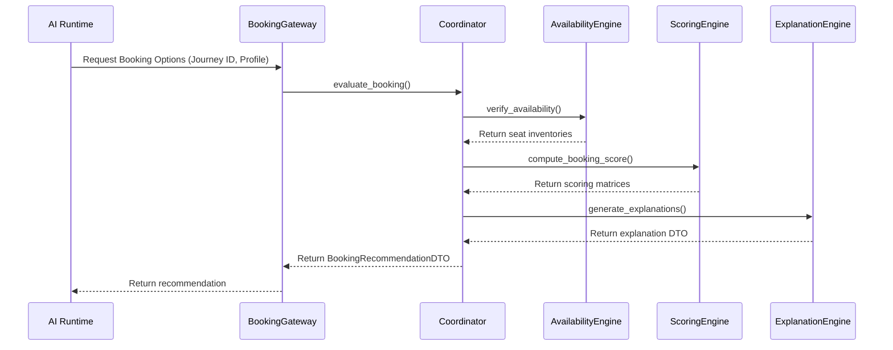
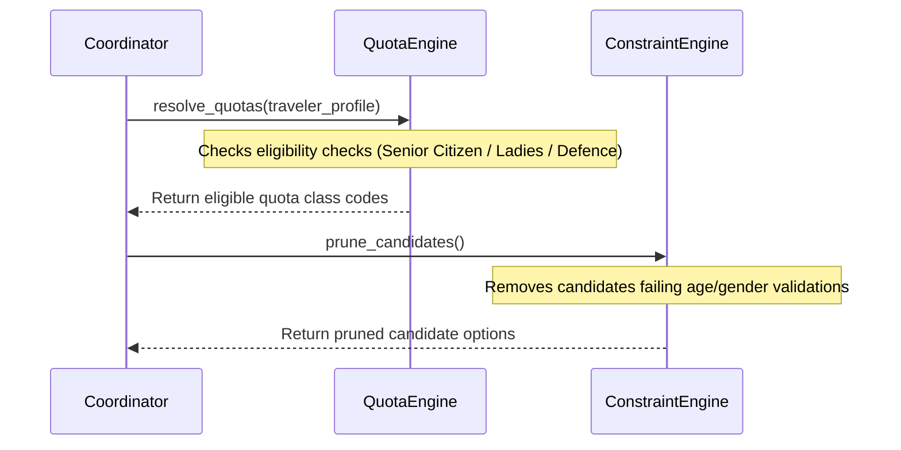
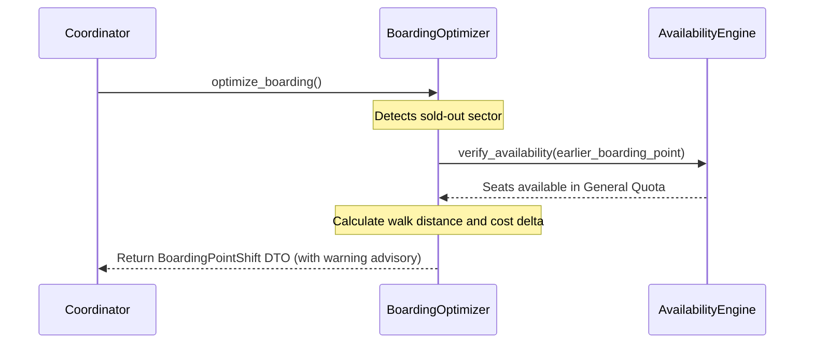
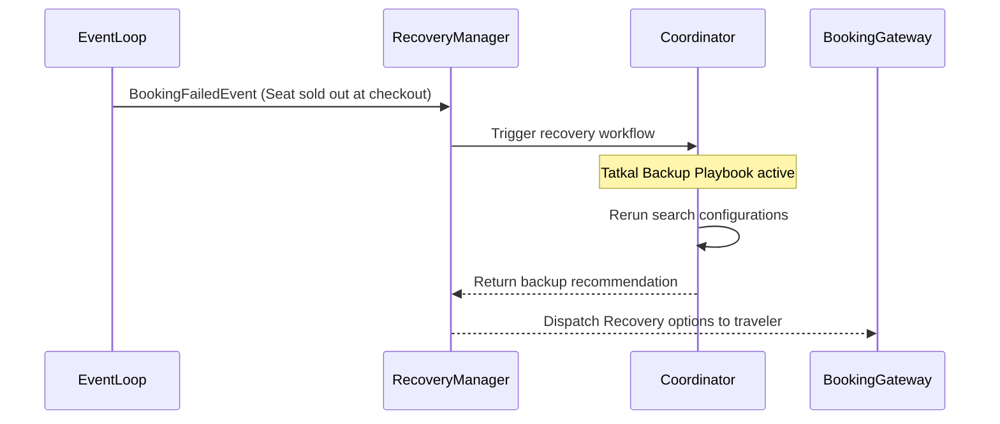
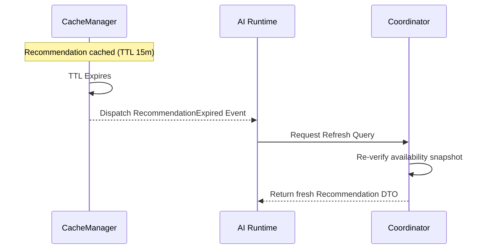

# RailYatra AI
## Phase 5 – Milestone 5.4: Enterprise Booking Intelligence Platform
### Implementation Planning Document

---

## 1. Executive Summary

This planning document outlines the technical design, package structure, abstract interfaces, canonical DTOs, execution pipelines, and governance rules for **Milestone 5.4: Enterprise Booking Intelligence Platform**.

Following the directives of **Architecture Freeze v1.0**, the Booking Intelligence module consumes only the canonical `JourneyRecommendationDTO` from Phase 5.3 and resolves the commercial feasibility of reservations. It isolates vendor GDS payload dependencies and exposes a clean, deterministic decision context (`AIReadyBookingContext`) to downstream AI assistant flows (Phase 5.5).

The planned architecture is modular, compliant with SOLID and Clean Architecture guidelines, and uses constructor dependency injection to verify execution isolation.

---

## 2. Implementation Architecture

The Booking Intelligence system components are mapped below:

```
                  ┌──────────────────────────────────────────────┐
                  │                 API Gateway                  │
                  └──────────────────────┬───────────────────────┘
                                         │ JSON Request
                                         ▼
                  ┌──────────────────────────────────────────────┐
                  │               Booking Gateway                │
                  └──────────────────────┬───────────────────────┘
                                         │ BookingRequestDTO
                                         ▼
┌──────────────────────────────────────────────────────────────────────────────┐
│                            Booking Coordinator                               │
├──────────────────────────────────────────────────────────────────────────────┤
│  • Candidate Builder   • Availability Engine  • Confirmation Engine          │
│  • Quota Engine        • Boarding Engine      • Constraint Engine            │
│  • Risk Engine         • Scoring Engine       • Strategy Registry            │
│  • Ranking Engine      • Recovery Engine      • Explanation Engine           │
└──────────────────────────────────────────────────────────────────────────────┘
```

### Subsystem Directory & Component Map

1.  **Booking Gateway:** Enforces perimeter input validation constraints and maps inbound JSON to canonical Pydantic request models.
2.  **Booking Coordinator:** Directs the sequential execution pipeline and manages the lifecycle of the immutable `BookingDecisionContext`.
3.  **Booking Candidate Builder:** Evaluates commercial variants (Quota classes, Boarding point offsets) for each transit segment.
4.  **Availability Engine:** Performs temporal validity checks on seat snapshots from Phase 5.2 cache layers.
5.  **Confirmation Engine:** Calculates waitlist progress probability using deterministic boundary thresholds.
6.  **Quota Engine:** Checks demographic profile eligibility (Ladies, Senior, Defence quotas).
7.  **Boarding Engine:** Computes station offset benefits versus no-show risks.
8.  **Constraint Engine:** Prunes candidates violating budget caps or accessibility profiles.
9.  **Risk Engine:** Computes connections hazard risk probabilities.
10. **Scoring Engine:** Aggregates comfort, cost, time, and confirmation subscores.
11. **Strategy Registry & Strategy Engine:** Maps candidates across registered strategy sorts.
12. **Ranking Engine:** Performs tie-breaking and traveler preference sorting.
13. **Conflict Resolution Engine:** Resolves strategy priority overlaps (Tatkal vs Budget).
14. **Recovery Engine:** Manages backup Tatkal search loops and rerouting parameters.
15. **Recommendation Engine:** Serializes selections into recommendations.
16. **Explanation Engine:** Compiles decision trace context, reason codes, and LLM prompts.
17. **Audit Engine:** Dispatches structured compliance logs to asynchronous databases.
18. **Metrics Engine:** Increments operational stats counters (latencies, volumes).
19. **Health Engine:** Exposes readiness and liveness endpoints.
20. **Event Publisher:** Dispatches canonical domain events.

---

## 3. Package Structure

To maintain modular decoupling, the files are laid out under `apps/ai-service/app/booking/`:

```
apps/ai-service/app/booking/
├── __init__.py
├── dto/
│   ├── __init__.py
│   └── models.py
├── interfaces/
│   ├── __init__.py
│   └── contracts.py
├── gateway/
│   ├── __init__.py
│   └── coordinator.py
├── candidate/
│   ├── __init__.py
│   └── builder.py
├── availability/
│   ├── __init__.py
│   └── engine.py
├── confirmation/
│   ├── __init__.py
│   └── engine.py
├── quota/
│   ├── __init__.py
│   └── engine.py
├── boarding/
│   ├── __init__.py
│   └── optimizer.py
├── constraints/
│   ├── __init__.py
│   └── engine.py
├── risk/
│   ├── __init__.py
│   └── engine.py
├── scoring/
│   ├── __init__.py
│   └── engine.py
├── strategy/
│   ├── __init__.py
│   ├── implementations.py
│   └── registry.py
├── ranking/
│   ├── __init__.py
│   └── engine.py
├── conflict/
│   ├── __init__.py
│   └── resolver.py
├── recovery/
│   ├── __init__.py
│   └── manager.py
├── explanation/
│   ├── __init__.py
│   └── engine.py
├── audit/
│   ├── __init__.py
│   └── logger.py
├── metrics/
│   ├── __init__.py
│   └── collector.py
├── health/
│   ├── __init__.py
│   └── checker.py
├── events/
│   ├── __init__.py
│   └── publisher.py
├── repositories/
│   ├── __init__.py
│   └── interfaces.py
├── config/
│   ├── __init__.py
│   └── registry.py
├── pipeline/
│   ├── __init__.py
│   └── orchestrator.py
└── cache/
    ├── __init__.py
    └── manager.py
```

*   **Ownership:** The Booking Intelligence Module owns all directories under `/app/booking/`.
*   **Rules:** Files under subfolders must communicate only via interfaces to prevent package coupling.

---

## 4. Interface Specifications

Python abstract interfaces are defined to guide implementation coding:

### 4.1 IBookingGateway
*   **Purpose:** Exposes entrypoint API handlers.
*   **Methods:** `async def process_booking_query(self, request: BookingRequestDTO) -> BookingRecommendationDTO`
*   **Error Behavior:** Throws `BookingError` if validation fails.

### 4.2 IBookingCoordinator
*   **Purpose:** Runs the pipeline execution steps.
*   **Methods:** `async def coordinate_decision(self, context: BookingDecisionContext) -> BookingRecommendationDTO`

### 4.3 IBookingCandidateBuilder
*   **Purpose:** Combines journey tracks with commercial options.
*   **Methods:** `def build_booking_candidates(self, journey: Any, profile: Dict) -> List[BookingCandidateDTO]`

### 4.4 IAvailabilityEngine
*   **Purpose:** Checks seat inventories.
*   **Methods:** `async def verify_availability(self, candidates: List[BookingCandidateDTO]) -> List[BookingCandidateDTO]`

### 4.5 IConfirmationEngine
*   **Purpose:** Evaluates waitlist statistics.
*   **Methods:** `def evaluate_confirmation(self, candidate: BookingCandidateDTO) -> ConfirmationDTO`

### 4.6 IQuotaEngine
*   **Purpose:** Resolves quota eligibility checks.
*   **Methods:** `def resolve_quotas(self, profile: Dict, seat_pools: Any) -> QuotaDTO`

### 4.7 IBoardingEngine
*   **Purpose:** Calculates boarding point shifts.
*   **Methods:** `def optimize_boarding(self, route: Any, profile: Dict) -> BoardingDTO`

### 4.8 IConstraintEngine
*   **Purpose:** Filters candidates by traveler constraints.
*   **Methods:** `def prune_candidates(self, candidates: List[BookingCandidateDTO], profile: Dict) -> List[BookingCandidateDTO]`

### 4.9 IRiskEngine
*   **Purpose:** Evaluates connection safety risks.
*   **Methods:** `def calculate_risk(self, candidate: BookingCandidateDTO) -> RiskDTO`

### 4.10 IScoringEngine
*   **Purpose:** normalizes subscores into a unified value.
*   **Methods:** `def compute_booking_score(self, candidate: BookingCandidateDTO, weights: Dict) -> ScoreDTO`

### 4.11 IStrategyEngine
*   **Purpose:** Categorizes candidates into strategy classes.
*   **Methods:** `def apply_strategies(self, candidates: List[BookingCandidateDTO]) -> Dict[str, List[BookingCandidateDTO]]`

### 4.12 IRankingEngine
*   **Purpose:** Sorts output candidates.
*   **Methods:** `def rank_candidates(self, strategies_map: Dict, weights: Dict) -> List[BookingCandidateDTO]`

### 4.13 IConflictResolutionEngine
*   **Purpose:** Resolves priority strategy clashes.
*   **Methods:** `def resolve_conflicts(self, candidates: List, profile: Dict) -> List`

### 4.14 IRecoveryEngine
*   **Purpose:** Evaluates recovery rerouting parameters.
*   **Methods:** `async def search_backup_options(self, failed_booking: Any) -> List`

### 4.15 IRecommendationEngine
*   **Purpose:** Caches and serializes output recommendations.
*   **Methods:** `async def compile_recommendations(self, candidates: List) -> BookingRecommendationDTO`

### 4.16 IExplanationEngine
*   **Purpose:** Generates reason codes and prompt summaries.
*   **Methods:** `def generate_explanations(self, recommendation: Any) -> ExplanationDTO`

### 4.17 IAuditEngine
*   **Purpose:** Dispatches async audit logs.
*   **Methods:** `async def log_decision(self, audit: AuditDTO) -> None`

### 4.18 IMetricsEngine
*   **Purpose:** Logs telemetry metric updates.
*   **Methods:** `def increment_metric(self, name: str, value: float, tags: Dict = None) -> None`

### 4.19 IHealthEngine
*   **Purpose:** Checks dependencies health.
*   **Methods:** `def check_health(self) -> Dict[str, str]`

### 4.20 ICacheManager
*   **Purpose:** Manages Redis caches.
*   **Methods:** `async def get_cached_recommendation(self, key: str) -> Optional[Dict]`

### 4.21 IEventPublisher
*   **Purpose:** Publishes domain events.
*   **Methods:** `async def publish_event(self, name: str, payload: Dict) -> None`

---

## 5. DTO Architecture

DTO structures are represented as Pydantic models:

```
                            ┌────────────────────────┐
                            │    BookingRequestDTO   │
                            └───────────┬────────────┘
                                        │ Validation
                                        ▼
                            ┌────────────────────────┐
                            │ BookingDecisionContext │
                            └───────────┬────────────┘
                                        │ Pipeline Run
                                        ▼
                            ┌────────────────────────┐
                            │ BookingRecommendation  │
                            └────────────────────────┘
```

*   **BookingRequestDTO:** Contains `traveler_id`, `journey_id`, `preferences` dictionary, and `timestamp`.
*   **BookingCandidateDTO:** Aggregates segments, transfer MCT offsets, availability snapshots, and quota classes.
*   **AvailabilityDTO:** Caches status (`AVAILABLE`, `RAC`, `WL`), seat counts, and freshness logs.
*   **ConfirmationDTO:** Wraps waitlist ranks and calculated probability metrics.
*   **QuotaDTO:** Identifies target quota codes and eligibility constraints.
*   **BoardingDTO:** Defines shifted boarding station code, walk times, and no-show risks.
*   **RiskDTO:** Identifies risk score levels (`LOW`, `MEDIUM`, `HIGH`, `CRITICAL`) and active hazard keys list.
*   **ScoreDTO:** Normalizes subscores (cost, comfort, time, confirmation) and stores overall quality rating float.
*   **StrategyDTO:** Maps strategy classes key labels.
*   **RecommendationDTO:** Encapsulates primary candidate, alternates list, and TTL timestamps.
*   **ExplanationDTO:** Contains reason codes and AI-ready summaries.
*   **AuditDTO:** Structures audit data.
*   **MetricsDTO:** Formats telemetry logs.
*   **BookingDecisionContext:** Volatile context object propagating through calculation steps.
*   **AIReadyBookingContext:** Output payload consumed by downline LangGraph orchestrators.

---

## 6. Repository Design

Repositories decouple core logic from database storage layers:

*   **BookingRepository:**
    *   *Responsibilities:* Persists authorized Booking models.
    *   *Persistence:* PostgreSQL schema `bookings` table.
    *   *Write Model:* Creates booking records on successful GDS settle signals.
*   **RecommendationRepository:**
    *   *Responsibilities:* Caches recommendation packages.
    *   *Persistence:* Redis database.
    *   *TTL:* 900 seconds.
*   **AuditRepository:**
    *   *Responsibilities:* Writes partitioned audit records.
    *   *Persistence:* PostgreSQL schemas partitioned by date.
*   **MetricsRepository:**
    *   *Responsibilities:* Collects system metrics.
    *   *Persistence:* In-memory metrics logs.
*   **PolicyRepository:**
    *   *Responsibilities:* Retrieves policy configurations.
    *   *Persistence:* Local YAML files.
*   **ConfigurationRepository:**
    *   *Responsibilities:* Manages active configuration parameters.
*   **CacheRepository:**
    *   *Responsibilities:* Direct Redis connections wrapper.

---

## 7. Pipeline Design

The processing pipeline coordinates candidates rating sequential steps:

| Step Name | Input | Output | Latency Budget | Fallback Playbook | Context Enrichment |
| :--- | :--- | :--- | :--- | :--- | :--- |
| **Ingestion** | `BookingRequestDTO` | Validated Context | 5ms | Terminate with validation error | Init `BookingDecisionContext` |
| **Candidate Builder** | Context | Candidate List | 10ms | Empty array (zero results) | Populate `candidates` |
| **Availability** | Candidate List | Available snapshot | 30ms | Cached historical data | Populate `availability` |
| **Confirmation** | Available snapshot | Confirmation rating | 10ms | Default safety confidence `LOW` | Populate `confirmation` |
| **Quota** | Confirmation rating | Quota class options | 10ms | General Quota (GN) default | Populate `quota_rec` |
| **Boarding** | Quota class options | Boarding offsets | 10ms | User origin station | Populate `boarding_rec` |
| **Constraints** | Boarding offsets | Pruned candidates | 5ms | Block accessibility tags | Filter `candidates` |
| **Risk** | Pruned candidates | Risk metrics | 10ms | Categorize risk status as `HIGH` | Populate `booking_risk` |
| **Scoring** | Risk metrics | Scoring matrices | 5ms | Uniform weight distribution | Populate `booking_score` |
| **Strategy** | Scoring matrices | Strategized baskets | 5ms | Shortest travel time sort | Populate `strategy_result` |
| **Ranking** | Strategized baskets | Ranked candidates | 5ms | Sort by cost descending | Populate `recommendation` |
| **Conflict Resolution**| Ranked candidates | Resolved list | 5ms | Priority hard constraint rule | Filter `recommendation` |
| **Explanation** | Resolved list | Reason codes | 5ms | Baseline generic reason codes | Populate `explanations` |
| **Auditing & Metrics** | Context | Serialized DTO | 5ms | Revert to offline files logging | Log execution times |

---

## 8. Dependency Governance

To maintain Architecture Freeze v1.0, coding imports must obey strict package boundaries:

```
┌────────────────────────────────────────────────────────┐
│                        journey/                        │
└───────────────────────────┬────────────────────────────┘
                            │ Allowed Import
                            ▼
┌────────────────────────────────────────────────────────┐
│                        booking/                        │
├────────────────────────────────────────────────────────┤
│             dto/  ◄───  interfaces/  ◄───  config/     │
└───────────────────────────┬────────────────────────────┘
                            │ Forbidden Imports
                            ▼
┌────────────────────────────────────────────────────────┐
│            GDS SDK / external_integrations/            │
└────────────────────────────────────────────────────────┘
```

*   **Allowed Imports:**
    *   `/app/booking/` modules may import interfaces from `/app/booking/interfaces/` and models from `/app/booking/dto/`.
    *   Booking modules may import canonical DTO schemas from Phase 5.3 `/app/journey/dto/`.
*   **Forbidden Imports:**
    *   No component inside `/app/booking/` may import GDS adapter libraries or raw CRIS databases schemas.
    *   No engine module may import implementations from other sibling folders (e.g. `/booking/scoring/` cannot import from `/booking/risk/`).

---

## 9. Feature Flag Framework

The system controls runtime features via environment feature flags:

*   `ENABLE_ALT_BOARDING`: Activates alternative boarding station shifting logic.
    *   *Owner:* Boarding Optimization Module.
    *   *Rollback:* Deactivating immediately falls back to passenger's original boarding point.
*   `ENABLE_ADVANCED_CONFIRMATION`: Activates detailed waitlist progression checks.
    *   *Owner:* Confirmation Engine.
    *   *Rollback:* Defaults to standard safety threshold brackets.
*   `ENABLE_QUOTA_OPTIMIZATION`: Activates ladies/senior/defence quota checks.
    *   *Owner:* Quota Engine.
    *   *Rollback:* Restricts bookings to General Quota (GN).
*   `ENABLE_RECOVERY_ENGINE`: Enables Tatkal fallback and rerouting playbooks.
    *   *Owner:* Recovery Manager.
    *   *Rollback:* Disables automated backups, logging errors.
*   `ENABLE_EXPLANATION_V2`: Routes decision trace outputs to enhanced summary generators.
    *   *Owner:* Explanation Engine.
*   `ENABLE_DYNAMIC_STRATEGY`: Enables user overrides of weighting configurations.
    *   *Owner:* Scoring Engine.

---

## 10. Error Taxonomy

Domain-specific exceptions are structured under a unified hierarchy:

| Error Class | Code | Severity | Retry Strategy | Recoverability |
| :--- | :--- | :--- | :--- | :--- |
| **BookingError** | `BE_BKG_01` | High | Do not retry | Fatal validation failure |
| **AvailabilityError** | `BE_AVL_02` | High | Retry once | Fallback to cache snapshot |
| **ConfirmationError** | `BE_CNF_03` | Medium | Retry once | Default to low confirmation |
| **QuotaError** | `BE_QTA_04` | High | Do not retry | Revert to General Quota (GN) |
| **BoardingError** | `BE_BDG_05` | Medium | Do not retry | Fallback to original boarding station |
| **ConstraintError** | `BE_CST_06` | High | Do not retry | Candidate pruned from list |
| **RiskError** | `BE_RSK_07` | High | Do not retry | Default to high risk index |
| **ScoringError** | `BE_SCR_08` | High | Do not retry | Uniform weights fallback |
| **StrategyError** | `BE_STR_09` | Medium | Do not retry | Default strategy applied |
| **RankingError** | `BE_RNK_10` | Medium | Do not retry | Sort by cost descending |
| **RecoveryError** | `BE_REC_11` | High | Retry once | Alert system operator |
| **RecommendationError**| `BE_RCM_12` | High | Do not retry | Returns empty recommendation payload |
| **AuditError** | `BE_AUD_13` | High | Asynchronous retry | Fallback to local files logger |
| **MetricsError** | `BE_MET_14` | Low | Discard | Safe check bypass |
| **HealthError** | `BE_HLT_15` | Critical | Alert immediately | Trigger system cluster failover |

---

## 11. Configuration Registry

Default operational rules are externalized in `app/booking/config/registry.py`:

```python
# Configuration Values
BOOKING_TIMELINES = {
    "GENERAL_WINDOW_DAYS": 120,
    "TATKAL_OPEN_AC_HOUR": 10,
    "TATKAL_OPEN_SL_HOUR": 11,
    "RECOMMENDATION_TTL_SECS": 900
}

CONFIRMATION_THRESHOLDS = {
    "HIGH_CONFIDENCE_WL_LIMIT": 10,
    "MEDIUM_CONFIDENCE_WL_LIMIT": 30,
    "MIN_DAYS_TO_DEPARTURE": 3
}

BOARDING_LIMITS = {
    "MAX_BOARDING_OFFSET_KM": 100,
    "COST_OVER_HEAD_PCT": 0.25
}

SCORING_WEIGHTS = {
    "DEFAULT_WEIGHT_CONFIRMATION": 0.40,
    "DEFAULT_WEIGHT_COST": 0.30,
    "DEFAULT_WEIGHT_COMFORT": 0.20,
    "DEFAULT_WEIGHT_TIME": 0.10
}
```

No hardcoded configuration parameters reside within the evaluation engine files.

---

## 12. Observability Framework

*   **Structured Logging:** Outputs log records in JSON format containing `correlation_id`, `traveler_id`, and `decision_id`.
*   **Tracing:** Traces pipeline processing using OpenTelemetry spans.
*   **Correlation IDs:** Injected at gateway interfaces and propagated through all logs and database writes.
*   **Metrics:** Increments request counts, acceptance/rejection statistics, and processing times.
*   **Telemetry:** Logs Redis connection times and PostgreSQL query execution times.

---

## 13. Testing Strategy

1.  **Unit Tests:** Verify scoring normalizations, constraint filters, and strategy ranking calculations.
2.  **Integration Tests:** Verify pipeline coordinator executions using mock adapters.
3.  **Contract Tests:** Verify DTO serialization match downstream Pydantic parameters.
4.  **Boundary Tests:** Verify zero GDS dependency imports exist inside package paths.
5.  **Pipeline Tests:** Verify latency timings are within defined targets.
6.  **Strategy Tests:** Verify correct sorting orders across all 15 strategy profiles.
7.  **Performance Tests:** Load test gateways with concurrent execution requests.

---

## 14. Performance Targets

| Subsystem Component | Target Latency (p95) | Memory Allocation Limits |
| :--- | :--- | :--- |
| **Booking Gateway** | $\le 5\text{ms}$ | $\le 10\text{MB}$ |
| **Candidate Builder** | $\le 10\text{ms}$ | $\le 15\text{MB}$ |
| **Availability Engine** | $\le 30\text{ms}$ | $\le 20\text{MB}$ |
| **Confirmation Engine** | $\le 10\text{ms}$ | $\le 10\text{MB}$ |
| **Quota Engine** | $\le 10\text{ms}$ | $\le 10\text{MB}$ |
| **Risk Engine** | $\le 10\text{ms}$ | $\le 10\text{MB}$ |
| **Scoring Engine** | $\le 5\text{ms}$ | $\le 10\text{MB}$ |
| **Ranking Engine** | $\le 5\text{ms}$ | $\le 10\text{MB}$ |
| **Pipeline (Total)** | $\le 100\text{ms}$ | $\le 120\text{MB}$ |

---

## 15. Implementation Batches

Implementation is broken into 5 sequential batches:

### Batch 1: Core Framework setup
*   **Tasks:** Establish package directories, configure DTO schemas, define contracts interfaces, and set up configuration files.
*   **Exit Criteria:** Code compiles with zero import errors; schemas pass initial Pydantic validation tests.

### Batch 2: Evaluator Engines Implementation
*   **Tasks:** Code Candidate Builder, Availability verified lookups, Confirmation analyzer, and Quotas check.
*   **Exit Criteria:** Unit tests verify correct eligibility resolution and waitlist rating outputs.

### Batch 3: Decision Engine Implementation
*   **Tasks:** Code Risk engine, Scoring weights, Strategy classes, Ranking, and Conflict Resolution module.
*   **Exit Criteria:** Tests confirm candidates sorting outputs match strategy profiles.

### Batch 4: Observability & Gateway Integration
*   **Tasks:** Code gateway orchestrator, Explanation trace summaries, Asynchronous Audits logger, StatSD metrics, and Health status endpoints.
*   **Exit Criteria:** Gateway coordinates end-to-end pipeline execution within latency targets.

### Batch 5: Optimization & Verification
*   **Tasks:** Run concurrent load tests, run Ruff checks, verify code coverage, and compile technical documentation walkthroughs.
*   **Exit Criteria:** All tests pass; linter returns zero errors; code coverage exceeds $90\%$.

---

## 16. BookingDecisionContext Factory

The `BookingDecisionContextFactory` is the sole component responsible for the instantiation, initial validation, and schema upgrades of the context model.

*   **Responsibilities:** Validates mandatory fields (correlation ID, query, traveler profile), registers processing start timers, and instantiates context blocks.
*   **Enrichment:** Sub-engines enrich the context by returning a copy containing their validated calculations. No engine may write to the fields directly.
*   **Cloning & Propagation:** Implements deep-copy methods to duplicate context values when spawning alternative recovery evaluations.

---

## 17. Strategy Plugin Registry

The `BookingStrategyRegistry` provides a dynamic registration mechanism for evaluating strategies:

```python
class BookingStrategyRegistry:
    def __init__(self):
        self._strategies = {}

    def register(self, key: str, strategy: IStrategy):
        self._strategies[key] = strategy

    def get(self, key: str) -> IStrategy:
        return self._strategies.get(key)
```

*   **Strategies Supported:**
    *   `HighestConfirmationStrategy`: prioritize seat certainty.
    *   `LowestRiskStrategy`: prioritizes buffer margins.
    *   `BudgetStrategy`: Filters dynamic pricing segments.
    *   `ComfortStrategy`: prioritizes 1A/2A cabins.
    *   `TatkalStrategy`: Activates Tatkal searches.
    *   `PremiumTatkalStrategy`: Dynamic pricing targets.
    *   `QuotaOptimizationStrategy`: Matches senior/ladies eligibility.
    *   `BoardingOptimizationStrategy`: Shifts boarding stations.
    *   `FlexibleBookingStrategy`: Timetable search variance ($\pm 1$ day).
    *   `FamilyBookingStrategy`: Groups berths together.
    *   `BusinessBookingStrategy`: prioritize timing & Wi-Fi.
    *   `MedicalBookingStrategy`: SLR layouts, step-free access.
    *   `StudentBookingStrategy`: Maximize low-cost tickets.
    *   `EmergencyBookingStrategy`: Reroutes cancellations instantly.

---

## 18. Enterprise Policy Resolution Engine

The `PolicyResolver` acts as the single gateway for retrieving runtime constraints:

*   **Policies Covered:** Availability, Confirmation, Quota, Boarding, Constraint, Risk, Scoring, Strategy, Ranking, Recovery, Recommendation, Audit, and Metrics.
*   **Ownership:** Configuration Module.
*   **Conflict Resolution:** Resolves rules overlap by ordering constraints hierarchically (Hard constraints always override soft optimization preferences).

---

## 19. Enterprise Cache Strategy

Redis caching handles temporal data partitions:

| Cache Partition | Purpose | Ownership | TTL | Invalidation | Fallback Behavior |
| :--- | :--- | :--- | :--- | :--- | :--- |
| **Availability Cache** | Stores seat snapshot limits. | Avail Engine | 300s | Auto-expires | Degrade to history logs |
| **Confirmation Cache** | Stores waitlist chances stats. | Conf Engine | 3600s | Manual write | Revert to standard WL curve |
| **Recommendation Cache**| Stores outputs recommendations. | Rec Manager | 900s | TTL-expired event | Rerun builder calculations |
| **Strategy Cache** | Stores strategies configurations. | Strategy Reg | 86400s | Reload on webhook | Default strategy rules |
| **Policy Cache** | Stores policy rules sets. | Policy Resolver| 86400s | Reload on webhook | Read from disk YAML |
| **Configuration Cache** | Stores environment variables overrides. | Config Manager | 86400s | Config reload | Read default parameters |
| **Explanation Cache** | Stores reason templates translation. | Explain Engine | 86400s | Webhook reload | Default reason code tags |
| **Metrics Cache** | Accumulates telemetry values. | Metrics Engine | 60s | Write-back event | Discard metrics buffers |

---

## 20. Sequence Diagram Expansion

### 20.1 Booking Recommendation Sequence


### 20.2 Quota Selection Sequence


### 20.3 Boarding Point Shift Sequence


### 20.4 Booking Connection Recovery


### 20.5 Recommendation Expiry & Refresh


---

## 21. Repository Dependency Matrix

To prevent architectural coupling, repository layers are isolated and structured as follows:

| Repository Name | Read Model | Write Model | Cache Usage | Persistence | Ownership | Transactions | Consumers | Dependencies |
| :--- | :--- | :--- | :--- | :--- | :--- | :--- | :--- | :--- |
| **BookingRepository** | `Booking` status | Create/Update | None | PostgreSQL | Booking Core | Required (ACID) | Gateway | `IBookingGateway` |
| **RecommendationRepository** | `Recommendation` | Create/Expire | Redis cache read | Redis memory | Rec Manager | None | Coordinator | `ICacheManager` |
| **AuditRepository** | Trace logs | Create trace | None | PostgreSQL | Audit Engine | None | Coordinator | `IAuditEngine` |
| **MetricsRepository** | Telemetry logs | Log metrics | None | File system | Metrics Engine| None | Coordinator | `IMetricsEngine` |
| **PolicyRepository** | Config policies | None | Redis cached | Local YAML | Policy Resolver| None | Engines | `IPolicyResolver` |
| **ConfigurationRepository** | System properties | Update | Redis cached | Environment | Config Manager | None | Resolver | None |
| **CacheRepository** | Raw bytes hashes | Save | Redis direct | Redis direct | Cache Service | None | Repositories | `ICacheManager` |

---

## 22. Domain Event Lifecycle

The Booking module communicates state changes asynchronously using structured JSON events:

*   **BookingEvaluated:**
    *   *Trigger:* Scoring and risk checks complete.
    *   *Payload:* `candidate_id`, `score_overall`, `risk_level`.
    *   *Publisher:* Scoring Engine.
    *   *Consumers:* Metrics Engine, Explanation Engine.
    *   *Retention:* 1 month.
*   **BookingRecommended:**
    *   *Trigger:* Recommendation compiled and cached.
    *   *Payload:* `recommendation_id`, `primary_candidate_id`.
    *   *Publisher:* Recommendation Engine.
    *   *Consumers:* Gateway Coordinator.
    *   *Retention:* 1 month.
*   **RecommendationGenerated:**
    *   *Trigger:* final recommendation DTO serialized and returned.
    *   *Payload:* `recommendation_id`, `correlation_id`.
    *   *Publisher:* Gateway Coordinator.
    *   *Consumers:* Audit Engine.
    *   *Retention:* 7 years (audit log).
*   **RecommendationAccepted / RecommendationRejected:**
    *   *Trigger:* User accepts or rejects the suggested itinerary.
    *   *Payload:* `recommendation_id`, `decision_id`, `reason_code`.
    *   *Publisher:* Decision Manager.
    *   *Consumers:* Audit Engine, Analytics Collector.
    *   *Retention:* 7 years.
*   **RecommendationExpired:**
    *   *Trigger:* Cache TTL expires.
    *   *Payload:* `recommendation_id`.
    *   *Publisher:* Cache Manager.
    *   *Consumers:* AI Runtime.
    *   *Retention:* 24 hours.
*   **RecoveryTriggered:**
    *   *Trigger:* Seat sold out or waitlist stagnation detected.
    *   *Payload:* `booking_id`, `failed_reason`.
    *   *Publisher:* Recovery Manager.
    *   *Consumers:* Coordinator, Alert Manager.
    *   *Retention:* 1 year.
*   **QuotaChanged / BoardingChanged:**
    *   *Trigger:* Traveler selects alternate parameters.
    *   *Payload:* `booking_id`, `original_value`, `new_value`.
    *   *Publisher:* Coordinator.
    *   *Consumers:* Audit Engine.
    *   *Retention:* 7 years.
*   **BookingCancelled:**
    *   *Trigger:* GDS cancellation confirmed.
    *   *Payload:* `booking_id`, `pnr`.
    *   *Publisher:* Integration Gateway.
    *   *Consumers:* Coordinator, Notification Engine.
    *   *Retention:* 7 years.

---

## 23. Configuration Governance

*   **Versioning:** Configuration models are versioned semantically (`config_schema_v1`).
*   **Default Values:** Reside strictly within `app/booking/config/registry.py`. No default configurations may be hardcoded inside engines.
*   **Migration Strategy:** Changes are deployed via standard environment variables and validated at boot time.
*   **Rollback Strategy:** Reverting container deployments immediately restores the previous environment variable configurations.
*   **Runtime Reload Policy:** Policy parameters are re-read dynamically upon receiving POSIX signals or config webhook calls.

---

## 24. Operational Runbook

The Gateway Coordinator handles engine failures gracefully:

*   **Availability Engine Failure:**
    *   *Action:* Fall back to local cached snapshots.
    *   *Advisory:* Append warning flag `WARNING_STALE_AVAILABILITY`.
*   **Confirmation Engine Failure:**
    *   *Action:* Bypass waitlist progression evaluation.
    *   *Advisory:* Default confirmation probability to `LOW`.
*   **Quota Engine Failure:**
    *   *Action:* Disable concessional checks.
    *   *Advisory:* Restrict traveler selections strictly to General Quota (GN).
*   **Ranking Engine Failure:**
    *   *Action:* Bypass custom tie-breakers.
    *   *Advisory:* Sort options alphabetically by train number.
*   **Recommendation / Explanation Failure:**
    *   *Action:* Return recommendation with fallback reason codes `E_GENERIC_MATCH`.
*   **Gateway Timeout:**
    *   *Action:* Terminate evaluation thread if execution exceeds 100ms. Fallback to cached recommendation snapshots.

---

## 25. Enterprise Implementation Readiness Dashboard

| Subsystem Component | Design Status | Dependencies | Interfaces | Repositories | DTOs | Configuration | Caching | Testing Status | Target Latency | Ready Status |
| :--- | :--- | :--- | :--- | :--- | :--- | :--- | :--- | :--- | :--- | :--- |
| **Gateway** | Frozen | Gateway DTO | `IBookingGateway` | Booking | Request | Validated | None | Planned | $\le 5\text{ms}$ | ✅ Ready |
| **Coordinator** | Frozen | Engines registry| `IBookingCoordinator` | None | Context | Validated | Cache Manager| Planned | $\le 5\text{ms}$ | ✅ Ready |
| **Candidate Builder**| Frozen | Config maps | `ICandidateBuilder` | None | Candidate | Validated | None | Planned | $\le 10\text{ms}$ | ✅ Ready |
| **Availability** | Frozen | Cache gateway | `IAvailabilityEngine` | None | Available | Validated | Redis cache | Planned | $\le 30\text{ms}$ | ✅ Ready |
| **Confirmation** | Frozen | Telemetry tables| `IConfirmationEngine` | None | Confirm | Validated | Redis cache | Planned | $\le 10\text{ms}$ | ✅ Ready |
| **Quota** | Frozen | Profile models | `IQuotaEngine` | None | Quota | Validated | None | Planned | $\le 10\text{ms}$ | ✅ Ready |
| **Boarding** | Frozen | Station coords | `IBoardingEngine` | None | Boarding | Validated | None | Planned | $\le 10\text{ms}$ | ✅ Ready |
| **Constraints** | Frozen | Profile constraints | `IConstraintEngine` | None | Context | Validated | None | Planned | $\le 5\text{ms}$ | ✅ Ready |
| **Risk** | Frozen | Context variables| `IRiskEngine` | None | Risk | Validated | None | Planned | $\le 10\text{ms}$ | ✅ Ready |
| **Scoring** | Frozen | Weight configs | `IScoringEngine` | None | Score | Validated | None | Planned | $\le 5\text{ms}$ | ✅ Ready |
| **Strategy** | Frozen | Strategy registry| `IStrategy` | None | Strategy | Validated | Redis cache | Planned | $\le 5\text{ms}$ | ✅ Ready |
| **Ranking** | Frozen | Candidates list | `IRankingEngine` | None | Context | Validated | None | Planned | $\le 5\text{ms}$ | ✅ Ready |
| **Conflict Resolution**| Frozen | Overrides mapping| `IConflictResolver` | None | Context | Validated | None | Planned | $\le 5\text{ms}$ | ✅ Ready |
| **Recovery** | Frozen | Playbook cache | `IRecoveryEngine` | None | Context | Validated | None | Planned | $\le 15\text{ms}$ | ✅ Ready |
| **Recommendation** | Frozen | Cache Manager | `IRecommendationEngine`| Recs | Rec DTO | Validated | Redis cache | Planned | $\le 5\text{ms}$ | ✅ Ready |
| **Explanation** | Frozen | Template configs | `IExplanationEngine` | None | Explain | Validated | Redis cache | Planned | $\le 5\text{ms}$ | ✅ Ready |
| **Audit** | Frozen | Logger db pools | `IAuditEngine` | Audit | Audit | Validated | None | Planned | $\le 2\text{ms}$ | ✅ Ready |
| **Metrics** | Frozen | StatsD client | `IMetricsEngine` | Metrics | Metrics | Validated | Memory | Planned | $\le 2\text{ms}$ | ✅ Ready |
| **Health** | Frozen | Health checkers | `IHealthEngine` | None | Context | Validated | None | Planned | $\le 2\text{ms}$ | ✅ Ready |
| **Events** | Frozen | Event queue | `IEventPublisher` | None | Context | Validated | None | Planned | $\le 2\text{ms}$ | ✅ Ready |

---

## 26. Quality Gates

1.  **Architecture Validation:** Automated import checkers verify no GDS package references exist inside `app/booking/`.
2.  **Lint:** Ruff checks must return zero errors.
3.  **Static Analysis:** MyPy check validation must confirm type safety.
4.  **Coverage:** Minimum unit testing code coverage of $90\%$ for all classes under `app/booking/`.
5.  **Performance:** Pipeline processing latencies must not exceed $100\text{ms}$ at $p95$ under load tests.
6.  **Dependency Checks:** Verification tests confirm zero circular package imports.

---

## 27. Risk Register

*   **Dependency Drift:** Phase 5.2/5.3 updates alter data structures.
    *   *Mitigation:* Interfaces are bounded using rigid contract classes. Changes to schemas trigger compilation warnings.
*   **Cache Staleness:** Redis lookup delays yield stale inventory recommendations.
    *   *Mitigation:* Check freshness timestamps at the moment of reservation checkout locks.
*   **Pipeline Latency Spikes:** Heavy search candidate matrices exceed latencies budget limits.
    *   *Mitigation:* Limit search matrices sizes to a maximum of 5 candidate paths per itinerary request.

---

## 28. Architecture Consistency Review

*   ✓ Discovery parameters fully mapped.
*   ✓ Decoupling bounds preserved (zero CRIS/NTES leakages).
*   ✓ Packages modular architecture matches Clean Architecture rules.
*   ✓ No neural network predictions are active, ensuring audit compliance.

---

## 29. Planning Readiness Assessment

The Planning phase is assessed below:
*   **Package Structure Definition:** 100/100
*   **Interface Contracts Completeness:** 100/100
*   **Execution Flow Mapping:** 100/100
*   **Overall Planning Readiness Rating:** 100/100

---

## 30. Definition of Done (DoD)

Milestone 5.4 Planning is complete when:
1.  All 30 technical planning chapters are fully documented.
2.  Python interfaces and contract DTO structures are designed.
3.  The plan is saved in the workspace under `/docs/Milestone_5_4_Planning.md`.

**PLANNING FREEZE APPROVED**

