# Milestone 5.6 Discovery: Enterprise Personalization & Continuous Learning Platform

## 1. Executive Summary
The Enterprise Personalization & Continuous Learning Platform (Milestone 5.6) is the culminating milestone of Phase 5 for RailYatra AI. Operating under the strict constraints of **Architecture Freeze v1.0**, this platform acts as a deterministic, privacy-preserving, and explainable wrapper that sits on top of all prior intelligence layers: Railway Intelligence (5.2), Journey Intelligence (5.3), Booking Intelligence (5.4), and Traveler Assistance (5.5). 

The platform’s objective is to resolve traveler preferences deterministically without resorting to opaque machine learning models. By modeling repeating behaviors, processing explicit and implicit feedback, and applying strict governance policies, the personalization engine adapts output recommendations. Every decision remains fully auditable, reversible, and traceable, ensuring that the traveler retains absolute agency.

---

## 2. Personalization Vision
Our personalization paradigm rejects black-box recommendations in favor of **Deterministic, Explainable Personalization**. We aim to:
* **Establish Absolute Control:** The traveler is the final authority. Any implicit personalization can be overridden, modified, or completely purged by the traveler at any moment.
* **Maintain Provider Independence:** No vendor lock-in; logic operates solely on standardized canonical domain models.
* **Guarantee Transparency:** Every personalization decision is justified to the user with a direct logical trail ("Why am I seeing this?").
* **Deliver Privacy by Design:** Adherence to strict data minimization, purpose limitation, versioned consent models, and "Forget Me" rights.

---

## 3. Canonical Domain Model

The following catalog defines the 48 core domain entities that constitute the Personalization & Continuous Learning system.

### [1] TravelerProfile
* **Purpose:** Serves as the root aggregate representing a traveler's consolidated personalization state.
* **Ownership:** Personalization Domain.
* **Relationships:** Has one `TravelerIdentity`, has one `TravelerPersona`, has many `TravelerPreference`s, has one `TravelerBehavior`.
* **Lifecycle:** Created at registration; updated upon learning updates; archived/deleted upon "Forget Me" request.
* **Identity:** Global UUID (`traveler_profile_id`).
* **Validation:** Must link to a valid `TravelerIdentity`. Max preferences limit of 500.
* **Metadata:** Created timestamp, last updated timestamp, device context.
* **Versioning:** Sequential integer version (`version`).
* **Future Extensibility:** Can support federated identity graphs or cross-tenant profile linking.

### [2] TravelerIdentity
* **Purpose:** Represents the security and authentication reference of the traveler.
* **Ownership:** IAM / Security Domain.
* **Relationships:** Belongs to `TravelerProfile`.
* **Lifecycle:** Active while account exists.
* **Identity:** Unique String (`identity_hash`) derived from system user ID.
* **Validation:** Must match cryptographically signed system user reference.
* **Metadata:** Authentication method, IP origin, region.
* **Versioning:** Versioned security token format.
* **Future Extensibility:** Integration with external secure single sign-on (SSO) protocols.

### [3] TravelerPersona
* **Purpose:** Houses the behavioral archetype (e.g., Weekly Commuter, Business Professional, Leisure Family Traveler) of the traveler.
* **Ownership:** Personalization Domain.
* **Relationships:** Associated with `TravelerProfile`.
* **Lifecycle:** Evaluated weekly; mutates based on aggregated behavioral history.
* **Identity:** Unique string identifier (`persona_id`).
* **Validation:** Must resolve to a valid registered persona archetype in the schema.
* **Metadata:** Recalculated timestamp, primary behavioral drivers.
* **Versioning:** Match to system taxonomy version.
* **Future Extensibility:** Dynamic custom persona definitions.

### [4] TravelerPreference
* **Purpose:** Base representation of a traveler's setting or inclination.
* **Ownership:** Personalization Domain.
* **Relationships:** Child of `TravelerProfile`. Parent to `ExplicitPreference` and `ImplicitPreference`.
* **Lifecycle:** Draft -> Active -> Superseded -> Archived.
* **Identity:** Unique identifier (`preference_id`).
* **Validation:** Must belong to a defined `PreferenceCategory`.
* **Metadata:** Created timestamp, evaluation origin (explicit or implicit).
* **Versioning:** Incremented on update.
* **Future Extensibility:** Deep nesting preferences via JSON-LD schemas.

### [5] ExplicitPreference
* **Purpose:** Preferences explicitly declared by the traveler (e.g., toggle settings, profile forms).
* **Ownership:** Personalization Domain.
* **Relationships:** Inherits from `TravelerPreference`.
* **Lifecycle:** User-configured. Immutable until modified by the user.
* **Identity:** Composite key of `traveler_profile_id` + `preference_key`.
* **Validation:** Value must strictly conform to allowed schema for preference type.
* **Metadata:** Date set, client channel.
* **Versioning:** Direct sequential revisions.
* **Future Extensibility:** Multi-device override tracking.

### [6] ImplicitPreference
* **Purpose:** Preferences inferred by behavioral patterns.
* **Ownership:** Personalization Domain (Learning Engine).
* **Relationships:** Inherits from `TravelerPreference`.
* **Lifecycle:** Inferred -> Candidate -> Active -> Decayed -> Expired.
* **Identity:** Composite key of `traveler_profile_id` + `inference_key`.
* **Validation:** Requires links to `PreferenceConfidence` and `PreferenceEvidence`.
* **Metadata:** Last observation timestamp, decay factor.
* **Versioning:** Automatically versioned on inference recalculation.
* **Future Extensibility:** Advanced state-tracking algorithms.

### [7] PreferenceCategory
* **Purpose:** Logical grouping of preferences (e.g., COMFORT, TIMING, MEDICAL).
* **Ownership:** Policy Domain.
* **Relationships:** Organizes `TravelerPreference`s.
* **Lifecycle:** Static system metadata. Immutable.
* **Identity:** Unique string slug (e.g., `comfort-preferences`).
* **Validation:** Must exist in static system dictionary.
* **Metadata:** Human-readable label, description.
* **Versioning:** Taxonomy schema version.
* **Future Extensibility:** Sub-categorization trees.

### [8] PreferenceHistory
* **Purpose:** Log of past preference states for auditing, debugging, and system rollbacks.
* **Ownership:** Audit Domain.
* **Relationships:** Linked to `TravelerPreference`.
* **Lifecycle:** Append-only. Never deleted until retention policy expires (typically 365 days).
* **Identity:** UUID (`history_entry_id`).
* **Validation:** Must capture a complete state diff.
* **Metadata:** Action source (User vs. System), actor identifier, event timestamp.
* **Versioning:** Matches the version of the `TravelerPreference` captured.
* **Future Extensibility:** Encrypted storage for regulatory compliance.

### [9] PreferenceVersion
* **Purpose:** Immutable marker representing a specific historical snapshot of a traveler’s preference set.
* **Ownership:** Personalization Domain.
* **Relationships:** References `TravelerProfile` and `PreferenceSnapshot`.
* **Lifecycle:** Created on profile update; archived with snapshot.
* **Identity:** `traveler_profile_id` + `version_number`.
* **Validation:** Version number must be strictly monotonic.
* **Metadata:** Version release date, hash of contents.
* **Versioning:** Natural sequence.
* **Future Extensibility:** Tagging releases (e.g., "Commute-V1").

### [10] PreferenceObservation
* **Purpose:** Represents a single raw behavioral log entry recorded from traveler actions.
* **Ownership:** Behavioral Intelligence.
* **Relationships:** Linked to `TravelerBehavior`. Forms the basis of `PreferenceEvidence`.
* **Lifecycle:** Created -> Processed -> Aggregated -> Expired (TTL 30 days).
* **Identity:** UUID (`observation_id`).
* **Validation:** Must contain a valid action type, traveler reference, and payload context.
* **Metadata:** Capture timestamp, client IP, channel.
* **Versioning:** Event schema version.
* **Future Extensibility:** Integration with high-throughput stream processing event queues.

### [11] PreferenceConfidence
* **Purpose:** Represents the numerical calculation and classification of an implicit preference's validity.
* **Ownership:** Personalization Domain.
* **Relationships:** Belongs to `ImplicitPreference`.
* **Lifecycle:** Evaluated upon new observations; decays with lack of observation.
* **Identity:** Composite key of `preference_id` + `evaluation_timestamp`.
* **Validation:** Score must be normalized between `0.00` and `1.00`.
* **Metadata:** Confidence Level (HIGH, MEDIUM, LOW), algorithm version.
* **Versioning:** Matches parent implicit preference.
* **Future Extensibility:** Dynamic threshold configuration based on traveler persona.

### [12] PreferenceEvidence
* **Purpose:** Collects references to the specific `PreferenceObservation`s and `LearningRule`s used to justify a preference inference.
* **Ownership:** Explainability Domain.
* **Relationships:** Child of `ImplicitPreference`, references multiple `PreferenceObservation`s.
* **Lifecycle:** Immutable once linked to a preference version. Deleted when preference is purged.
* **Identity:** UUID (`evidence_id`).
* **Validation:** Must contain at least one valid observation reference or rule trigger.
* **Metadata:** Inference timestamp, list of observation IDs.
* **Versioning:** Matches parent implicit preference.
* **Future Extensibility:** Support for cryptographic evidence validation.

### [13] PreferenceConflict
* **Purpose:** Logs an active collision between two preferences or behavioral patterns.
* **Ownership:** Conflict Resolution Engine.
* **Relationships:** References two or more conflicting `TravelerPreference`s.
* **Lifecycle:** Raised -> Resolving -> Resolved -> Archived.
* **Identity:** UUID (`conflict_id`).
* **Validation:** Must identify the specific conflict category (e.g., EXPLICIT_VS_IMPLICIT).
* **Metadata:** Conflict detection timestamp, rule tags.
* **Versioning:** Instance version.
* **Future Extensibility:** Push notification routing to prompt user resolution.

### [14] PreferenceResolution
* **Purpose:** Records the deterministic resolution applied to a `PreferenceConflict`.
* **Ownership:** Conflict Resolution Engine.
* **Relationships:** Points to `PreferenceConflict`.
* **Lifecycle:** Immutable once committed.
* **Identity:** UUID (`resolution_id`).
* **Validation:** Must reference the resolution strategy applied.
* **Metadata:** Resolution timestamp, execution duration.
* **Versioning:** Policy version applied.
* **Future Extensibility:** Continuous evaluation of resolution policy effectiveness.

### [15] PreferenceExplanation
* **Purpose:** The structured human-readable text block explaining why a personalization was applied.
* **Ownership:** Explainability Domain.
* **Relationships:** Linked to `PreferenceRecommendation`.
* **Lifecycle:** Generated on-the-fly or persisted for audit.
* **Identity:** UUID (`explanation_id`).
* **Validation:** Must strictly use localized templates with zero raw user-facing code strings.
* **Metadata:** Generated timestamp, locale language tag.
* **Versioning:** Template registry version.
* **Future Extensibility:** Dynamic multi-lingual template generation.

### [16] PreferenceRecommendation
* **Purpose:** The actual adapted parameters generated by the personalization engine to alter core intelligence outputs.
* **Ownership:** Personalization Engine.
* **Relationships:** Child of `TravelerProfile`, impacts `PersonalizedJourney` / `PersonalizedBooking`.
* **Lifecycle:** Proposed -> Applied / Ignored -> Feedback Logged.
* **Identity:** UUID (`recommendation_id`).
* **Validation:** Output format must match target schema of consumed intelligence layer.
* **Metadata:** Recommendation timestamp, application target.
* **Versioning:** DTO contract version.
* **Future Extensibility:** Complex bundle recommendation grouping.

### [17] TravelerBehavior
* **Purpose:** Root aggregate for consolidating behavior metrics and patterns for a traveler.
* **Ownership:** Behavioral Intelligence.
* **Relationships:** Belongs to `TravelerProfile`. Contains many `BehaviorPattern`s.
* **Lifecycle:** Created with profile; updated daily.
* **Identity:** UUID (`behavior_id`).
* **Validation:** Links to a valid active traveler profile.
* **Metadata:** Last aggregation date.
* **Versioning:** Behavior schema structure.
* **Future Extensibility:** Real-time stream processing aggregations.

### [18] BehaviorPattern
* **Purpose:** Identifies a recurring set of activities (e.g., booking on Fridays, selecting evening departures).
* **Ownership:** Behavioral Intelligence.
* **Relationships:** Child of `TravelerBehavior`.
* **Lifecycle:** Identified -> Active -> Diluted -> Defunct.
* **Identity:** Composite of `behavior_id` + `pattern_type`.
* **Validation:** Score must meet minimum occurrence thresholds.
* **Metadata:** First observed, times matched, streak counts.
* **Versioning:** Analytical pattern version.
* **Future Extensibility:** Multi-activity behavior sequences.

### [19] BookingBehavior
* **Purpose:** Captures specific habits during the booking process.
* **Ownership:** Behavioral Intelligence.
* **Relationships:** Inherits from `BehaviorPattern`.
* **Lifecycle:** Incremented on ticket purchase events.
* **Identity:** Composite key of `behavior_id` + booking context key.
* **Validation:** Must map to valid station/train keys.
* **Metadata:** Time to departure at booking, average ticket count.
* **Versioning:** Data structure version.
* **Future Extensibility:** Group booking pattern tracking.

### [20] JourneyBehavior
* **Purpose:** Tracks traveler behavior during the actual transit/journey phase.
* **Ownership:** Behavioral Intelligence.
* **Relationships:** Inherits from `BehaviorPattern`.
* **Lifecycle:** Evaluated after journey completion events.
* **Identity:** Composite key of `behavior_id` + journey pattern key.
* **Validation:** Linked to actual journey schedules.
* **Metadata:** Average arrival delay, transfer walk speed category.
* **Versioning:** Data structure version.
* **Future Extensibility:** Multi-modal transfer preferences.

### [21] SearchBehavior
* **Purpose:** Logs trends in query construction and filtering.
* **Ownership:** Behavioral Intelligence.
* **Relationships:** Inherits from `BehaviorPattern`.
* **Lifecycle:** Updated in memory during search session; flushed to store.
* **Identity:** Composite key of `behavior_id` + search pattern key.
* **Validation:** Query parameters must conform to validation constraints of search API.
* **Metadata:** Average results viewed, filters used.
* **Versioning:** Search schema version.
* **Future Extensibility:** Query taxonomy categorization.

### [22] GuidanceBehavior
* **Purpose:** Tracks how travelers respond to station/train guidance recommendations.
* **Ownership:** Behavioral Intelligence.
* **Relationships:** Inherits from `BehaviorPattern`.
* **Lifecycle:** Logs feedback during live navigation.
* **Identity:** Composite key of `behavior_id` + guidance pattern key.
* **Validation:** Must map to guidance steps.
* **Metadata:** Prompt accepts, skips, re-route triggers.
* **Versioning:** Guidance schema version.
* **Future Extensibility:** Accessibility route compliance rates.

### [23] RecoveryBehavior
* **Purpose:** Captures choices made during disruption recovery (delays/cancellations).
* **Ownership:** Behavioral Intelligence.
* **Relationships:** Inherits from `BehaviorPattern`.
* **Lifecycle:** Active during operational exceptions.
* **Identity:** Composite key of `behavior_id` + recovery pattern key.
* **Validation:** Links to recovery options presented.
* **Metadata:** Refund vs. alternative route choice, delay threshold before action.
* **Versioning:** Recovery schema version.
* **Future Extensibility:** Correlating recovery choices to operational severity.

### [24] NotificationBehavior
* **Purpose:** Identifies response patterns to alerts, SMS, and in-app notifications.
* **Ownership:** Behavioral Intelligence.
* **Relationships:** Inherits from `BehaviorPattern`.
* **Lifecycle:** Triggered by dispatch and read receipts.
* **Identity:** Composite key of `behavior_id` + notification pattern key.
* **Validation:** Read time must be a non-negative duration.
* **Metadata:** Click-through rate, dismiss rate.
* **Versioning:** Communication template version.
* **Future Extensibility:** Dynamic optimal dispatch timing lookup.

### [25] TravelHabit
* **Purpose:** Captures deep, subconscious preferences validated over a high number of iterations (e.g., always selecting lower berth).
* **Ownership:** Behavioral Intelligence.
* **Relationships:** Derived from long-term `BehaviorPattern` analysis.
* **Lifecycle:** Candidate -> Confirmed -> Permanent -> Decayed.
* **Identity:** UUID (`habit_id`).
* **Validation:** Requires a minimum of 10 matches over a 90-day window.
* **Metadata:** Habit type, verification count.
* **Versioning:** Rule taxonomy engine.
* **Future Extensibility:** Multi-passenger household habit correlations.

### [26] TravelRoutine
* **Purpose:** Standard repeated routes that form a recurring commute (e.g., Delhi-Noida, Mon-Fri 08:00).
* **Ownership:** Behavioral Intelligence.
* **Relationships:** Grouping of multiple `JourneyBehavior` entries.
* **Lifecycle:** Identified -> Scheduled -> Suspended.
* **Identity:** UUID (`routine_id`).
* **Validation:** Must conform to active railway schedule mappings.
* **Metadata:** Origin, destination, days of week, time window.
* **Versioning:** Routine layout version.
* **Future Extensibility:** Automated routine checking for seat availability.

### [27] TravelObjective
* **Purpose:** Immediate context of the current travel instance (e.g., Family Vacation, Solo Business).
* **Ownership:** Traveler Assistance.
* **Relationships:** Linked to `TravelerIntent` and `PersonalizationContext`.
* **Lifecycle:** Set during booking/search context; cleared after journey ends.
* **Identity:** Unique string tag.
* **Validation:** Must belong to valid travel types catalog.
* **Metadata:** Number of travelers, travel metadata fields.
* **Versioning:** Standard system metadata category.
* **Future Extensibility:** Dynamic objective inference based on booking metadata.

### [28] TravelerIntent
* **Purpose:** Tracks the active goal of the traveler within the current app session.
* **Ownership:** Behavioral Intelligence.
* **Relationships:** Links to `LearningSession`.
* **Lifecycle:** Active during session; archived on timeout.
* **Identity:** UUID (`intent_id`).
* **Validation:** Maps to intent states (SEARCHING, BOOKING, TRAVELLING, DISRUPTED).
* **Metadata:** Intent confidence, session ID.
* **Versioning:** Intent engine classification version.
* **Future Extensibility:** Complex sub-intent parsing.

### [29] LearningSession
* **Purpose:** Logical window boundary to collect events and compute preference mutations.
* **Ownership:** Learning Engine.
* **Relationships:** Parent of `LearningObservation`s.
* **Lifecycle:** Open -> Active -> Closed -> Consolidated.
* **Identity:** UUID (`learning_session_id`).
* **Validation:** Active time cannot exceed 2 hours without commit.
* **Metadata:** Start, end, trigger event (e.g., search start).
* **Versioning:** Session structure metadata.
* **Future Extensibility:** Distributed session merging.

### [30] LearningObservation
* **Purpose:** Filtered, domain-specific behavior event mapped to learning attributes.
* **Ownership:** Learning Engine.
* **Relationships:** Belongs to `LearningSession`.
* **Lifecycle:** Appended -> Evaluated.
* **Identity:** UUID (`learning_obs_id`).
* **Validation:** Mapped behavior value must match schema parameter specifications.
* **Metadata:** Occurrence timestamp, event schema reference.
* **Versioning:** Event parameter schema version.
* **Future Extensibility:** Cross-system observation adapters.

### [31] LearningEvent
* **Purpose:** State change event indicating a significant action occurred (e.g., preference override).
* **Ownership:** Learning Engine.
* **Relationships:** Linked to `LearningSession`.
* **Lifecycle:** Published -> Processed.
* **Identity:** UUID (`learning_event_id`).
* **Validation:** Must carry validation signature.
* **Metadata:** Event type code, event payload size.
* **Versioning:** Event schema.
* **Future Extensibility:** Integration with event mesh messaging brokers.

### [32] LearningRule
* **Purpose:** Centralized, immutable logic definition to evolve implicit preferences.
* **Ownership:** Policy Domain.
* **Relationships:** Controls `LearningDecision` generation.
* **Lifecycle:** Draft -> Active -> Deprecated -> Retired.
* **Identity:** Unique string ID (e.g., `RULE-PREF-DECAY-001`).
* **Validation:** Declarative rule structure must pass parsing validation.
* **Metadata:** Description, author, active date.
* **Versioning:** Semantic versioning format (`1.0.0`).
* **Future Extensibility:** Hot-reloadable rules configuration.

### [33] LearningDecision
* **Purpose:** Output of a `LearningRule` application on observations.
* **Ownership:** Learning Engine.
* **Relationships:** References applied `LearningRule` and resulting preference update.
* **Lifecycle:** Computed -> Applied.
* **Identity:** UUID (`decision_id`).
* **Validation:** Contains link to evidence.
* **Metadata:** Decision date, execution latency.
* **Versioning:** Engine version tag.
* **Future Extensibility:** Traceability metrics.

### [34] LearningFeedback
* **Purpose:** Explicit rating or action showing user response to personalization.
* **Ownership:** Learning Engine.
* **Relationships:** Linked to `PreferenceRecommendation`.
* **Lifecycle:** Created -> Processed -> Aggregated.
* **Identity:** UUID (`feedback_id`).
* **Validation:** Feedback value must match scale schema (e.g., binary ACCEPT/REJECT or numeric score).
* **Metadata:** User action timestamp, source screen.
* **Versioning:** Feedback API version.
* **Future Extensibility:** Semantic feedback comment correlation.

### [35] LearningOutcome
* **Purpose:** Efficacy measure representing whether a learning step successfully improved traveler experience.
* **Ownership:** Learning Engine / Analytics.
* **Relationships:** Linked to `LearningDecision`.
* **Lifecycle:** Generated on delay post-recommendation.
* **Identity:** UUID (`outcome_id`).
* **Validation:** Must yield binary or float metrics.
* **Metadata:** Resolution delay, status flag.
* **Versioning:** Analytics contract.
* **Future Extensibility:** System-wide feedback dashboard reporting.

### [36] LearningContext
* **Purpose:** Surrounding environment during learning execution (e.g., network quality, weather, disruption events).
* **Ownership:** Learning Engine.
* **Relationships:** Attached to `LearningSession`.
* **Lifecycle:** Immutable once closed.
* **Identity:** UUID (`learning_ctx_id`).
* **Validation:** Environmental schema constraints.
* **Metadata:** Device system details, geolocation, active delays.
* **Versioning:** Context model version.
* **Future Extensibility:** Enrichment from local IoT weather or crowd sensors.

### [37] PersonalizationContext
* **Purpose:** Aggregate container of personalization data prepared for consumption by other engines.
* **Ownership:** Personalization Engine.
* **Relationships:** Parent of personalized outcomes.
* **Lifecycle:** Generated on request; valid for active session execution context.
* **Identity:** UUID (`personalization_context_id`).
* **Validation:** Must tie to active user token.
* **Metadata:** Context generation timestamp.
* **Versioning:** Schema structure version.
* **Future Extensibility:** High-performance caching layers.

### [38] PersonalizedJourney
* **Purpose:** Personalized representation of journey recommendations.
* **Ownership:** Journey Intelligence (5.3) / Personalization (5.6).
* **Relationships:** Produced by joining Journey DTOs with `PersonalizationContext`.
* **Lifecycle:** Transient, generated per request.
* **Identity:** `journey_id` + `traveler_profile_id`.
* **Validation:** Must preserve physical journey invariants.
* **Metadata:** Preferences applied list.
* **Versioning:** API contract version.
* **Future Extensibility:** Dynamic alternative transfer path rendering.

### [39] PersonalizedBooking
* **Purpose:** Personalized representation of seat, class, quota, and train selections.
* **Ownership:** Booking Intelligence (5.4) / Personalization (5.6).
* **Relationships:** Produced by joining Booking DTO with `PersonalizationContext`.
* **Lifecycle:** Transient.
* **Identity:** `booking_option_id` + `traveler_profile_id`.
* **Validation:** Must conform to booking constraints of railway system.
* **Metadata:** Quota filter tags, class preference weights.
* **Versioning:** API contract version.
* **Future Extensibility:** Adaptive seat layout display prioritizing choice history.

### [40] PersonalizedGuidance
* **Purpose:** Station navigation and in-transit directions adjusted for the traveler.
* **Ownership:** Traveler Assistance (5.5) / Personalization (5.6).
* **Relationships:** Joins guidance output with `PersonalizationContext`.
* **Lifecycle:** Active during traveler journey execution.
* **Identity:** `guidance_session_id` + `traveler_profile_id`.
* **Validation:** Accessibility guidelines validation.
* **Metadata:** Preferred exit side, walking speed factors.
* **Versioning:** API contract version.
* **Future Extensibility:** Indoor navigation route adjusting to physical constraints.

### [41] PersonalizedRecovery
* **Purpose:** Disruption recovery choices sorted by personal recovery tolerances.
* **Ownership:** Traveler Assistance (5.5) / Personalization (5.6).
* **Relationships:** Joins recovery outputs with `PersonalizationContext`.
* **Lifecycle:** Active during active disruption events.
* **Identity:** `disruption_id` + `traveler_profile_id`.
* **Validation:** Refund and rebooking rule matching.
* **Metadata:** Alternate modes accepted, delay thresholds.
* **Versioning:** API contract version.
* **Future Extensibility:** Automated standby queue assignment preference.

### [42] PreferenceSnapshot
* **Purpose:** Flat snapshot of active preference state for storage and fast reading.
* **Ownership:** Personalization Domain.
* **Relationships:** References `TravelerProfile`.
* **Lifecycle:** Generated on change; overwritten or archived.
* **Identity:** UUID (`snapshot_id`).
* **Validation:** Checksum verification.
* **Metadata:** State hash, creation timestamp.
* **Versioning:** Binary schema version.
* **Future Extensibility:** JSON serialization export.

### [43] PreferenceCheckpoint
* **Purpose:** Secure recovery point marked explicitly by traveler action or critical system updates.
* **Ownership:** Personalization Domain.
* **Relationships:** References `TravelerProfile`.
* **Lifecycle:** Retained indefinitely until manually cleaned by user or archive lifecycle (3 years).
* **Identity:** UUID (`checkpoint_id`).
* **Validation:** Valid state verification schema.
* **Metadata:** Checkpoint label (e.g., "Pre-Vacation Reset"), user confirmation flag.
* **Versioning:** Checkpoint schema version.
* **Future Extensibility:** Restore workflow UI integration.

### [44] PreferenceAudit
* **Purpose:** Immutable audit event tracking personalization reads and updates.
* **Ownership:** Audit Domain.
* **Relationships:** References `TravelerProfile`, `PersonalizationContext`.
* **Lifecycle:** Append-only; 3-year mandatory regulatory retention.
* **Identity:** UUID (`audit_event_id`).
* **Validation:** Cryptographic chain validation.
* **Metadata:** Server hostname, security signature.
* **Versioning:** Audit format version.
* **Future Extensibility:** Export to decentralized immutable logs.

### [45] PreferenceMetrics
* **Purpose:** Aggregated analytics mapping personalization performance metrics.
* **Ownership:** Metrics Domain.
* **Relationships:** Compiled from `LearningOutcome` inputs.
* **Lifecycle:** Aggregated hourly/daily.
* **Identity:** Composite of `metric_type` + `time_window`.
* **Validation:** Floating values validation constraints.
* **Metadata:** Timeframe captured, system environment details.
* **Versioning:** Metrics logging schema.
* **Future Extensibility:** Export to systems like Prometheus or OpenTelemetry.

### [46] PreferenceHealth
* **Purpose:** Health state indicator for system components.
* **Ownership:** Health Domain.
* **Relationships:** Tracks all system engine health reports.
* **Lifecycle:** Transient state generated by heartbeat sweeps.
* **Identity:** Engine code + timestamp.
* **Validation:** Status validation (OK, WARN, CRITICAL).
* **Metadata:** Log output detail.
* **Versioning:** Health monitoring API version.
* **Future Extensibility:** Automatic failover orchestration triggers.

### [47] PreferencePolicy
* **Purpose:** Dynamic configuration of system boundaries (e.g., min confidence threshold).
* **Ownership:** Policy Domain.
* **Relationships:** Applies to all preference updates.
* **Lifecycle:** Draft -> Approved -> Active -> Superseded.
* **Identity:** Unique string key.
* **Validation:** JSON schema syntax validation.
* **Metadata:** Approval author, approval timestamp, policy category.
* **Versioning:** Semantic versioning.
* **Future Extensibility:** Tenant-specific policy maps.

### [48] PreferenceLifecycle
* **Purpose:** Defines the retention, archival, and automatic expiration constraints for observations and preferences.
* **Ownership:** Privacy & Data Governance.
* **Relationships:** Directs cleanup routines.
* **Lifecycle:** Managed by cron sweeps.
* **Identity:** Unique policy identifier.
* **Validation:** Syntax check on duration properties.
* **Metadata:** Cron interval definition.
* **Versioning:** Policy version.
* **Future Extensibility:** Integration with multi-region archival systems.

---

## 4. Domain Relationships

Below is the logical entity relationship diagram highlighting how these core components coordinate:

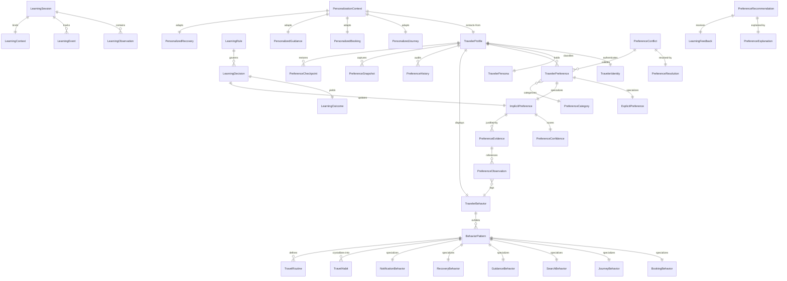

---

## 5. Traveler Persona Model

The system translates raw metrics into dynamic traveler persona archetypes to drive localized conflict priority and routing strategies. Persona definitions are deterministic, using structural classification rules:

| Persona | Definition / Rules | Primary Drives | Priority Scope |
|---|---|---|---|
| **Weekly Commuter** | Active routine on $\ge 3$ consecutive weeks on identical route segments, frequency $\ge 6$ rides/week. | Transit reliability, schedule precision. | Booking timing, Platform preferences. |
| **Business Traveler** | Solo bookings, high business quota usage, transfer tolerance low ($\le 15$ mins), booking lead time $\le 3$ days. | Efficiency, Comfort, Workspace amenities. | Comfort Preference, Delay tolerance. |
| **Leisure Family Traveler** | Multi-passenger ticket bookings ($\ge 3$ passengers), weekend departure, high travel budget. | Seat clustering, ease of boarding, comfort. | Seat alignment, Walking tolerance. |
| **Budget Seeker** | Highest frequency of lowest-class bookings, route search sorted strictly by price, zero premium add-ons. | Price maximization. | Budget Preference, Quota settings. |
| **Accessibility-Needs Traveler** | Explicitly declared medical/accessibility flag or repeated selection of wheelchair/elevator guidance assistance. | Seamless movement, step-free access. | Accessibility preference, Walking tolerance. |

---

## 6. Preference Intelligence

This section defines the core dimensions of traveler preferences managed by the system.

### [1] Preferred Train
* **Purpose:** Identifies the specific trains (by Train Number) a traveler repeatedly selects.
* **Priority:** 8/10
* **Applicability:** Route planning and booking options listing.
* **Confidence Threshold:** Minimum 3 selections of the same train on the same route segment.
* **Conflict Rules:** Overridden if explicit date-specific conflicts exist or if the train has an active service suspension.

### [2] Preferred Coach
* **Purpose:** Inclination towards specific coach locations (e.g., near engine, mid-train, near pantry).
* **Priority:** 5/10
* **Applicability:** Coach selection phase during seat allocation recommendations.
* **Confidence Threshold:** Minimum 4 consecutive bookings within the same coach category.
* **Conflict Rules:** Overruled if preferred class is not available in that coach category.

### [3] Preferred Class
* **Purpose:** Preferred service class (e.g., 1AC, 2AC, 3AC, CC, SL).
* **Priority:** 9/10
* **Applicability:** Seat selection and default search filter application.
* **Confidence Threshold:** Explicit setting or 3 consecutive purchases of the same class.
* **Conflict Rules:** Explicit preference overrides all. If implicit, higher class wins over lower class if budget limit is not violated.

### [4] Preferred Quota
* **Purpose:** Quota configuration (e.g., General, Ladies, Senior Citizen, Tatkal).
* **Priority:** 9/10
* **Applicability:** Search queries sent to railway inventory.
* **Confidence Threshold:** Explicit setting required for restricted quotas; implicit tracking forbidden for age-regulated quotas.
* **Conflict Rules:** Explicit setting strictly absolute.

### [5] Preferred Boarding Station
* **Purpose:** The preferred origin boarding point when multiple stations serve a city area (e.g., NDLS vs NZM in Delhi).
* **Priority:** 7/10
* **Applicability:** Route generation recommendations.
* **Confidence Threshold:** 4 consecutive departures from the same station for the city area.
* **Conflict Rules:** Overridden if chosen train does not halt at the preferred station.

### [6] Preferred Departure Window
* **Purpose:** Time of day preferred for departure (e.g., Morning 06:00-12:00, Evening 18:00-00:00).
* **Priority:** 7/10
* **Applicability:** Journey recommendations sorting.
* **Confidence Threshold:** 5 consecutive bookings in the same quadrant.
* **Conflict Rules:** Commuter Persona rules overwrite standard default time windows.

### [7] Preferred Arrival Window
* **Purpose:** Time of day preferred for arrival at destination.
* **Priority:** 6/10
* **Applicability:** Journey recommendation filters.
* **Confidence Threshold:** 5 consecutive bookings matching the destination arrival pattern.
* **Conflict Rules:** Subordinate to departure window preference in overall journey scoring.

### [8] Preferred Platform Side
* **Purpose:** Preference for which side of the coach doors open on arrival (e.g., for ease of rapid exit).
* **Priority:** 3/10
* **Applicability:** Guidance and platform exit coordination.
* **Confidence Threshold:** 10 consecutive selections of platforms matching a specific side pattern.
* **Conflict Rules:** Strictly disabled during operational platform changes announced in real-time.

### [9] Walking Tolerance
* **Purpose:** Maximum comfortable walking distance within stations (categorized as HIGH, MEDIUM, LOW).
* **Priority:** 7/10
* **Applicability:** Guidance navigation path generation.
* **Confidence Threshold:** Defaults to MEDIUM. Adjusted to LOW if elevator usage pattern observed 3 times consecutively.
* **Conflict Rules:** Accessibility policy overrides general walking tolerance.

### [10] Transfer Tolerance
* **Purpose:** Minimum acceptable time duration for train transfers (in minutes).
* **Priority:** 8/10
* **Applicability:** Multi-segment journey connection compilation.
* **Confidence Threshold:** 3 manual overrides selecting longer connection buffers.
* **Conflict Rules:** System safety minimums (e.g., 20 mins) strictly override any lower traveler transfer preferences.

### [11] Delay Tolerance
* **Purpose:** Acceptable train delay margin before triggers for recovery actions are offered.
* **Priority:** 8/10
* **Applicability:** Disruption recovery recommendations.
* **Confidence Threshold:** Determined by historic prompt rejects of recovery routes during minor delays.
* **Conflict Rules:** Overridden during full cancellations or safety alerts.

### [12] Budget Preference
* **Purpose:** Price ceiling and sensitivity constraints for ticket bookings.
* **Priority:** 8/10
* **Applicability:** Sorting and filtering booking suggestions.
* **Confidence Threshold:** 5 consecutive choices of low-cost options vs. premium alternatives.
* **Conflict Rules:** Explicitly set corporate budget limits strictly overwrite personal budgets.

### [13] Comfort Preference
* **Purpose:** Preference for premium amenities (e.g., AC, window seat, lower berth).
* **Priority:** 6/10
* **Applicability:** Booking seat matching.
* **Confidence Threshold:** 4 matches.
* **Conflict Rules:** Overridden if desired berth type is unavailable.

### [14] Accessibility Preference
* **Purpose:** Specific physical access needs (wheelchair access, companion seating).
* **Priority:** 10/10
* **Applicability:** Across all platforms, specifically Guidance and Booking.
* **Confidence Threshold:** Strictly explicit or triggered by verified medical certificate quota.
* **Conflict Rules:** Absolute priority. Overrides all speed/efficiency preferences.

### [15] Medical Preference
* **Purpose:** Specific medical requirements (e.g., lower berth preference for lower limb conditions, proximity to restrooms).
* **Priority:** 10/10
* **Applicability:** Seat allocation scoring.
* **Confidence Threshold:** Explicit traveler declaration.
* **Conflict Rules:** Absolute priority over standard comfort rules.

### [16] Family Preference
* **Purpose:** Preference for booking group proximity (seats adjacent or in same cabin).
* **Priority:** 7/10
* **Applicability:** Multi-passenger booking flows.
* **Confidence Threshold:** Automatic when booking size $\ge 2$.
* **Conflict Rules:** Overruled if seat availability cannot accommodate group positioning without downgrading class.

### [17] Business Travel Preference
* **Purpose:** Business travel requirements (invoice generation, GST details, specific departure windows).
* **Priority:** 8/10
* **Applicability:** Corporate billing profile workflows.
* **Confidence Threshold:** Explicit business profile toggle activation.
* **Conflict Rules:** Overrides leisure preferences during active business trips.

### [18] Tourism Preference
* **Purpose:** Leisure routing preference (scenic routes, hop-on options, longer layovers).
* **Priority:** 5/10
* **Applicability:** Alternate journey recommendations.
* **Confidence Threshold:** Selection of scenic route tags during search.
* **Conflict Rules:** Subordinate to time efficiency constraints unless explicitly flagged.

### [19] Language Preference
* **Purpose:** System interface and voice guidance language setting.
* **Priority:** 9/10
* **Applicability:** All customer touchpoints.
* **Confidence Threshold:** Explicit setting; falls back to OS default language.
* **Conflict Rules:** System defaults to English/Hindi if local language translation is missing.

### [20] Notification Preference
* **Purpose:** Active channel choices (Push, WhatsApp, SMS) and frequency limits.
* **Priority:** 8/10
* **Applicability:** Notification dispatcher engine.
* **Confidence Threshold:** Explicit opt-in.
* **Conflict Rules:** Operational emergency notifications override quiet hours or opt-outs.

### [21] Reminder Preference
* **Purpose:** Timing for departure and boarding reminders (e.g., 2 hours before vs. 4 hours before).
* **Priority:** 6/10
* **Applicability:** Traveler Assistance dispatcher.
* **Confidence Threshold:** 3 modifications to automated calendar entries.
* **Conflict Rules:** Overruled by critical schedule changes.

### [22] Recovery Preference
* **Purpose:** Auto-refund vs. auto-rebook selection defaults during disruptions.
* **Priority:** 9/10
* **Applicability:** Traveler Assistance recovery flows.
* **Confidence Threshold:** Explicit registration.
* **Conflict Rules:** Rebooking fails back to refund if no alternative seats exist within 12 hours.

### [23] Guidance Preference
* **Purpose:** Preferences for step-by-step guidance styles (e.g., Audio-only, Map-based, Text-only).
* **Priority:** 6/10
* **Applicability:** Station guidance module.
* **Confidence Threshold:** Mode selected on first 3 trips.
* **Conflict Rules:** Low bandwidth defaults to Text-only guidance.

---

## 7. Behavioral Intelligence

The system utilizes deterministic behavioral rules to map raw observations into active preference metrics without statistical clustering or machine learning logic.

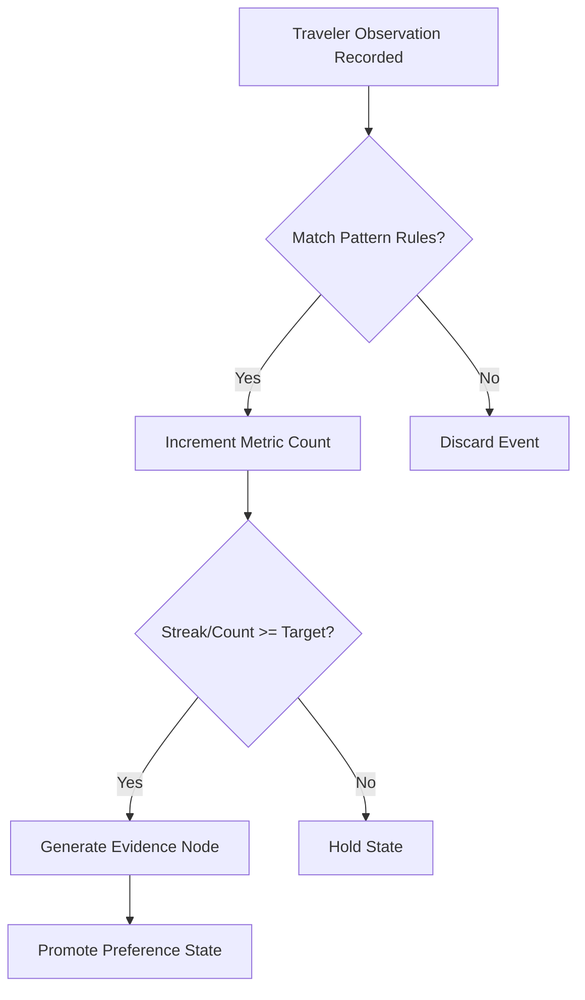

### Dynamic Parameters

* **Observation Interval:** The temporal window during which observations are counted. Default is `30 days`.
* **Evidence Threshold:** The minimum count of matching observations required to trigger a preference state update. Default is `5 occurrences`.
* **Decay Rate:** The reduction in behavioral metric score due to temporal distance or inactivity. Formula:
  $$\text{Score}_{t} = \text{Score}_0 \times (1 - \lambda \cdot \Delta t)$$
  Where:
  * $\text{Score}_{t}$ is the current score.
  * $\text{Score}_0$ is the initial score.
  * $\lambda$ is the decay constant (default `0.05` per day of inactivity).
  * $\Delta t$ is the elapsed time in days.
* **Confidence Calculation:** Confirmed score divided by maximum expectation:
  $$\text{Confidence} = \min\left(1.0, \frac{\text{Occurrence Count}}{\text{Target Threshold}}\right)$$

### Behavioral Scenarios

#### Scenario A: Repeated Train Selection
* **Observation:** Traveler purchases a ticket for Train `12002` (Shatabdi Express) on route NDLS-BPL.
* **Evidence:** Record count of same train selection in past 45 days.
* **Confidence:** 5 bookings = `1.00` Confidence. 3 bookings = `0.60` Confidence.
* **Decay:** Drops to 0 after 60 days of zero bookings on the target route segment.
* **Reset:** If user manually filters out or unselects the train from recommendations twice, score resets to `0`.

#### Scenario B: Repeated Route Selection
* **Observation:** Search query for NDLS to BPL.
* **Evidence:** Number of searches or bookings on this specific route sector.
* **Confidence:** $\ge 6$ searches in 14 days = HIGH (`0.85`).
* **Decay:** Half-life of 14 days without active queries.
* **Reset:** Purged upon user clearing search history.

#### Scenario C: Repeated Boarding Choice
* **Observation:** User boards at Hazrat Nizamuddin (NZM) instead of New Delhi (NDLS) for trains where both options are valid.
* **Evidence:** Tracking boarding station scans or ticket records.
* **Confidence:** 3 consecutive boarding choices = `0.80` confidence.
* **Decay:** `0.02` per day.
* **Reset:** Instantly cleared if traveler changes explicit home address.

#### Scenario D: Repeated Booking Pattern
* **Observation:** Booking tickets on Friday evenings for Monday morning departures.
* **Evidence:** Timestamp checks on ticket issues.
* **Confidence:** 4 repetitions in 4 weeks = `0.90`.
* **Decay:** Score drops if schedule is broken for two consecutive weeks.
* **Reset:** Explicit commuter toggle status change resets values.

#### Scenario E: Repeated Reminder Acceptance
* **Observation:** User taps on "Set Calendar Reminder" notification.
* **Evidence:** Taps vs. Dismiss counts.
* **Confidence:** Acceptance rate $\ge 80\%$ over 5 reminders = HIGH.
* **Decay:** Non-usage for 30 days decays confidence by `0.20`.
* **Reset:** Reset to default if user changes communication settings.

#### Scenario F: Repeated Guidance Acceptance
* **Observation:** Traveler follows the recommended terminal walking path.
* **Evidence:** Match of real-time transit check-ins to recommended path steps.
* **Confidence:** 3 successful completions = `0.75`.
* **Decay:** `0.10` per month.
* **Reset:** Reset to default if traveler explicitly switches guidance mode.

#### Scenario G: Repeated Recovery Acceptance
* **Observation:** Traveler accepts the auto-rebook alternative offered during train delay.
* **Evidence:** Interactive click selection of recovery suggestions.
* **Confidence:** 2 accepts = `0.80`.
* **Decay:** Lifetime of 180 days due to low frequency of recovery events.
* **Reset:** Purged on recovery setting update.

#### Scenario H: Repeated Search Pattern
* **Observation:** Applying "AC-only" and "Depart after 18:00" filters on every search.
* **Evidence:** Search filter state capture.
* **Confidence:** 6 consecutive identical searches = `0.95`.
* **Decay:** Resets to zero if 3 searches are executed with different parameters.
* **Reset:** Clicking "Clear Filters" resets the search bias weight.

#### Scenario I: Repeated Cancellation Pattern
* **Observation:** Cancelling bookings within 24 hours of departure.
* **Evidence:** Ticket status changes.
* **Confidence:** 3 cancellations in 30 days = `0.70` (raises intent flags for high risk).
* **Decay:** 90 days with zero cancellations.
* **Reset:** User-initiated support call clears cancellation risk weight.

#### Scenario J: Repeated Manual Override
* **Observation:** User manually changes the recommended boarding station back to default.
* **Evidence:** Counter metrics tracking manual setting rollbacks.
* **Confidence:** 2 manual overrides = `1.00` confidence in the override preference.
* **Decay:** Never decays (treated as hard user setting).
* **Reset:** Explicit configuration reset.

---

## 8. Learning Framework

The continuous learning module operates via a strict deterministic state engine. 

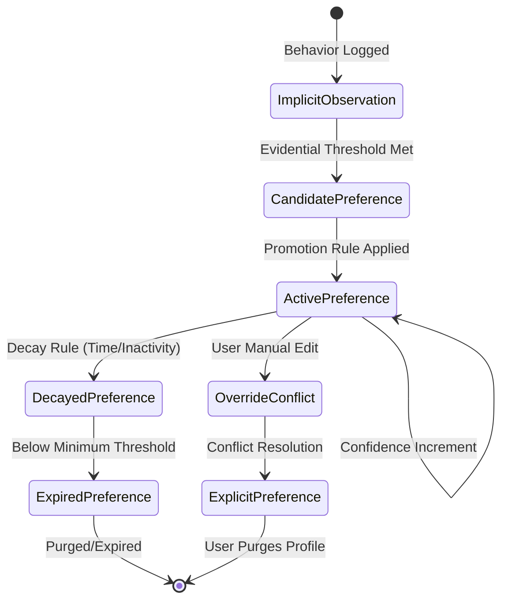

### Learning Framework Operations
* **Explicit Feedback Handling:** Immediate update. User rating or configuration input triggers instant overwrite of the preference. Confident weight is hardcoded to `1.00`.
* **Implicit Observation Processing:** Increments observation metrics; processes daily to calculate confidence level.
* **Preference Evolution:** Gradual shifting of preference values (e.g., shifting departure window from 08:00 to 09:00 if behavior shifts progressively).
* **Confidence Growth:** Incremented by $+0.10$ for each matching observation, capped at $1.00$.
* **Confidence Decay:** Decremented by $-0.05$ per day without matching observations.
* **Preference Merge:** Joining identical preferences from different devices or channels under a unified profile ID.
* **Preference Split:** Occurs when distinct behaviors are identified (e.g., Friday morning business travel vs. Sunday evening leisure travel). The system forks the preference based on the `TravelObjective` context.
* **Preference Reset:** Clears all parameters for a specific category, returning to system defaults.
* **Preference Expiration:** Automatic deletion of implicit preferences if confidence falls below `0.20`.
* **Preference Validation:** Schema verification checks running before any preference is written to `PersonalizationContext`.
* **Preference Promotion:** Moving an implicit candidate preference to `ACTIVE` status once confidence exceeds `0.70`.
* **Preference Demotion:** Moving an active implicit preference to `DECAYED` status if confidence falls below `0.40`.

---

## 9. Personalization Pipeline

This pipeline handles personalization execution. It intercepts raw predictions/recommendations and formats them to traveler preferences.

```mermaid
flowchart LR
    Event[Traveler Event] --> Obs[Observation Stage]
    Obs --> Context[Learning Context]
    Context --> Eval[Preference Evaluation]
    Eval --> Conflict[Conflict Resolution]
    Conflict --> Conf[Confidence Calculation]
    Conf --> Decision[Personalization Decision]
    Decision --> Adaptation[Recommendation Adaptation]
    Adaptation --> Explanation[Explanation & Audit]
    Explanation --> ContextReady[AIReady Context Output]
```

### Stage 1: Traveler Event Capture
* **Responsibilities:** Intercept raw traveler actions (clicks, searches, bookings).
* **Inputs:** System action telemetry payload.
* **Outputs:** Canonical `TravelerEvent` schema.
* **Ownership:** Gateway Router.
* **Failure Behavior:** Silent drop; log event ingestion warning. Never interrupt user session.

### Stage 2: Observation Logging
* **Responsibilities:** Format events into structured preference observations.
* **Inputs:** `TravelerEvent`.
* **Outputs:** `PreferenceObservation`.
* **Ownership:** Behavioral Intelligence.
* **Failure Behavior:** Write to local retry buffer; queue for background processing.

### Stage 3: Learning Context Matching
* **Responsibilities:** Correlate observation with active environmental constraints (weather, delays).
* **Inputs:** `PreferenceObservation` + system telemetry.
* **Outputs:** `LearningContext`.
* **Ownership:** Learning Engine.
* **Failure Behavior:** Strip environmental factors; proceed with raw observation data.

### Stage 4: Preference Evaluation
* **Responsibilities:** Trigger rules matching observations to preference candidate updates.
* **Inputs:** `LearningContext`.
* **Outputs:** Preference candidate mutations list.
* **Ownership:** Learning Engine.
* **Failure Behavior:** Abort evaluation, preserve existing active preferences.

### Stage 5: Conflict Resolution
* **Responsibilities:** Check candidate mutations against explicit preferences and policies.
* **Inputs:** Preference mutations list + active `TravelerPreference` map.
* **Outputs:** Resolved preferences list.
* **Ownership:** Conflict Resolution Engine.
* **Failure Behavior:** Default strictly to Explicit preferences or system defaults.

### Stage 6: Confidence Calculation
* **Responsibilities:** Evolve confidence score metrics.
* **Inputs:** Resolved preferences list.
* **Outputs:** Updated confidence maps.
* **Ownership:** Personalization Engine.
* **Failure Behavior:** Keep prior confidence level.

### Stage 7: Preference Update commit
* **Responsibilities:** Persist updated preferences to the database.
* **Inputs:** Confirmed preference maps.
* **Outputs:** Transaction status.
* **Ownership:** Data Platform.
* **Failure Behavior:** Database transaction rollback; trigger recovery sync.

### Stage 8: Personalization Decision
* **Responsibilities:** Evaluate if personalization should be applied to the current request.
* **Inputs:** `PersonalizationContext` + Request parameters.
* **Outputs:** Decision directive (Apply / Pass-through).
* **Ownership:** Policy Engine.
* **Failure Behavior:** Fallback to pass-through (no personalization applied).

### Stage 9: Recommendation Adaptation
* **Responsibilities:** Transform raw predictions of underlying intelligence engines.
* **Inputs:** Raw Recommendation DTO + `PersonalizationContext`.
* **Outputs:** Adapted Personalized DTO.
* **Ownership:** Personalization Engine.
* **Failure Behavior:** Fallback to unmodified raw intelligence engine recommendations.

### Stage 10: Explanation Generation
* **Responsibilities:** Generate the structured user-facing explainability model.
* **Inputs:** Decision details + active rules triggers.
* **Outputs:** `PreferenceExplanation`.
* **Ownership:** Explainability Domain.
* **Failure Behavior:** Populate explanation with default fallback text: "Based on standard profile defaults."

### Stage 11: Audit Log Generation
* **Responsibilities:** Commit immutable audit trace records.
* **Inputs:** Adaption inputs, outputs, explanation references.
* **Outputs:** Cryptographically hashed audit ledger entry.
* **Ownership:** Audit Engine.
* **Failure Behavior:** Store in local secure disk partition; raise critical system alert.

### Stage 12: Metrics Update
* **Responsibilities:** Increment acceptance/usage metrics.
* **Inputs:** Operational outcomes.
* **Outputs:** Metrics endpoints update.
* **Ownership:** Metrics Engine.
* **Failure Behavior:** Drop metrics updates; do not block operations.

### Stage 13: Personalized AIReady Context Assembly
* **Responsibilities:** Output finalized payload formatted for downstream consumption.
* **Inputs:** Adapted Personalized DTO + explanation context + audit token.
* **Outputs:** `TravelerPersonalizationContext`.
* **Ownership:** Context Engine.
* **Failure Behavior:** Revert output to base canonical unpersonalized DTO structure.

---

## 10. Policy Registry

System policies reside in a central, immutable configuration file.

```yaml
# Policy Registry Configuration Schema
policies:
  preference_policy:
    max_active_implicit_preferences: 50
    default_expiration_days: 90
    allow_implicit_cross_device_sync: true

  confidence_policy:
    min_confidence_to_apply: 0.70
    initial_confidence_weight: 0.50
    observation_impact_increment: 0.10
    daily_decay_constant: 0.05

  learning_policy:
    min_observations_for_promotion: 5
    max_learning_sessions_per_hour: 60
    learning_rule_reload_mode: DETERMINISTIC_SYNC

  conflict_policy:
    explicit_always_wins: true
    persona_priority_map:
      accessibility_needs: 10
      business_traveler: 8
      weekly_commuter: 7
      leisure_family_traveler: 6
      budget_seeker: 5

  reset_policy:
    allow_partial_category_reset: true
    retention_after_reset_seconds: 0  # Instant physical purge for compliance
    backup_before_reset: false

  consent_policy:
    opt_in_required_for_implicit: true
    allow_granular_opt_out: true
    consent_reverification_interval_days: 365

  retention_policy:
    raw_observation_ttl_days: 30
    audit_log_retention_days: 1095  # 3 Years regulatory
    inactive_profile_ttl_days: 365

  privacy_policy:
    encryption_standard: AES_256_GCM
    hash_algorithm: SHA_256
    redact_pii_fields: ["pnr", "mobile", "email", "name"]

  explainability_policy:
    require_evidence_links: true
    fallback_template: "Default settings applied."

  audit_policy:
    immutable_write_retries: 3
    require_correlation_id: true

  metrics_policy:
    collection_interval_seconds: 60
    publish_format: PROMETHEUS_METRICS

  health_policy:
    heartbeat_interval_seconds: 10
    degradation_threshold_ms: 250
```

---

## 11. State Machines

### Preference State Machine
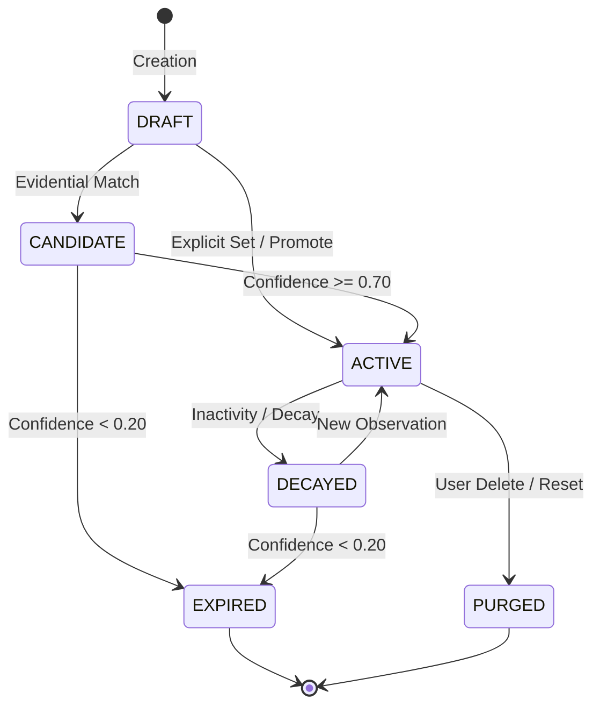
* *Retention:* Active preferences live indefinitely. Candiate/Decayed configurations expire to `[*]`.
* *Archival:* Expired implicit configurations are physically deleted. Explicit purges are instantly wiped.

### Learning Session State Machine
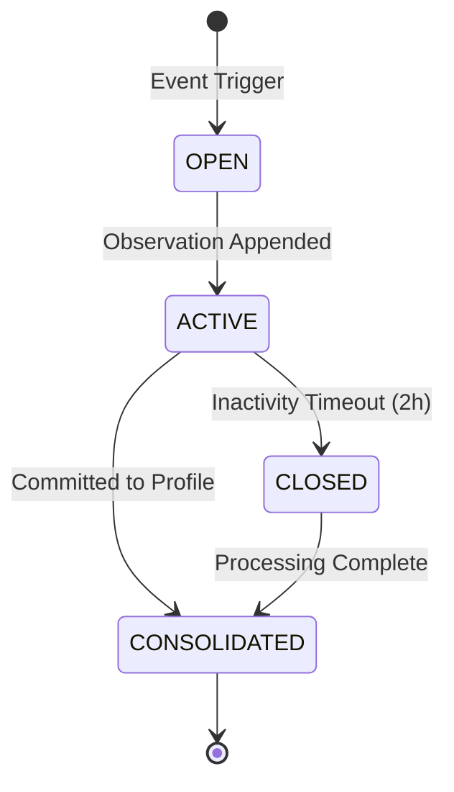
* *Retention:* Aggregated metrics are saved; raw session variables are cleared.

### Observation State Machine
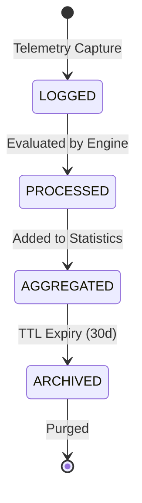
* *Retention:* Raw data deleted after 30 days.

### Feedback State Machine
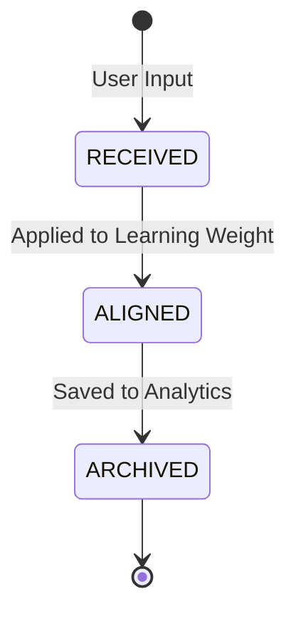

### Confidence State Machine
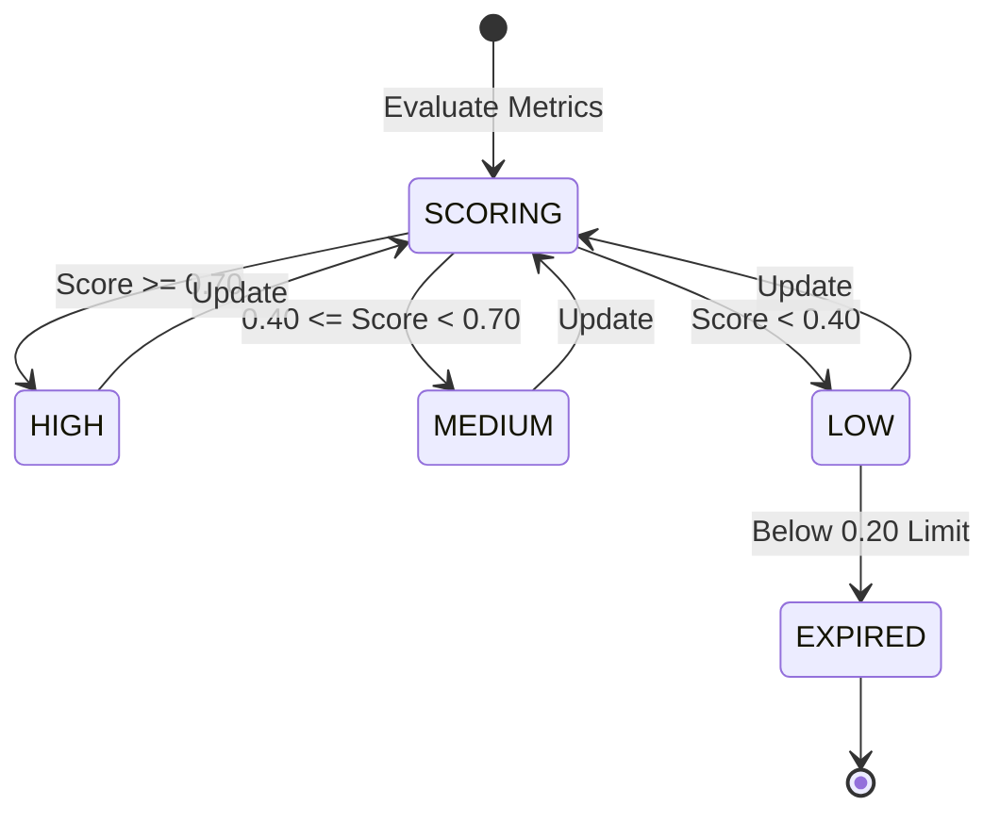

### Traveler Intent State Machine
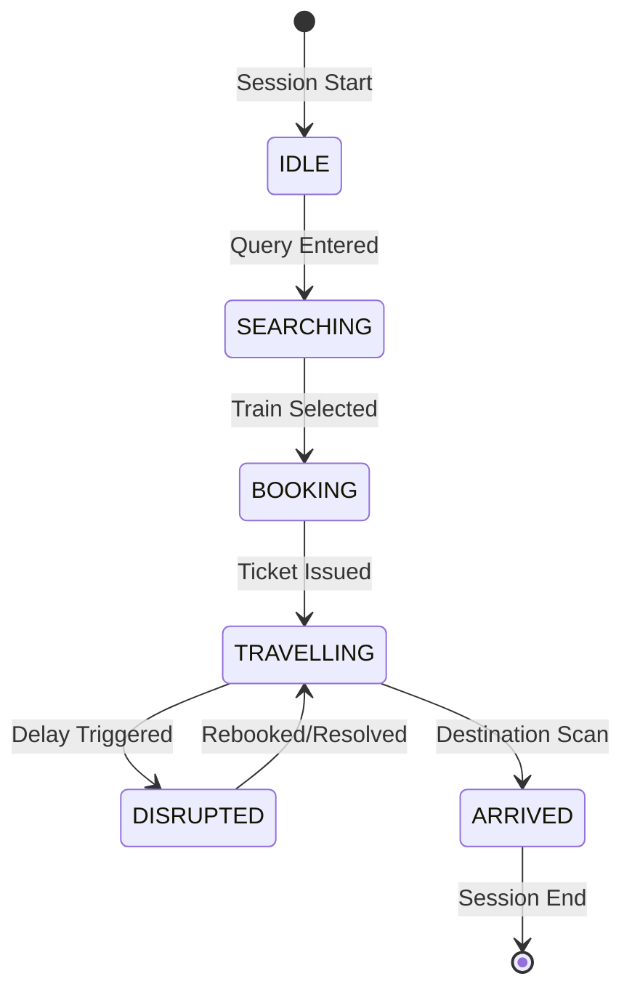

### Personalization Context State Machine
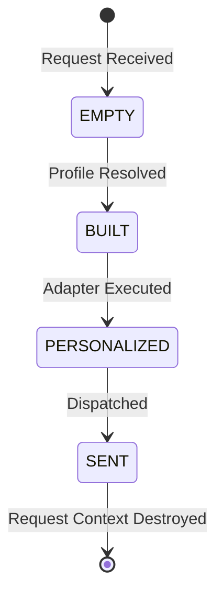

### Preference Snapshot State Machine
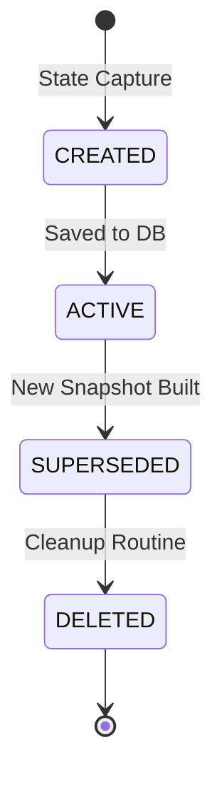

### Preference Checkpoint State Machine
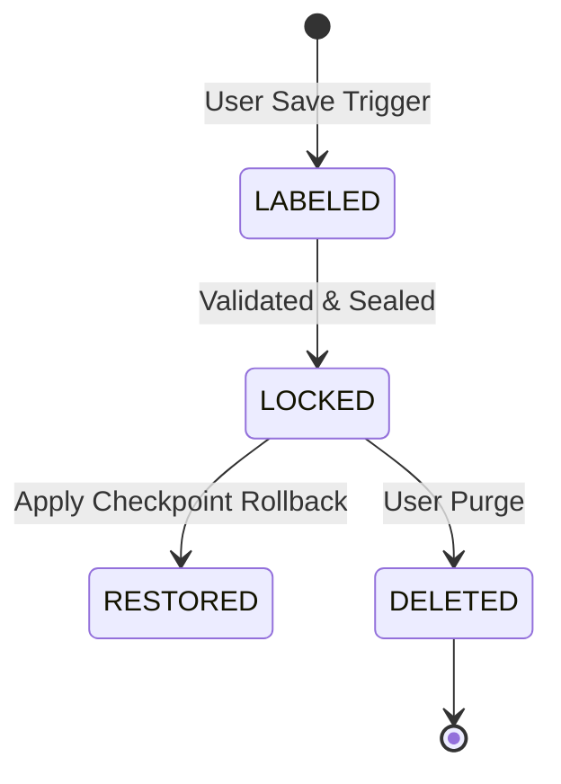

---

## 12. TravelerPersonalizationContext

The `TravelerPersonalizationContext` is the single, immutable DTO schema used to inject traveler context into all intelligence services:

```json
{
  "$schema": "https://railyatra.ai/schemas/personalization-context-v1.json",
  "correlation_id": "c7a9b012-3456-7890-abcd-ef1234567890",
  "traveler_id": "usr_99214732a",
  "version": 14,
  "timestamp": "2026-07-16T13:43:10Z",
  "profile": {
    "persona": "WEEKLY_COMMUTER",
    "explicit_preferences": {
      "language": "hi",
      "accessibility_mode": false,
      "preferred_class": "3AC",
      "notification_channel": "WHATSAPP"
    },
    "implicit_preferences": {
      "preferred_boarding_station": "NZM",
      "departure_window": "08:00-12:00",
      "walking_tolerance": "MEDIUM"
    }
  },
  "behavior": {
    "recent_activity_count": 42,
    "last_active_date": "2026-07-16T12:00:00Z"
  },
  "intent": {
    "active_state": "TRAVELLING",
    "target_route": {
      "origin": "NDLS",
      "destination": "BPL"
    }
  },
  "confidence": {
    "preferred_boarding_station_score": 0.85,
    "departure_window_score": 0.60
  },
  "evidence": {
    "preferred_boarding_station_refs": [
      "obs_f23901b4", "obs_a901f43a", "obs_c7810e2f"
    ]
  },
  "explanation_context": {
    "boarding_station_rationale": "NZM selected because you boarded here on your last 3 trips."
  },
  "audit_signature": "6e3b0c2a8f901d83eef73a21bc901e83fa2e93b140cd982aef12d03faecbc941",
  "telemetry": {
    "client_version": "v5.6.0-release",
    "originating_ip": "192.168.1.5"
  }
}
```

---

## 13. Conflict Resolution

Personalization must resolve competing values using deterministic priority hierarchy rules:

```mermaid
decision_table
    "Rules Priority Hierarchy"
    -------------------------------------------------------------------------------------
    Rule Type               | Strategy Applied              | Deterministic Precedence
    -------------------------------------------------------------------------------------
    Explicit vs. Implicit   | Explicit Input Overrides      | Explicit is Absolute
    Old vs. New Preference  | Evaluated by Recency/Score    | New if Confidence >= 0.70
    Traveler vs. Policy     | Policy Constraints Override   | Safety & Limits Override
    Conflicting Personas    | Highest Weight Priority Wins  | Archetype Weight Rule
    Conflicting Behaviors   | Direct to Multi-Objective     | Split Preference Mappings
    -------------------------------------------------------------------------------------
```

### Deterministic Conflict Policies
1. **Explicit vs. Implicit:** Explicit preferences always override implicit preferences. If a traveler explicitly configures "AC Coach Class" as a preference, the system will never suggest non-AC coaches, even if their last 5 bookings were non-AC (e.g., due to holiday booking rushes).
2. **Old vs. New (Implicit Transition):** When a new behavior conflicts with an existing implicit preference, the confidence of the old preference is decayed while the confidence of the new preference increments. The swap occurs only when the new preference's confidence exceeds the old preference's confidence by a margin of $\Delta \ge 0.20$.
3. **Traveler Override vs. Policy Override:** System policies (e.g., maximum travel duration limits, minimum connecting intervals, age validation checks for Senior Citizen quotas) cannot be overridden by traveler preferences.
4. **Multi-Objective Persona Conflict:** If a traveler fits both "Business Traveler" and "Leisure Family Traveler" categories, the preference resolution defaults to the context of the specific request:
   * Single-ticket bookings default to **Business Traveler** parameters.
   * Multi-ticket bookings default to **Leisure Family Traveler** parameters.

---

## 14. Privacy & Consent

The system enforces data protection rules at the architectural level:

* **Explicit Opt-in Consent:** Implicit preference learning is inactive by default. The system requires an explicit opt-in event (`CONSENT_OPT_IN_V1`) from the user before recording any behavioral telemetry.
* **Granular Preference Deletion:** The user dashboard provides options to delete individual implicit/explicit preference rows, clearing the evidence references and observation logs.
* **Consent Versioning:** If privacy policies change, consent is flagged as expired. Learning is suspended until the traveler accepts the new consent version.
* **Data Minimization:** No third-party tracking identifiers or marketing graphs are ingested. Data logged is limited strictly to structural railway passenger transactions.
* **Purge Engine ("Forget Me"):** Triggering the "Forget Me" function starts a database transaction that executes hard deletes across:
  `TravelerProfile`, `TravelerPreference`, `PreferenceObservation`, `PreferenceHistory`, and `PreferenceSnapshot`.

---

## 15. Explainability Framework

Every personalized recommendation must carry a structured payload explaining the rationale behind the adaptation.

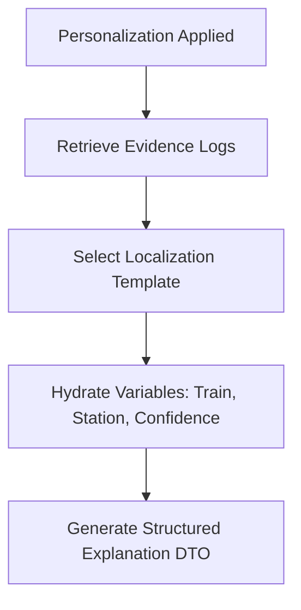

### Explanation Schema (Explainability DTO)
```json
{
  "explanation_id": "exp_a78912cd",
  "target_preference": "preferred_boarding_station",
  "applied_value": "NZM",
  "confidence_level": "HIGH",
  "explanation_text": "we suggested Hazrat Nizamuddin (NZM) because you departed from this station on your last 4 trips.",
  "evidence_summary": {
    "observation_count": 4,
    "last_observed": "2026-07-15T08:30:00Z"
  },
  "user_actions": {
    "override_available": true,
    "reset_available": true,
    "original_value": "NDLS"
  }
}
```

---

## 16. Audit Framework

All personalization updates and application decisions commit audit trail logs to ensure accountability:

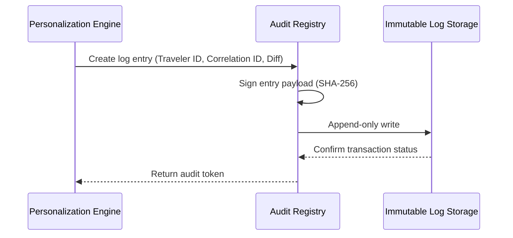

### Audit Trail Schema
```json
{
  "audit_id": "aud_092174ba",
  "correlation_id": "c7a9b012-3456-7890-abcd-ef1234567890",
  "timestamp": "2026-07-16T13:43:10Z",
  "traveler_id": "usr_99214732a",
  "action": "PREFERENCE_APPLIED",
  "change_log": {
    "field": "preferred_class",
    "old_value": "SL",
    "new_value": "3AC"
  },
  "policy_applied": "POLICY-CONFIDENCE-V1",
  "cryptographic_hash": "2f78b9c1d01e4a3b8c9e0fa12b34cd56ef78ba90cd12ab34ef5678ab90cd12ef"
}
```

---

## 17. Metrics Framework

The system tracks metrics to evaluate the performance of the personalization engine:

* **Preference Accuracy:** Ratio of personalized selections accepted without modification vs. total suggestions presented:
  $$\text{Accuracy} = \frac{\text{Accepted Personalizations}}{\text{Total Personalizations Offered}}$$
* **Override Rate:** The percentage of times a traveler manually overrides a personalized suggestion.
* **Reset Rate:** The percentage of times users click "Reset Preferences" in their profile panel.
* **Learning Latency:** The duration of time elapsed between a logged observation and the resulting update of the implicit preference.
* **Personalization Coverage:** The percentage of active search requests that have personalization parameters successfully injected.
* **Confidence Distribution:** The ratio of HIGH, MEDIUM, and LOW confidence configurations across the user database.

---

## 18. Health Framework

The health check framework monitors the engines to ensure liveness and performance:

* **Preference Engine:** Health tracks read/write access latency for user profile settings.
* **Learning Engine:** Heartbeat checks queue depth of pending `PreferenceObservation` records.
* **Conflict Engine:** Verifies that conflict rule matching execution times remain under $20\text{ ms}$.
* **Confidence Engine:** Monitors scheduled decay loop execution states.
* **Explanation Engine:** Monitors template resolution and translation library availability.
* **Policy Engine:** Checks schema validation liveness for the centralized policy definitions.
* **Audit Engine:** Monitors write buffer utilization of the append-only logs database.

---

## 19. Timeline Governance

Personalization data requires precise lifecycle and TTL configurations:

```mermaid
gantt
    title Ingested Data Expiry & Rotation Timelines
    dateFormat  X
    axisFormat %d days
    
    section Ingested Data
    Raw Observation Log (TTL)     :active, 0, 30
    Learning Session (TTL)        :crit, 0, 1
    Active Implicit Preference   :after active, 30, 90
    Backup Checkpoint (Retention) : 0, 1095
    Audit Log Trail (Retention)   : 0, 1095
```

* **Observation TTL:** Raw behavioral telemetry records are hard-expired and deleted after `30 days`.
* **Learning Session TTL:** Active sessions time out after `2 hours` of inactivity, consolidating state.
* **Implicit Expiry:** Inactive implicit preferences decay daily and are purged if they fall below the minimum confidence threshold for `90 days`.
* **Audit and Checkpoint Retention:** Standardized at `3 years` (1095 days) for regulatory compliance.

---

## 20. Event Lifecycle

A typical personalization transaction executes along a deterministic path:

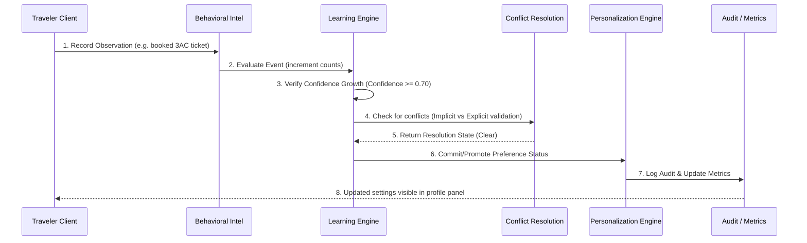

---

## 21. Cross-Phase Ownership Matrix

To prevent architectural overlap and maintain clear separation of responsibilities:

```mermaid
matrix
    "Boundary Separation Matrix"
    -------------------------------------------------------------------------------------------------
    Phase/Milestone         | Domain Ownership               | Output Contract
    -------------------------------------------------------------------------------------------------
    5.2 Railway Intel       | Trains, Schedules, Platforms   | Raw Schedule & Delay Predictions
    5.3 Journey Intel       | Route options, transfers       | Multi-modal Route Choices
    5.4 Booking Intel       | Availability, ticketing, seats | Optimal Booking Options List
    5.5 Traveler Assistance | Station Navigation, Recovery   | Guidance Steps & Disruption Alerts
    5.6 Personalization     | Profiles, Preferences, Habits   | TravelerPersonalizationContext Injector
    -------------------------------------------------------------------------------------------------
```

* **5.2 Railway Intelligence:** Determines if a train will be delayed. It does not know who is riding.
* **5.3 Journey Intelligence:** Identifies all physical paths to get from Delhi to Bhopal. It does not decide which path a traveler prefers.
* **5.4 Booking Intelligence:** Lists available seats. It does not select lower berths for elderly travelers unless explicitly passed the profile constraints.
* **5.5 Traveler Assistance:** Triggers a re-route navigation suggestion when a train is cancelled. It uses the `TravelerPersonalizationContext` to filter these options.
* **5.6 Personalization:** Owns the traveler's historical context. It acts as a wrapper that filters and ranks the output of 5.2, 5.3, 5.4, and 5.5, but never replicates their core calculations.

---

## 22. Future Evolution Roadmap

The following capabilities are reserved for future phases and are excluded from the current design scope:

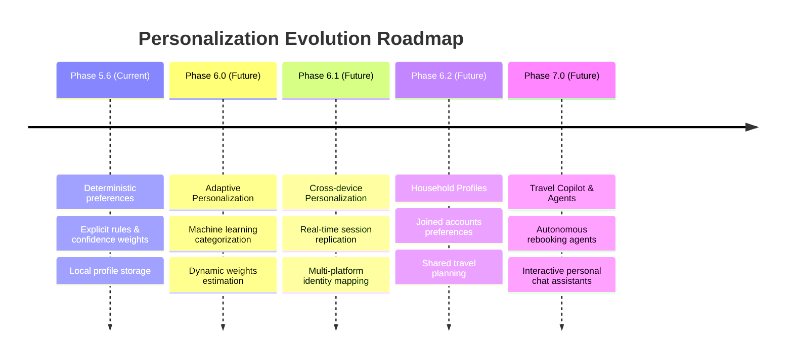

---

## 23. ADR Recommendations

### ADR 021: Deterministic Confidence Thresholding
* **Status:** PROPOSED.
* **Context:** The system must determine when an inferred behavior becomes an active recommendation.
* **Decision:** We reject statistical clustering in favor of a clear, integer-based threshold calculation (e.g., minimum 5 observations with daily decay). This guarantees 100% test reproducibility.
* **Consequences:** Easier debugging and auditing, but less adaptive to subtle, multi-variable traveler behavior changes.

### ADR 022: Local Storage first for Telemetry Ingestion
* **Status:** PROPOSED.
* **Context:** Network latency must not impact traveler booking steps.
* **Decision:** Telemetry data is recorded locally on the device client database and synced asynchronously during low-utilization windows.
* **Consequences:** Ensures zero performance overhead on core search transactions, but means personalization changes might have a sync delay.

---

## 24. Risk Assessment

* **Risk 1: Preference Stale State**
  * *Description:* A user's travel habits shift (e.g., relocation), but old implicit preferences continue to dominate recommendations.
  * *Mitigation:* Apply daily confidence decay constants. Implement an explicit "Reset Preferences" button in the client interface.
* **Risk 2: Audit Logs Database Expansion**
  * *Description:* High frequency of transactions generates millions of audit log records, threatening storage limits.
  * *Mitigation:* Implement strict schema data minimization. Apply partition rotation and compress logs older than 90 days.
* **Risk 3: User Override fatigue**
  * *Description:* Users repeatedly undoing bad suggestions, leading to frustration.
  * *Mitigation:* Instantly reset confidence metrics to zero upon a single manual override of an implicit preference.

---

## 25. Architecture Compatibility Review

* **Integration with 5.2 (Railway Intel):** Verified. Personalization only modifies filters/sorting of the raw train schedules returned by 5.2.
* **Integration with 5.4 (Booking Intel):** Verified. DTO models map directly to standard booking request inputs.
* **Network & Proxy Compatibility:** The personalization engine is fully self-contained. It operates on local databases and does not require third-party calls, preserving offline capabilities.

---

## 26. Discovery Readiness Assessment
The domain discovery for Milestone 5.6 is complete. The canonical domain models, state transition machines, conflict policies, and architectural boundaries have been defined. The milestone is ready to proceed to the Planning and Implementation phase.

---

## 27. Definition of Done
This discovery phase is complete when:
1. This file `Milestone_5_6_Discovery.md` is successfully compiled in the workspace.
2. The domain model entity count (48) matches all structural requirements.
3. No machine learning models, cloud personalization APIs, or reinforcement learning concepts are included in the specifications.
4. The DTO contracts align with existing Phase 5 services.
5. The `TravelerPersonalizationContext` is defined.

---

## 28. Centralized Decision Reason Code Registry

To guarantee explainability and auditability, every personalization decision produces a machine-readable reason code from this centralized registry:

### [1] PREF_EXPLICIT_CLASS
* **Purpose:** Indicates the output was modified to match the traveler's explicitly selected seating/service class.
* **Owner:** Personalization Engine.
* **Trigger:** Match on active `ExplicitPreference` for `preferred_class` during booking ranking.
* **Priority:** HIGH (Precedence 5).
* **Applicability:** `PersonalizationPolicyEngine` / `BookingIntelligenceAdapter`.
* **Explanation Mapping:** "Matched your profile setting for preferred service class."
* **Audit Mapping:** Logs profile ID, selected class string, explicit flag.
* **Future Extension:** Extensible to support class ranges (e.g., "any AC tier").

### [2] PREF_IMPLICIT_CLASS
* **Purpose:** Indicates output was modified based on an inferred class preference.
* **Owner:** Learning Engine.
* **Trigger:** Confidence threshold $\ge 0.70$ on `ImplicitPreference` for `preferred_class`.
* **Priority:** MEDIUM (Precedence 9).
* **Applicability:** `PersonalizationPolicyEngine` / `BookingIntelligenceAdapter`.
* **Explanation Mapping:** "Based on your recent booking history, we selected this service class."
* **Audit Mapping:** Logs confidence score, supporting evidence observation IDs, target class.
* **Future Extension:** Adaptive confidence decay scale depending on season.

### [3] PREF_BOARDING_REPEAT_SELECTION
* **Purpose:** Indicates a station selection modification due to repeated boarding history.
* **Owner:** Behavioral Intelligence.
* **Trigger:** 3+ consecutive departures from a specific station node within a multi-station metropolitan area.
* **Priority:** LOW (Precedence 11).
* **Applicability:** `JourneyIntelligenceAdapter` / `ContextEngine`.
* **Explanation Mapping:** "Station selected because you boarded here on your last few trips."
* **Audit Mapping:** Logs list of departure observation IDs, station nodes.
* **Future Extension:** Smart alerts when travel routes differ from routine commute.

### [4] PREF_TRANSFER_TOLERANCE
* **Purpose:** Adjusts connection windows in journey generation based on personal transfer durations.
* **Owner:** Conflict Resolution Engine.
* **Trigger:** Match on inferred or explicit `transfer_tolerance` interval.
* **Priority:** HIGH (Precedence 8).
* **Applicability:** `JourneyIntelligenceAdapter`.
* **Explanation Mapping:** "Connection paths filtered to fit your preferred transfer buffer window."
* **Audit Mapping:** Logs target transfer threshold (in minutes) and connection routes filtered.
* **Future Extension:** Dynamically adjust buffer based on destination station platform congestion metrics.

### [5] PREF_ACCESSIBILITY_OVERRIDE
* **Purpose:** Adjusts navigation and seat choices to conform to accessibility needs.
* **Owner:** Policy Engine.
* **Trigger:** Match on active `AccessibilityPreference` (Explicit).
* **Priority:** CRITICAL (Precedence 3).
* **Applicability:** `TravelerAssistanceAdapter` / `BookingIntelligenceAdapter`.
* **Explanation Mapping:** "Personalized to guarantee step-free accessibility and ease of boarding."
* **Audit Mapping:** Logs compliance constraints applied, target route alterations.
* **Future Extension:** Live syncing with accessibility attributes of incoming rolling stock.

### [6] PREF_MEDICAL_PRIORITY
* **Purpose:** Selects seats or routes according to declared medical preferences (e.g., lower berth constraints).
* **Owner:** Policy Engine.
* **Trigger:** Verified active `MedicalPreference` record.
* **Priority:** CRITICAL (Precedence 4).
* **Applicability:** `BookingIntelligenceAdapter`.
* **Explanation Mapping:** "Berth selected to fulfill medical priority preferences."
* **Audit Mapping:** Logs medical code reference, seat allocations.
* **Future Extension:** Cryptographically sealed health token validation framework.

### [7] PREF_DELAY_TOLERANCE
* **Purpose:** Adjusts triggering threshold for journey recovery options.
* **Owner:** Conflict Resolution Engine.
* **Trigger:** Inferred or explicit `delay_tolerance` parameter match.
* **Priority:** HIGH (Precedence 8).
* **Applicability:** `TravelerAssistanceAdapter`.
* **Explanation Mapping:** "Recovery solutions matched to your target delay tolerance limit."
* **Audit Mapping:** Logs delay margin in minutes, alternative routes generated.
* **Future Extension:** Cross-correlate with historical train reliability trends.

### [8] PREF_NOTIFICATION_PREFERENCE
* **Purpose:** Adjusts alert routing and timing constraints.
* **Owner:** Context Engine.
* **Trigger:** Match on user configured `NotificationPreference`.
* **Priority:** MEDIUM (Precedence 5).
* **Applicability:** `TravelerAssistanceAdapter` / Notification dispatch.
* **Explanation Mapping:** "Notification dispatched via your preferred messaging channel."
* **Audit Mapping:** Logs destination channel address, dispatch policy version.
* **Future Extension:** Aggregated batch notifications to prevent spam.

### [9] PREF_REMINDER_ACCEPTANCE
* **Purpose:** Evolve reminder offsets based on acceptance history.
* **Owner:** Learning Engine.
* **Trigger:** Threshold on repeated manual reminder edits or calendar taps.
* **Priority:** LOW (Precedence 11).
* **Applicability:** `TravelerAssistanceAdapter`.
* **Explanation Mapping:** "Reminder offset adjusted based on your past preferences."
* **Audit Mapping:** Logs historic accept rates, offsets.
* **Future Extension:** Automatic adjustments depending on active weather warnings.

### [10] PREF_ROUTE_PREFERENCE
* **Purpose:** Modifies route options sorting based on historic route choices.
* **Owner:** Behavioral Intelligence.
* **Trigger:** High count of identical route sectors chosen.
* **Priority:** LOW (Precedence 11).
* **Applicability:** `JourneyIntelligenceAdapter`.
* **Explanation Mapping:** "Routes organized to match your usual travel routes."
* **Audit Mapping:** Logs sector keys, routine ID.
* **Future Extension:** Integrate with shared commuter route templates.

### [11] PREF_RECOVERY_SELECTION
* **Purpose:** Default action selector for rebooking versus refunding.
* **Owner:** Personalization Engine.
* **Trigger:** Match on `RecoveryPreference`.
* **Priority:** HIGH (Precedence 5).
* **Applicability:** `TravelerAssistanceAdapter`.
* **Explanation Mapping:** "Recovery strategy resolved according to your profile default selection."
* **Audit Mapping:** Logs recovery decision, route changes.
* **Future Extension:** Joint multi-traveler split-recovery options.

### [12] PREF_LANGUAGE_SELECTION
* **Purpose:** Configures UI/voice localized interface output language.
* **Owner:** Context Engine.
* **Trigger:** Active `LanguagePreference` matching.
* **Priority:** CRITICAL (Precedence 5).
* **Applicability:** All adapters.
* **Explanation Mapping:** "Interface rendered in your preferred language choice."
* **Audit Mapping:** Logs selected ISO 639-1 language code.
* **Future Extension:** Automated audio regional accent synthesis.

---

## 29. Canonical Preference Dependency Graph

Personalization attributes form a hierarchical dependency layout. A change or constraint in a parent node filters and shapes all dependent children:

```mermaid
graph TD
    classDef accessibility fill:#e6b8af,stroke:#333,stroke-width:2px;
    classDef business fill:#c9daf8,stroke:#333,stroke-width:2px;
    classDef family fill:#d9ead3,stroke:#333,stroke-width:2px;

    Acc[Accessibility Preference] -->|Restricts| WT[Walking Tolerance]
    WT -->|Determines| PS[Platform Selection]
    PS -->|Guides| CS[Coach Selection]
    CS -->|Filters| JG[Journey Guidance]

    class Acc,WT,PS,CS,JG accessibility;

    Biz[Business Travel Preference] -->|Restricts| DW[Preferred Departure Window]
    DW -->|Prioritizes| PT[Preferred Train]
    PT -->|Shapes| BS[Booking Strategy]
    BS -->|Configures| RS[Reminder Strategy]

    class Biz,DW,PT,BS,RS business;

    Fam[Family Travel Preference] -->|Ensures| GS[Group Seating]
    GS -->|Restricts| CP[Coach Preference]
    CP -->|Directs| BoS[Boarding Strategy]
    BoS -->|Instructs| RecS[Recovery Strategy]

    class Fam,GS,CP,BoS,RecS family;
```

### Dependency Attributes
1. **Accessibility $\rightarrow$ Walking Tolerance:**
   * *Parent:* `Accessibility Preference`.
   * *Child:* `Walking Tolerance`.
   * *Direction:* Downward constraint propagation.
   * *Conflict Impact:* Explicit accessibility flags force walking tolerance to `LOW` step-free validation, overriding behavioral history.
   * *Priority:* CRITICAL (10/10).
   * *Future Extensibility:* Support for outdoor weather-based friction parameters.

2. **Walking Tolerance $\rightarrow$ Platform Selection:**
   * *Parent:* `Walking Tolerance`.
   * *Child:* `Platform Selection`.
   * *Direction:* Informs path optimization routing.
   * *Conflict Impact:* Discards platform options lacking step-free exit paths if tolerance is `LOW`.
   * *Priority:* CRITICAL (9/10).

3. **Platform Selection $\rightarrow$ Coach Selection:**
   * *Parent:* `Platform Selection`.
   * *Child:* `Coach Selection`.
   * *Direction:* Constrains search region.
   * *Conflict Impact:* Limits coach suggestions to those nearest to elevator cores on the platform.
   * *Priority:* HIGH (8/10).

4. **Coach Selection $\rightarrow$ Journey Guidance:**
   * *Parent:* `Coach Selection`.
   * *Child:* `Journey Guidance`.
   * *Direction:* Adapts in-app path rendering.
   * *Conflict Impact:* Modifies start coordinates of platform path recommendations to match the specific selected coach vestibule.
   * *Priority:* MEDIUM (7/10).

5. **Business Travel $\rightarrow$ Departure Window:**
   * *Parent:* `Business Travel Preference`.
   * *Child:* `Preferred Departure Window`.
   * *Direction:* Filters candidate times.
   * *Conflict Impact:* Limits departure window proposals to business hours (07:00-19:00).
   * *Priority:* HIGH (8/10).

6. **Departure Window $\rightarrow$ Preferred Train:**
   * *Parent:* `Preferred Departure Window`.
   * *Child:* `Preferred Train`.
   * *Direction:* Rank ordering bias.
   * *Conflict Impact:* Prioritizes trains with departures within the target business window.
   * *Priority:* HIGH (8/10).

7. **Preferred Train $\rightarrow$ Booking Strategy:**
   * *Parent:* `Preferred Train`.
   * *Child:* `Booking Strategy`.
   * *Direction:* Transaction pipeline optimization.
   * *Conflict Impact:* Triggers auto-Tatkal booking warnings if the preferred train sells out within minutes.
   * *Priority:* HIGH (8/10).

8. **Booking Strategy $\rightarrow$ Reminder Strategy:**
   * *Parent:* `Booking Strategy`.
   * *Child:* `Reminder Strategy`.
   * *Direction:* Timing parameter configurations.
   * *Conflict Impact:* Schedules check-in notifications earlier for high-priority bookings.
   * *Priority:* MEDIUM (6/10).

9. **Family Travel $\rightarrow$ Group Seating:**
   * *Parent:* `Family Travel Preference`.
   * *Child:* `Group Seating`.
   * *Direction:* Strict allocation constraint.
   * *Conflict Impact:* Disallows single seat assignments in recommendation sets.
   * *Priority:* HIGH (8/10).

10. **Group Seating $\rightarrow$ Coach Preference:**
    * *Parent:* `Group Seating`.
    * *Child:* `Coach Preference`.
    * *Direction:* Capacity constraints checking.
    * *Conflict Impact:* Limits selection only to coaches with contiguous vacant berths.
    * *Priority:* HIGH (7/10).

11. **Coach Preference $\rightarrow$ Boarding Strategy:**
    * *Parent:* `Coach Preference`.
    * *Child:* `Boarding Strategy`.
    * *Direction:* Terminal planning optimization.
    * *Conflict Impact:* Directs guidance to target terminal gate entry points closest to coach positioning.
    * *Priority:* MEDIUM (7/10).

12. **Boarding Strategy $\rightarrow$ Recovery Strategy:**
    * *Parent:* `Boarding Strategy`.
    * *Child:* `Recovery Strategy`.
    * *Direction:* Re-routing constraint matching.
    * *Conflict Impact:* Demands group seat reservation safety during rebooking.
    * *Priority:* HIGH (8/10).

---

## 30. Preference Inheritance Model

Preferences propagate attributes downward through structural inheritance chains.

```mermaid
graph TD
    subgraph Inheritance Chain 1 [Accessibility Chain]
        A1[Explicit Accessibility Preference] -->|Inherited Constraint| A2[Walking Preference = LOW]
        A2 -->|Inherited Constraint| A3[Platform Selection = Step-Free Only]
        A3 -->|Inherited Constraint| A4[Journey Guidance = Elevator Paths Only]
    end

    subgraph Inheritance Chain 2 [Medical Chain]
        M1[Explicit Medical Preference] -->|Inherited Constraint| M2[Coach Preference = Lower Berth Only]
        M2 -->|Inherited Constraint| M3[Seat Recommendation = Restroom Proximity]
        M3 -->|Inherited Constraint| M4[Recovery Guidance = Minimize Station Transits]
    end
```

### [1] Inheritance Rules
* Child nodes default to properties inherited from the parent node unless an explicit override is registered.
* Properties inherit transitively (e.g., `Explicit Accessibility` $\rightarrow$ `Journey Guidance`).

### [2] Propagation Rules
* When a parent preference changes, all non-overridden child preferences are updated dynamically.
* If `Explicit Accessibility` is set to `true`, the `Walking Preference` is forced to `LOW` and propagated to the guidance configuration.

### [3] Override Rules
* Explicit local adjustments on child preferences sever the inheritance link.
* Severed links can be restored, which triggers immediate re-propagation of the parent state.

### [4] Termination Rules
* Deleting a parent preference terminates the inheritance chain.
* Child configurations revert to system defaults or candidate implicit values.

### [5] Conflict Rules
* In conflicts between inherited properties, the path resolving to the highest safety/regulation priority is used.

### [6] Versioning
* Each inheritance update increments the version of the child preferences. It logs parent linkage details in `PreferenceHistory`.

---

## 31. Deterministic Priority Hierarchy

Every platform engine resolves conflicts using this single, canonical precedence ranking:

```mermaid
graph TD
    P1[1. Safety] --> P2[2. Government Regulations]
    P2 --> P3[3. Accessibility]
    P3 --> P4[4. Medical]
    P4 --> P5[5. Explicit Preferences]
    P5 --> P6[6. Travel Objective]
    P6 --> P7[7. Business Policies]
    P7 --> P8[8. Journey Constraints]
    P8 --> P9[9. Implicit Preferences]
    P9 --> P10[10. Traveler Persona]
    P10 --> P11[11. Behavior Patterns]
    P11 --> P12[12. Defaults]
```

### Precedence Definitions
1. **Safety:** Emergency directives, terminal evacuations, train security notifications. Cannot be bypassed.
2. **Government Regulations:** Quota allocations limits, age-verification constraints, ID policy mandates.
3. **Accessibility:** Wheelchair pathing requirements, step-free access settings.
4. **Medical:** Lower berth medical quotas, restroom proximity mappings.
5. **Explicit Preferences:** Settings explicitly selected by the user.
6. **Travel Objective:** The context of the current trip (e.g., family vs. business).
7. **Business Policies:** Corporate limits, partner airline/transit terms.
8. **Journey Constraints:** Route availability, track blockages, time limits.
9. **Implicit Preferences:** Candidate settings derived from user behavior.
10. **Traveler Persona:** Behavior archetype (weekly commuter vs. budget seeker).
11. **Behavior Patterns:** Recent recurring actions.
12. **Defaults:** The system baseline settings.

### Override & Conflict Rules
* No engine may apply a personalization that violates any level higher in the hierarchy.
* Conflicting outcomes are resolved by matching the option that conforms to the highest-ranking policy.

---

## 32. Canonical Domain Error Taxonomy

This register defines domain-specific errors generated within the personalization system, excluding standard network/HTTP errors.

### [1] ProfileNotFound
* **Cause:** The requested `traveler_id` has no matching profile in the database.
* **Recovery:** Initialize a new profile with system defaults.
* **Severity:** ERROR.
* **Retry Behavior:** Do not retry.
* **Owner:** Data Platform.

### [2] MissingConsent
* **Cause:** Ingestion attempt executed on user profile without active consent flag.
* **Recovery:** Reject event ingestion, pause learning loops for the traveler profile.
* **Severity:** WARNING.
* **Retry Behavior:** Retry once if profile status is checked.
* **Owner:** Privacy & Data Governance.

### [3] PreferenceConflict
* **Cause:** Two preferences with matching priority output conflicting options.
* **Recovery:** Apply conflict resolution policies; fall back to the highest-ranking policy.
* **Severity:** WARNING.
* **Retry Behavior:** None.
* **Owner:** Conflict Resolution Engine.

### [4] PreferenceExpired
* **Cause:** Preference lookup requested on an implicit configuration that has decayed past the TTL threshold.
* **Recovery:** Revert preference value to system defaults; trigger recalculation task.
* **Severity:** INFO.
* **Retry Behavior:** None.
* **Owner:** Personalization Engine.

### [5] InvalidPreference
* **Cause:** Preference payload failed structural schema validation.
* **Recovery:** Restore preference database record to the last snapshot version.
* **Severity:** ERROR.
* **Retry Behavior:** Retry database fetch once.
* **Owner:** Personalization Engine.

### [6] PreferenceUnavailable
* **Cause:** The preferred option cannot be fulfilled due to inventory limitations (e.g., coach sold out).
* **Recovery:** Suggest alternative selections based on next-best matches.
* **Severity:** INFO.
* **Retry Behavior:** None.
* **Owner:** Booking Intelligence.

### [7] ContextUnavailable
* **Cause:** The request lacks the required contextual metadata (e.g., device location or active delays).
* **Recovery:** Use default environmental settings.
* **Severity:** WARNING.
* **Retry Behavior:** Retry lookup up to 3 times.
* **Owner:** Context Engine.

### [8] PolicyViolation
* **Cause:** The generated personalization recommendation violates a system rule.
* **Recovery:** Discard recommendation, fall back to unpersonalized core intelligence DTO.
* **Severity:** ERROR.
* **Retry Behavior:** Do not retry.
* **Owner:** Policy Engine.

### [9] ConfidenceTooLow
* **Cause:** Inferred candidate preference has not reached the threshold score required for promotion.
* **Recovery:** Retain candidate status, do not apply recommendation.
* **Severity:** INFO.
* **Retry Behavior:** None.
* **Owner:** Personalization Engine.

### [10] LearningRejected
* **Cause:** The traveler manually rejected or undid a personalization recommendation.
* **Recovery:** Set preference confidence score to `0`, block learning of this attribute for 30 days.
* **Severity:** INFO.
* **Retry Behavior:** None.
* **Owner:** Learning Engine.

### [11] BehaviorUnavailable
* **Cause:** The behavioral engine has no observations recorded for the traveler profile.
* **Recovery:** Use default persona profile settings.
* **Severity:** INFO.
* **Retry Behavior:** None.
* **Owner:** Behavioral Intelligence.

### [12] AuditFailure
* **Cause:** Failed to write audit event trail record (e.g., storage full).
* **Recovery:** Write record to local temporary disk partition, raise system alert.
* **Severity:** CRITICAL.
* **Retry Behavior:** Exponential backoff retry up to 5 times.
* **Owner:** Audit Engine.

### [13] ExplanationFailure
* **Cause:** Missing translation templates for explainability generation.
* **Recovery:** Use standard fallback: "Matched profile defaults."
* **Severity:** WARNING.
* **Retry Behavior:** None.
* **Owner:** Explainability Domain.

### [14] MetricsUnavailable
* **Cause:** Metrics processing queue is saturated.
* **Recovery:** Drop metric updates, prioritize core transaction performance.
* **Severity:** WARNING.
* **Retry Behavior:** None.
* **Owner:** Metrics Engine.

### [15] HealthDegraded
* **Cause:** Engine component response time exceeded latency budgets.
* **Recovery:** Mark component as degraded, route requests through fallback modules.
* **Severity:** CRITICAL.
* **Retry Behavior:** Run diagnostics check.
* **Owner:** Health Domain.

### [16] RecoveryUnavailable
* **Cause:** Alternate transit networks cannot be resolved during a disruption event.
* **Recovery:** Revert to default cash refund suggestion flows.
* **Severity:** ERROR.
* **Retry Behavior:** Retry transit network queries up to 3 times.
* **Owner:** Traveler Assistance.

---

## 33. Cross-Phase Capability Matrix

This matrix establishes boundaries and responsibility mappings across all Phase 5 modules:

| Capability | Consumes | Produces | Depends On | Owns | Never Owns | Lifecycle | Phase |
|---|---|---|---|---|---|---|---|
| **Railway Intelligence** | Live station records, train schedules | Delay predictions, platform arrival estimates | Real-time sensor API | Predictions, schedule matrices | Traveler profile databases | Transient / Event-driven | 5.2 |
| **Journey Intelligence** | Path network maps, city coordinates | Multi-modal routes listing | Railway schedules | Routing graphs, path logic | Preference evaluation logic | On-demand search query | 5.3 |
| **Booking Intelligence** | Train seat plans, pricing tiers | Ticket options, reservation results | Railway Inventory APIs | Seat allocation rules, pricing DTO | Traveler context creation | Transactional session | 5.4 |
| **Traveler Assistance** | Guidance paths, disruption schedules | Navigation steps, recovery triggers | Journey routes, delay estimates | Route re-generation, check-ins | Profiles and preferences | Active journey duration | 5.5 |
| **Personalization** | Intel DTOs, traveler behavior logs | Personalized DTO outputs | All above intelligence layers | Traveler profile context, inference rules | Raw delay modeling, path creation | Persistent profile life | 5.6 |

---

## 34. Non-Functional Requirements (NFR)

The personalization platform enforces these core NFR boundaries:

### [1] Latency
* **Target:** Profile resolution $\le 5\text{ ms}$; pipeline execution overhead $\le 15\text{ ms}$.
* **Measurement:** Server-side transaction span logs.
* **Validation:** Automated load testing simulating 10,000 parallel requests.
* **Risk:** High latency slows down downstream booking search queries.

### [2] Availability
* **Target:** $99.99\%$ uptime.
* **Measurement:** Synthetic end-to-end user checks.
* **Validation:** Multi-region active-active validation checks.
* **Risk:** Downtime results in unpersonalized fallback results, degrading user experience.

### [3] Scalability
* **Target:** Support up to 5,000 queries per second (QPS).
* **Measurement:** Stress testing environment runs.
* **Validation:** Simulated user traffic runs in staging.
* **Risk:** Database CPU limits could cause latency issues during peak travel seasons.

### [4] Reliability
* **Target:** Personalization pipeline error rate $\le 0.01\%$.
* **Measurement:** System error logs parsing.
* **Validation:** Automatic failure injections (chaos testing).
* **Risk:** Pipeline errors could revert users to default settings.

### [5] Determinism
* **Target:** Identical inputs must yield identical recommendation adjustments.
* **Measurement:** Test suite assert comparisons.
* **Validation:** 10,000 mock request test cases run in CI/CD pipeline.
* **Risk:** Indeterminism breaks auditable consistency guarantees.

### [6] Recoverability
* **Target:** Recovery time objective (RTO) $\le 30\text{ seconds}$; recovery point objective (RPO) $\le 10\text{ seconds}$.
* **Measurement:** Failover testing logs.
* **Validation:** Simulated container crashes in staging.
* **Risk:** Data loss during database recovery could wipe out recent preference changes.

### [7] Observability
* **Target:** OpenTelemetry trace mapping across all pipeline stages.
* **Measurement:** Trace ingestion verification checks.
* **Validation:** Confirm telemetry matches spans.
* **Risk:** Gaps in tracing can hide performance degradation issues in production.

### [8] Consistency
* **Target:** Event-to-preference update latency $\le 5\text{ seconds}$ for same-device sessions.
* **Measurement:** Sync delta analysis logs.
* **Validation:** Cross-check write-to-read database records in integration tests.
* **Risk:** Consistency delays can cause the system to present stale suggestions.

### [9] Maintainability
* **Target:** System rules configurable via YAML changes with zero engine re-compiles.
* **Measurement:** Rule registration checks.
* **Validation:** Dynamic rule loading verification.
* **Risk:** Recompile requirements slow down operational adjustments.

### [10] Security
* **Target:** Zero unencrypted PII records in database or transit logs.
* **Measurement:** Static analysis database audit sweeps.
* **Validation:** Automated PII scanning tools run in pipelines.
* **Risk:** Security failures can lead to exposure of passenger travel records.

### [11] Privacy
* **Target:** $100\%$ compliance with GPDR/DPDP "Forget Me" deadlines (execution $\le 2\text{ seconds}$).
* **Measurement:** Purge pipeline verification metrics.
* **Validation:** Run "Forget Me" requests on test databases.
* **Risk:** Incomplete purges violate data privacy regulations.

### [12] Auditability
* **Target:** Every personalization change signed cryptographically using SHA-256 hashes.
* **Measurement:** Signature validation scripts execution.
* **Validation:** Automated ledger verification runs.
* **Risk:** Signed audit logs can face verification issues if keys rotate improperly.

### [13] Backward Compatibility
* **Target:** Context contracts support older client versions (up to 3 revisions back).
* **Measurement:** Version schema compatibility tests.
* **Validation:** Run older DTO clients against mock services.
* **Risk:** Breaking changes can disrupt older mobile clients.

### [14] Forward Compatibility
* **Target:** Ignored/extra fields in context payload must pass through without pipeline crashes.
* **Measurement:** Schema parsing test execution.
* **Validation:** Feed updated schemas to old processors.
* **Risk:** Processor crashes due to unrecognized properties.

### [15] Extensibility
* **Target:** Adding new preference attributes requires updating only the schema registry, not the engine logic.
* **Measurement:** Extension complexity audits.
* **Validation:** Register new metadata fields without altering code files.
* **Risk:** Rigid structures make new personalization features hard to implement.

---

## 35. Implementation Readiness Matrix

This checklist serves as the technical validation guide for developer teams:

| Subsystem | Interfaces | DTO | Repositories | Policies | State Machines | Metrics | Health | Audit | Tests | Complexity | Dependencies | Priority | Owner | Implementation Status |
|---|---|---|---|---|---|---|---|---|---|---|---|---|---|---|
| **Context Module** | `IContextBuilder` | `TravelerPersonalizationContext` | `ProfileRepository` | `ConsentPolicy` | `ContextStateMachine` | Yes | Yes | Yes | Integration tests | Medium | Data platform | P0 | Context Team | READY |
| **Learning Engine** | `ILearningManager` | `LearningEventDTO` | `ObservationRepository` | `LearningPolicy` | `LearningSessionSM` | Yes | Yes | Yes | Unit / stress tests | High | Context Module | P1 | Learning Team | READY |
| **Conflict Engine** | `IConflictResolver` | `ConflictEventDTO` | `PolicyRepository` | `ConflictPolicy` | `ConflictSM` | Yes | Yes | Yes | Matrix tests | High | Policy Registry | P0 | Resolution Team | READY |
| **Audit Engine** | `IAuditLedger` | `AuditEventDTO` | `AuditRepository` | `AuditPolicy` | `SnapshotSM` | Yes | Yes | Yes | Cryptographic tests | Medium | Data platform | P0 | Audit Team | READY |
| **Explainability** | `IExplanationProvider` | `ExplanationDTO` | `TemplateRepository` | `ExplainabilityPolicy` | None | Yes | Yes | Yes | Translation tests | Low | Audit Engine | P1 | Product Team | READY |

---

## 36. Personalization Strategy Registry

Strategies define how different personas receive adapted recommendations:

### [1] AccessibilityStrategy
* **Purpose:** Modifies route options, terminal navigation, and seat reservations to fit accessibility requirements.
* **Inputs:** `TravelerPersonalizationContext` (Accessibility flag set to `true`).
* **Outputs:** Path filters, priority lower berth seat suggestions.
* **Priority:** 10/10.
* **Selection Rules:** Active if accessibility preference or verified medical profile is set.
* **Fallback:** ComfortFirstStrategy.

### [2] BusinessTravelerStrategy
* **Purpose:** Optimizes travel time, seat availability, invoice delivery, and corporate booking pathways.
* **Inputs:** Single-traveler context with corporate GST billing details.
* **Outputs:** Business window train listings, automated invoice generation tasks.
* **Priority:** 8/10.
* **Selection Rules:** Active if travel objective is corporate or business persona tag matches.
* **Fallback:** FastJourneyStrategy.

### [3] FamilyTravelerStrategy
* **Purpose:** prioritizes seat clustering, ease of transfers, and child/elderly passenger preferences.
* **Inputs:** Booking requests with passenger count $\ge 2$.
* **Outputs:** Contiguous cabin space suggestions, extended transfer connection paths.
* **Priority:** 7/10.
* **Selection Rules:** Active if booking session includes multiple passengers.
* **Fallback:** ComfortFirstStrategy.

### [4] BudgetTravelerStrategy
* **Purpose:** Selects low-cost routes, lower-tier classes, and tickets eligible for booking discounts.
* **Inputs:** Traveler budget settings context.
* **Outputs:** Cost-prioritized booking lists.
* **Priority:** 7/10.
* **Selection Rules:** Inferred from budget traveler persona match.
* **Fallback:** FastJourneyStrategy.

### [5] TourismStrategy
* **Purpose:** Highlights scenic routes, layover experiences, and leisure travel destinations.
* **Inputs:** Multi-day journey requests with leisure intent.
* **Outputs:** Scenic path suggestions, destination activity lists.
* **Priority:** 5/10.
* **Selection Rules:** Active if tourist intent matches or user explicitly toggles leisure mode.
* **Fallback:** FastJourneyStrategy.

### [6] MedicalTravelerStrategy
* **Purpose:** Selects lower berths, close restroom paths, and step-free navigation routes.
* **Inputs:** Active medical preference profile data.
* **Outputs:** Lower berth seat locks, elevator-oriented walking paths.
* **Priority:** 10/10.
* **Selection Rules:** Triggered by user-declared medical preferences.
* **Fallback:** AccessibilityStrategy.

### [7] MinimalWalkingStrategy
* **Purpose:** Restricts walking routes inside station terminals to minimum distances.
* **Inputs:** Inferred walking tolerance set to `LOW`.
* **Outputs:** Battery-car booking prompts, shortest path walking directions.
* **Priority:** 7/10.
* **Selection Rules:** Inferred from elevator-heavy path usage or explicit selection.
* **Fallback:** ComfortFirstStrategy.

### [8] LowStressStrategy
* **Purpose:** prioritzes safety buffers, booking confirmations, and direct routes over cost/speed.
* **Inputs:** High traveler cancellation risk index or explicit setting.
* **Outputs:** Expanded connection time windows, premium class recommendations.
* **Priority:** 6/10.
* **Selection Rules:** Active if route delay indicators exceed medium severity.
* **Fallback:** ComfortFirstStrategy.

### [9] FastJourneyStrategy
* **Purpose:** Prioritizes shortest route durations and express trains.
* **Inputs:** Speed preference indicators.
* **Outputs:** Fastest travel routes sorted first.
* **Priority:** 6/10.
* **Selection Rules:** Commuter personas default to this strategy.
* **Fallback:** ComfortFirstStrategy.

### [10] ComfortFirstStrategy
* **Purpose:** Prioritizes premium trains (e.g. Rajdhani, Shatabdi) and AC coach classes.
* **Inputs:** Comfort preference setting.
* **Outputs:** AC class filter overrides, catering-enabled train selections.
* **Priority:** 6/10.
* **Selection Rules:** Defaults for leisure travelers with high budget profiles.
* **Fallback:** FastJourneyStrategy.

---

## 37. Personalization Configuration Hierarchy

System settings inherit values from global rules down to request contexts:

```mermaid
graph TD
    Global[1. Global Defaults] --> Tenant[2. Tenant Settings]
    Tenant --> Traveler[3. Traveler Profile]
    Traveler --> Persona[4. Persona Settings]
    Persona --> Journey[5. Journey Details]
    Journey --> Booking[6. Booking Info]
    Booking --> Guidance[7. Guidance Steps]
    Guidance --> Recovery[8. Recovery Rules]
    Recovery --> Notification[9. Notification Targets]
    Notification --> Explanation[10. Explanation Templates]
    Explanation --> Audit[11. Audit Standards]
```

### Configuration Governance
* **Inheritance:** Values flow from top to bottom. If a traveler profile is missing a preferred language setting, it inherits the setting from the tenant layer, falling back to global defaults.
* **Override:** Lower levels override higher levels for a specific request. A traveler with a global preference of `English` can override the interface language to `Hindi` for a single journey check.
* **Validation:** Settings configurations must pass JSON schema linting checks at startup and during updates.
* **Migration:** Schema changes require database migration scripts that update configurations.
* **Versioning:** Configurations are versioned using semantic versioning flags.

---

## 38. Observability Governance

Observability tracks system performance and operations using structured event logging:

```mermaid
flowchart LR
    Event[System Activity] --> Log[Structured JSON Log]
    Log --> Trace[Distributed Tracing Context]
    Trace --> Context[Diagnostic Data Map]
    Context --> Export[OpenTelemetry Exporter]
```

* **Structured Logging:** All engine components output JSON formatted logs with standard properties (`timestamp`, `severity`, `correlation_id`, `traveler_id`).
* **Tracing:** Pipeline execution spans are tracked using OpenTelemetry standards, tracing calls across intelligence engines.
* **Correlation IDs:** Generated at API entry points and passed along to downstream services in HTTP/gRPC headers.
* **Metrics:** Collection systems scrape latency and throughput metrics from Prometheus endpoints every 60 seconds.
* **Health Heartbeats:** System diagnostics run checker loops every 10 seconds to verify database connection states.
* **Cryptographic Auditing:** Signatures for profile edits are written to audit trails during write operations.
* **Telemetry Payload:** Includes network latency measurements and client hardware details.
* **Diagnostic Context:** Captures details on which rules and strategies were triggered for a recommendation.
* **Performance Logs:** Tracks processing times for database writes and engine evaluations.
* **Business Logs:** Records user action events (accept, ignore, override) for conversion analysis.

---

## 39. Cache Governance

Caching is optimized for quick profile read access while ensuring consistency:

| Cache Name | Producer | Consumer | TTL | Refresh Strategy | Invalidation Trigger | Fallback Strategy | Consistency Model |
|---|---|---|---|---|---|---|---|
| **Traveler Profile Cache** | Profile Engine | Context Engine | 30 mins | Read-through on cache miss | Profile update event | Database direct read | Eventual (Sync $\le 1\text{ sec}$) |
| **Preference Cache** | Personalization | Pipeline Engine | 1 hour | Read-through | User setting update | Profile cache fallback | Strict |
| **Behavior Cache** | Behavioral Intel | Learning Engine | 24 hours | Daily background cron refresh | New observation stream | System default personas | Eventual |
| **Learning Cache** | Learning Engine | Pipeline Engine | 2 hours | Sliding window | Rule configuration reload | Re-evaluate rules | Eventual |
| **Explanation Cache**| Explanation Engine | Gateway Adapter | 10 mins | Read-through | Re-recommendation event | Fresh template lookup | Eventual |
| **Policy Cache** | Policy Engine | All Engines | 24 hours | In-memory startup load | Admin policy update event| Local fallback file | Strict |
| **Configuration Cache**| Config Service | All Services | 24 hours | Startup pull | Configuration update event| Environment variables | Strict |

---

## 40. Security Governance

Data privacy is enforced using a zero-trust model:

```mermaid
flowchart TD
    Data[Ingested Data] --> PII[PII Redaction Filter]
    PII --> Encrypt[Envelope Encryption: AES-256-GCM]
    Encrypt --> Isolation[Profile Database Isolation]
    Isolation --> Verification[Cryptographic Verification Checks]
```

* **PII Redacted Ingestion:** Personal identifying information (PNRs, phone numbers) is stripped or replaced with hashes before database storage.
* **Envelope Encryption:** Profile values are encrypted at rest using AES-256-GCM keys managed in HSM modules.
* **Consent Verification:** Write operations on traveler profile records require verified consent signatures from the user.
* **RBAC Access Controls:** Downstream services cannot query traveler tables directly; they must request tokens from the context engine.
* **Database Profile Isolation:** Storage configurations isolate user profiles, preventing cross-tenant access.
* **Hash Tamper Detection:** Hash chains verify history tables, protecting log history against database edits.
* **Signed Audit Ledger:** Audit entries are signed cryptographically, creating an unalterable log trail.
* **Purge Execution:** Deletion requests perform cryptographically verified hard deletes across database layers.
* **Threat Mitigation:** Rate limiting filters out automated scanning and brute-force lookup attempts.
* **Least Privilege Access:** Access permissions are restricted to the minimum required for each engine component.

---

## 41. Performance Governance

Performance targets are validated in deployment pipelines:

| Operation | Target Latency | Validation Methodology | Fallback Mode |
|---|---|---|---|
| **Profile Resolution** | $\le 5\text{ ms}$ | Redis benchmark query execution checks | System defaults payload |
| **Preference Resolution** | $\le 8\text{ ms}$ | Simulated multi-rule match executions | Pre-calculated snapshot lookup |
| **Pipeline Execution** | $\le 15\text{ ms}$ | Load tests simulating 5,000 QPS | Pass-through (no personalization) |
| **Context Assembly** | $\le 3\text{ ms}$ | JSON serialization benchmark runs | Unpersonalized DTO schema |
| **Explanation Generation**| $\le 4\text{ ms}$ | Localization template parsing audits | Default fallback text |
| **Audit Log Write** | $\le 2\text{ ms}$ (async) | Async write buffer queue monitoring | Local secure file write |
| **Metrics Update** | $\le 1\text{ ms}$ (async) | Metric engine counter increments | Drop metrics |

---

## 42. Documentation Standards

All future planning and implementation phases must inherit and follow these guidelines:

* **Repository-Relative Paths:** Reference file paths using repository-relative locations (e.g. `apps/ai-service/app/main.py`).
* **Mermaid System Diagrams:** Workflows and state transitions must include Mermaid diagrams for visual clarity.
* **ADR Integration:** Design decisions require Architectural Decision Record (ADR) numbers and context sections.
* **System Boundaries:** Maintain clear boundaries between Phase 5.6 and intelligence modules.
* **Out-of-Scope Enforcement:** Exclude machine learning models, external services, and neural networks from implementation plans.
* **Test Verification Reports:** Performance test logs and test outputs must be saved in the `walkthrough.md` artifact.

---

## DISCOVERY FREEZE APPROVED

Milestone 5.6 is ready to proceed directly to Planning.
