# Milestone 5.6 Planning: Enterprise Personalization & Continuous Learning Platform

**Phase:** 5 | **Milestone:** 5.6 | **Document:** Implementation Planning Blueprint
**Architecture Freeze:** v1.0 ACTIVE
**Discovery Freeze:** APPROVED
**Discovery Reference:** `Milestone_5_6_Discovery.md`

---

## 1. Executive Summary

This document is the engineering implementation blueprint for Milestone 5.6, the Enterprise Personalization & Continuous Learning Platform. It transforms the approved Discovery Freeze into precise subsystem specifications, interface contracts, repository designs, pipeline stage definitions, and implementation batch sequences.

### Scope
* **In Scope:** 27 subsystems, 22 interfaces, 16 DTOs, 12 repositories, 15-stage pipeline, 10 strategies, 10 scenarios, 12 policies, 8 feature flags, 16 error types, and 5 implementation batches.
* **Out of Scope:** Machine learning models, neural networks, reinforcement learning, LLM memory, AI agents, external cloud personalization APIs. Prior milestone codebases (5.2–5.5) remain untouched per Architecture Freeze v1.0.

### Guiding Principles
1. **Deterministic Personalization:** All personalization decisions use rule-based, threshold-driven logic. Zero statistical inference.
2. **Architecture Freeze v1.0:** Prior milestone packages (`intelligence/`, `journey/`, `booking/`, `traveler/`) receive zero modifications.
3. **Adapter Pattern:** Personalization connects to prior milestones exclusively through read-only adapter interfaces.
4. **Privacy by Design:** Mandatory opt-in consent, envelope encryption, immediate hard-delete purge.
5. **Explainability First:** Every personalization decision produces a machine-readable reason code and a human-readable explanation.

### Target Package
All new code resides under:
```
apps/ai-service/app/personalization/
```

---

## 2. Implementation Architecture

### 2.1 Architecture Diagram

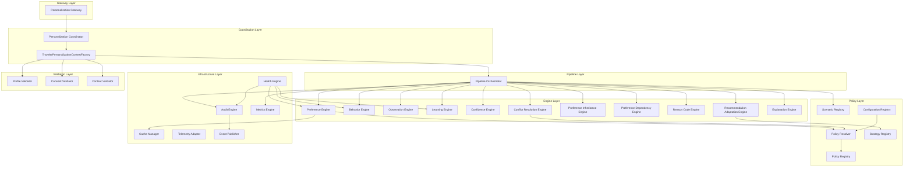

### 2.2 Subsystem Catalog

---

#### [1] Personalization Gateway

* **Purpose:** Single entry point for all personalization requests from upstream API routes and intelligence adapters.
* **Responsibilities:** Request validation, correlation ID generation, consent pre-check, routing to Coordinator.
* **Inputs:** HTTP/gRPC request payload containing `traveler_id`, `request_type`, and optional `journey_context`.
* **Outputs:** `AIReadyPersonalizationContext` or graceful fallback DTO.
* **Dependencies:** `PersonalizationCoordinator`, `ConsentValidator`, `ContextValidator`.
* **Ownership:** Personalization Team.
* **Failure Modes:** Returns unpersonalized pass-through DTO on any internal failure. Logs `GatewayError`.
* **Extension Points:** Custom middleware hooks for rate limiting, A/B routing.

#### [2] Personalization Coordinator

* **Purpose:** Orchestration facade that sequences the context factory, pipeline, and output assembly.
* **Responsibilities:** Calls `TravelerPersonalizationContextFactory`, invokes `PipelineOrchestrator`, returns final context.
* **Inputs:** Validated request from Gateway.
* **Outputs:** `AIReadyPersonalizationContext`.
* **Dependencies:** `TravelerPersonalizationContextFactory`, `PipelineOrchestrator`, `AuditEngine`, `MetricsEngine`.
* **Ownership:** Personalization Team.
* **Failure Modes:** Falls back to unpersonalized context. Emits `CoordinatorError` event.
* **Extension Points:** Pre/post pipeline hooks for cross-cutting concerns.

#### [3] TravelerPersonalizationContextFactory

* **Purpose:** Assembles the canonical `TravelerPersonalizationContext` from profile, preferences, behavior, and intent data.
* **Responsibilities:** Profile resolution, preference aggregation, behavior snapshot, persona evaluation, consent verification.
* **Inputs:** `traveler_id`, `correlation_id`.
* **Outputs:** `TravelerPersonalizationContext`.
* **Dependencies:** `TravelerProfileRepository`, `PreferenceRepository`, `BehaviorRepository`, `ProfileValidator`, `ConsentValidator`.
* **Ownership:** Context Team.
* **Failure Modes:** Returns empty context with system defaults if profile not found. Logs `ProfileNotFound`.
* **Extension Points:** Custom context enrichers for future persona types.

#### [4] Pipeline Orchestrator

* **Purpose:** Executes the 15-stage personalization pipeline in deterministic sequence.
* **Responsibilities:** Stage sequencing, latency budget enforcement, stage-level error isolation, context enrichment chaining.
* **Inputs:** `TravelerPersonalizationContext`.
* **Outputs:** Enriched `AIReadyPersonalizationContext`.
* **Dependencies:** All engine subsystems, `PolicyResolver`, `AuditEngine`, `MetricsEngine`.
* **Ownership:** Pipeline Team.
* **Failure Modes:** Stage failures are isolated; pipeline continues with degraded context. Emits `PipelineStageError`.
* **Extension Points:** Dynamic stage insertion/removal via configuration.

#### [5] Preference Engine

* **Purpose:** Resolves the active preference set for a traveler by merging explicit and implicit preferences.
* **Responsibilities:** Preference lookup, state validation, version reconciliation, category filtering.
* **Inputs:** `TravelerPersonalizationContext` (profile segment).
* **Outputs:** Resolved `TravelerPreferenceDTO` collection.
* **Dependencies:** `PreferenceRepository`, `CacheManager`, `PolicyResolver`.
* **Ownership:** Preference Team.
* **Failure Modes:** Falls back to explicit-only preferences. Logs `PreferenceUnavailable`.
* **Extension Points:** Custom preference resolvers per category.

#### [6] Behavior Engine

* **Purpose:** Evaluates aggregated behavioral patterns to inform preference inference and persona classification.
* **Responsibilities:** Pattern matching, streak counting, habit identification, routine detection.
* **Inputs:** `TravelerPersonalizationContext` (behavior segment).
* **Outputs:** `TravelerBehaviorDTO` with active patterns.
* **Dependencies:** `BehaviorRepository`, `CacheManager`.
* **Ownership:** Behavioral Intelligence Team.
* **Failure Modes:** Returns empty behavior set. Logs `BehaviorUnavailable`.
* **Extension Points:** Custom pattern matchers for new behavior types.

#### [7] Observation Engine

* **Purpose:** Ingests, validates, and normalizes raw traveler action events into structured observations.
* **Responsibilities:** Event parsing, schema validation, deduplication, TTL stamping.
* **Inputs:** Raw `TravelerEvent` payload.
* **Outputs:** `LearningObservationDTO`.
* **Dependencies:** `ObservationRepository`, `ProfileValidator`.
* **Ownership:** Behavioral Intelligence Team.
* **Failure Modes:** Silently drops invalid events. Writes to retry buffer on storage failure. Logs `InvalidObservation`.
* **Extension Points:** Custom event parsers for new telemetry sources.

#### [8] Learning Engine

* **Purpose:** Applies deterministic learning rules to observations to evolve implicit preferences.
* **Responsibilities:** Rule matching, evidence accumulation, preference candidate promotion, session management.
* **Inputs:** `LearningObservationDTO`, `TravelerBehaviorDTO`.
* **Outputs:** `LearningDecisionDTO` with preference mutation candidates.
* **Dependencies:** `LearningRepository`, `PolicyResolver`, `ConfidenceEngine`.
* **Ownership:** Learning Team.
* **Failure Modes:** Aborts learning cycle; preserves existing preferences. Logs `LearningRejected`.
* **Extension Points:** Hot-reloadable rule definitions via YAML.

#### [9] Confidence Engine

* **Purpose:** Calculates and manages confidence scores for implicit preferences using deterministic formulas.
* **Responsibilities:** Score calculation, decay application, threshold evaluation, level classification (HIGH/MEDIUM/LOW).
* **Inputs:** Observation counts, decay parameters, policy thresholds.
* **Outputs:** `PreferenceConfidenceDTO`.
* **Dependencies:** `ConfidenceRepository`, `PolicyResolver`.
* **Ownership:** Learning Team.
* **Failure Modes:** Retains prior confidence level. Logs `ConfidenceTooLow`.
* **Extension Points:** Configurable decay constants per preference category.

#### [10] Conflict Resolution Engine

* **Purpose:** Detects and resolves conflicts between competing preferences using the deterministic priority hierarchy.
* **Responsibilities:** Conflict detection, priority ranking, resolution strategy selection, resolution logging.
* **Inputs:** Merged preference set from Preference Engine.
* **Outputs:** Resolved preference set, `PreferenceConflict` events.
* **Dependencies:** `PolicyResolver`, `PolicyRepository`.
* **Ownership:** Resolution Team.
* **Failure Modes:** Defaults to explicit preferences or system defaults. Logs `PreferenceConflict`.
* **Extension Points:** Custom resolution strategies per conflict type.

#### [11] Preference Inheritance Engine

* **Purpose:** Propagates parent preference constraints to dependent child preferences per the inheritance model.
* **Responsibilities:** Chain traversal, constraint propagation, override detection, termination handling.
* **Inputs:** Resolved preference set.
* **Outputs:** Inheritance-adjusted preference set.
* **Dependencies:** `PreferenceEngine`, `PolicyResolver`.
* **Ownership:** Preference Team.
* **Failure Modes:** Skips inheritance; uses standalone preference values. Logs `InheritanceSkipped`.
* **Extension Points:** Custom inheritance chain definitions.

#### [12] Preference Dependency Engine

* **Purpose:** Evaluates hierarchical dependency relationships between preference attributes.
* **Responsibilities:** Dependency graph traversal, constraint filtering, cascading adjustments.
* **Inputs:** Inheritance-adjusted preference set.
* **Outputs:** Dependency-resolved preference set.
* **Dependencies:** `PreferenceInheritanceEngine`, `PolicyResolver`.
* **Ownership:** Preference Team.
* **Failure Modes:** Returns input preferences unchanged. Logs `DependencySkipped`.
* **Extension Points:** Dynamic dependency graph definitions.

#### [13] Reason Code Engine

* **Purpose:** Assigns machine-readable reason codes to every personalization decision from the centralized registry.
* **Responsibilities:** Reason code lookup, assignment, template resolution, audit linking.
* **Inputs:** Personalization decision context.
* **Outputs:** `ReasonCodeDTO` attached to each adaptation.
* **Dependencies:** `ReasonCodeRepository`, `PolicyResolver`.
* **Ownership:** Explainability Team.
* **Failure Modes:** Assigns `PREF_DEFAULT_FALLBACK` reason code. Logs `ReasonCodeUnavailable`.
* **Extension Points:** Dynamic reason code registration.

#### [14] Recommendation Adaptation Engine

* **Purpose:** Transforms raw intelligence outputs (from 5.2–5.5) by applying personalized filters, sorting, and constraints.
* **Responsibilities:** DTO transformation, filter application, sort reordering, constraint enforcement.
* **Inputs:** Raw intelligence DTO + `TravelerPersonalizationContext`.
* **Outputs:** `RecommendationAdaptationDTO` containing personalized outputs.
* **Dependencies:** `StrategyRegistry`, `PolicyResolver`, `ReasonCodeEngine`.
* **Ownership:** Adaptation Team.
* **Failure Modes:** Returns unmodified raw intelligence DTO. Logs `AdaptationSkipped`.
* **Extension Points:** Custom adaptation strategies per intelligence layer.

#### [15] Explanation Engine

* **Purpose:** Generates structured human-readable explanations for personalization decisions.
* **Responsibilities:** Template resolution, variable hydration, localization, evidence linking.
* **Inputs:** Reason codes, evidence references, locale settings.
* **Outputs:** `PreferenceExplanation` with localized text.
* **Dependencies:** `ReasonCodeEngine`, `PolicyResolver`.
* **Ownership:** Product Team.
* **Failure Modes:** Returns fallback text: "Default settings applied." Logs `ExplanationFailure`.
* **Extension Points:** Custom template registrations per locale.

#### [16] Policy Resolver

* **Purpose:** Central resolution engine that evaluates applicable policies for any given personalization context.
* **Responsibilities:** Policy lookup, version matching, override resolution, validation.
* **Inputs:** Policy query with context parameters.
* **Outputs:** Resolved policy configuration values.
* **Dependencies:** `PolicyRegistry`, `ConfigurationRegistry`.
* **Ownership:** Policy Team.
* **Failure Modes:** Returns hardcoded default policy values. Logs `PolicyViolation`.
* **Extension Points:** Tenant-specific policy overlays.

#### [17] Policy Registry

* **Purpose:** Immutable store of all system policy definitions loaded from YAML configuration.
* **Responsibilities:** Policy storage, version indexing, schema validation, startup loading.
* **Inputs:** YAML policy configuration files.
* **Outputs:** Typed policy objects.
* **Dependencies:** `ConfigurationRegistry`.
* **Ownership:** Policy Team.
* **Failure Modes:** Startup failure if policy schema is invalid. Logs `ConfigurationError`.
* **Extension Points:** Runtime policy reload without service restart.

#### [18] Strategy Registry

* **Purpose:** Central registry of all personalization strategies (e.g., AccessibilityStrategy, BusinessTravelerStrategy).
* **Responsibilities:** Strategy registration, lookup by persona/context, priority ordering, fallback chain management.
* **Inputs:** Persona type, travel objective, preference context.
* **Outputs:** Ordered list of applicable strategies.
* **Dependencies:** `PolicyResolver`.
* **Ownership:** Adaptation Team.
* **Failure Modes:** Returns `ComfortFirstStrategy` as universal fallback. Logs `StrategyNotFound`.
* **Extension Points:** Dynamic strategy registration.

#### [19] Scenario Registry

* **Purpose:** Registry of pre-defined personalization scenarios that map traveler contexts to deterministic decision flows.
* **Responsibilities:** Scenario matching, trigger evaluation, decision flow execution.
* **Inputs:** `TravelerPersonalizationContext`.
* **Outputs:** Matched scenario with decision overrides.
* **Dependencies:** `StrategyRegistry`, `PolicyResolver`.
* **Ownership:** Product Team.
* **Failure Modes:** No scenario match; proceeds with standard pipeline. Logs `ScenarioNotMatched`.
* **Extension Points:** YAML-defined scenario definitions.

#### [20] Configuration Registry

* **Purpose:** Hierarchical configuration store managing global, tenant, and environment-specific settings.
* **Responsibilities:** Configuration loading, hierarchy resolution, validation, runtime reload.
* **Inputs:** YAML/JSON configuration files, environment variables.
* **Outputs:** Typed configuration values.
* **Dependencies:** None (foundation layer).
* **Ownership:** Platform Team.
* **Failure Modes:** Falls back to hardcoded defaults. Logs `ConfigurationError`.
* **Extension Points:** Dynamic configuration providers.

#### [21] Cache Manager

* **Purpose:** Centralized cache coordination layer managing all personalization caches.
* **Responsibilities:** Cache read/write, TTL management, invalidation propagation, fallback coordination.
* **Inputs:** Cache keys, values, TTL parameters.
* **Outputs:** Cached values or cache-miss signals.
* **Dependencies:** `CacheRepository`.
* **Ownership:** Platform Team.
* **Failure Modes:** Cache-miss triggers direct repository read. Logs `CacheMiss`.
* **Extension Points:** Custom cache backends (in-memory, Redis).

#### [22] Audit Engine

* **Purpose:** Commits immutable, cryptographically signed audit trail entries for all personalization decisions.
* **Responsibilities:** Entry creation, SHA-256 signing, append-only persistence, chain validation.
* **Inputs:** Personalization decision context, change logs.
* **Outputs:** Signed `PreferenceAuditDTO`.
* **Dependencies:** `AuditRepository`, `EventPublisher`.
* **Ownership:** Audit Team.
* **Failure Modes:** Writes to local secure buffer; retries with exponential backoff. Logs `AuditFailure`.
* **Extension Points:** External audit sink integration.

#### [23] Metrics Engine

* **Purpose:** Tracks and publishes personalization performance metrics.
* **Responsibilities:** Counter increments, histogram updates, gauge tracking, Prometheus endpoint exposure.
* **Inputs:** Operational events from pipeline stages.
* **Outputs:** `PreferenceMetricsDTO`, Prometheus scrape endpoint.
* **Dependencies:** `MetricsRepository`.
* **Ownership:** Observability Team.
* **Failure Modes:** Drops metric updates silently. Logs `MetricsFailure`.
* **Extension Points:** Custom metric collectors.

#### [24] Health Engine

* **Purpose:** Monitors liveness and readiness of all personalization subsystems.
* **Responsibilities:** Heartbeat checks, degradation detection, status aggregation, alert routing.
* **Inputs:** Heartbeat responses from all engines.
* **Outputs:** Aggregated health status (OK, DEGRADED, CRITICAL).
* **Dependencies:** All engine subsystems.
* **Ownership:** Reliability Team.
* **Failure Modes:** Reports DEGRADED status; routes through fallback modules. Logs `HealthDegraded`.
* **Extension Points:** Custom health indicators per engine.

#### [25] Telemetry Adapter

* **Purpose:** Bridges personalization events to the OpenTelemetry tracing infrastructure.
* **Responsibilities:** Span creation, context propagation, trace export.
* **Inputs:** Pipeline stage execution events.
* **Outputs:** OpenTelemetry trace spans.
* **Dependencies:** OpenTelemetry SDK.
* **Ownership:** Observability Team.
* **Failure Modes:** Disables tracing silently. Logs `TelemetryDisabled`.
* **Extension Points:** Custom span enrichers.

#### [26] Event Publisher

* **Purpose:** Publishes domain events to internal event channels for async processing.
* **Responsibilities:** Event serialization, channel routing, delivery confirmation.
* **Inputs:** Domain event objects.
* **Outputs:** Published event confirmations.
* **Dependencies:** None (foundation layer).
* **Ownership:** Platform Team.
* **Failure Modes:** Queues events to local buffer for retry. Logs `EventPublishFailed`.
* **Extension Points:** Custom event channel backends.

#### [27] Validators (Profile, Consent, Context)

* **Purpose:** Validate incoming data at system boundaries.
* **Responsibilities:**
  * **ProfileValidator:** Validates `traveler_id` format, profile existence, version consistency.
  * **ConsentValidator:** Verifies active consent flag, consent version compatibility, opt-in status.
  * **ContextValidator:** Validates request payload schema, required fields, correlation ID presence.
* **Inputs:** Raw request data, profile records, consent records.
* **Outputs:** Validation result (pass/fail with error details).
* **Dependencies:** `TravelerProfileRepository`, `PolicyResolver`.
* **Ownership:** Validation Team.
* **Failure Modes:** Rejects invalid requests with structured error responses. Logs validation failure type.
* **Extension Points:** Custom validation rules per request type.

---

## 3. Package Structure

```
apps/ai-service/app/personalization/
├── __init__.py                          # Package initialization, public API exports
├── gateway/
│   ├── __init__.py
│   ├── gateway.py                       # PersonalizationGateway implementation
│   ├── middleware.py                    # Rate limiting, correlation ID injection
│   └── errors.py                        # Gateway-specific error types
├── coordinator/
│   ├── __init__.py
│   └── coordinator.py                   # PersonalizationCoordinator implementation
├── context/
│   ├── __init__.py
│   ├── factory.py                       # TravelerPersonalizationContextFactory
│   ├── builder.py                       # Context builder utilities
│   └── enrichers.py                     # Context enrichment plugins
├── pipeline/
│   ├── __init__.py
│   ├── orchestrator.py                  # PipelineOrchestrator implementation
│   ├── stages.py                        # Stage definitions and sequencing
│   └── budget.py                        # Latency budget enforcement
├── preferences/
│   ├── __init__.py
│   ├── engine.py                        # PreferenceEngine implementation
│   ├── resolver.py                      # Preference merge and resolution logic
│   └── categories.py                    # PreferenceCategory definitions
├── behavior/
│   ├── __init__.py
│   ├── engine.py                        # BehaviorEngine implementation
│   ├── patterns.py                      # Pattern matching logic
│   ├── habits.py                        # Habit and routine detection
│   └── personas.py                      # Persona classification rules
├── observations/
│   ├── __init__.py
│   ├── engine.py                        # ObservationEngine implementation
│   ├── parser.py                        # Event parsing and normalization
│   └── deduplication.py                 # Observation deduplication logic
├── learning/
│   ├── __init__.py
│   ├── engine.py                        # LearningEngine implementation
│   ├── rules.py                         # LearningRule definitions and evaluation
│   ├── sessions.py                      # LearningSession lifecycle management
│   └── decisions.py                     # LearningDecision generation
├── confidence/
│   ├── __init__.py
│   ├── engine.py                        # ConfidenceEngine implementation
│   ├── calculator.py                    # Score calculation and decay formulas
│   └── thresholds.py                    # Threshold and level classification
├── conflict/
│   ├── __init__.py
│   ├── engine.py                        # ConflictResolutionEngine implementation
│   ├── detector.py                      # Conflict detection logic
│   ├── strategies.py                    # Resolution strategy implementations
│   └── hierarchy.py                     # Priority hierarchy definitions
├── inheritance/
│   ├── __init__.py
│   ├── engine.py                        # PreferenceInheritanceEngine implementation
│   ├── chains.py                        # Inheritance chain definitions
│   └── propagation.py                   # Constraint propagation logic
├── dependency/
│   ├── __init__.py
│   ├── engine.py                        # PreferenceDependencyEngine implementation
│   └── graph.py                         # Dependency graph definitions
├── recommendation/
│   ├── __init__.py
│   └── engine.py                        # RecommendationAdaptationEngine implementation
├── adaptation/
│   ├── __init__.py
│   ├── journey_adapter.py              # JourneyIntelligence adapter (read-only)
│   ├── booking_adapter.py              # BookingIntelligence adapter (read-only)
│   ├── guidance_adapter.py             # TravelerAssistance guidance adapter (read-only)
│   └── recovery_adapter.py             # TravelerAssistance recovery adapter (read-only)
├── reason_codes/
│   ├── __init__.py
│   ├── engine.py                        # ReasonCodeEngine implementation
│   ├── registry.py                      # Reason code catalog
│   └── templates.py                     # Explanation template mappings
├── explanation/
│   ├── __init__.py
│   ├── engine.py                        # ExplanationEngine implementation
│   ├── templates.py                     # Localized explanation templates
│   └── hydrator.py                      # Template variable hydration
├── policies/
│   ├── __init__.py
│   ├── resolver.py                      # PolicyResolver implementation
│   ├── registry.py                      # PolicyRegistry implementation
│   ├── definitions/                     # YAML policy definition files
│   │   ├── preference_policy.yaml
│   │   ├── confidence_policy.yaml
│   │   ├── learning_policy.yaml
│   │   ├── consent_policy.yaml
│   │   ├── privacy_policy.yaml
│   │   ├── conflict_policy.yaml
│   │   ├── retention_policy.yaml
│   │   ├── explanation_policy.yaml
│   │   ├── audit_policy.yaml
│   │   ├── metrics_policy.yaml
│   │   ├── health_policy.yaml
│   │   └── reason_code_policy.yaml
│   └── schemas/                         # JSON schemas for policy validation
│       └── policy_schema.json
├── strategies/
│   ├── __init__.py
│   ├── registry.py                      # StrategyRegistry implementation
│   ├── accessibility.py                 # AccessibilityStrategy
│   ├── business_traveler.py             # BusinessTravelerStrategy
│   ├── family_traveler.py               # FamilyTravelerStrategy
│   ├── budget_traveler.py               # BudgetTravelerStrategy
│   ├── medical_traveler.py              # MedicalTravelerStrategy
│   ├── tourist.py                       # TouristStrategy
│   ├── minimal_walking.py              # MinimalWalkingStrategy
│   ├── comfort_first.py                # ComfortFirstStrategy
│   ├── fast_journey.py                  # FastJourneyStrategy
│   └── low_stress.py                    # LowStressStrategy
├── scenarios/
│   ├── __init__.py
│   ├── registry.py                      # ScenarioRegistry implementation
│   └── definitions/                     # YAML scenario definition files
│       ├── daily_commuter.yaml
│       ├── weekend_traveler.yaml
│       ├── family_vacation.yaml
│       ├── business_trip.yaml
│       ├── medical_travel.yaml
│       ├── senior_citizen.yaml
│       ├── tourist.yaml
│       ├── wheelchair_traveler.yaml
│       ├── night_journey.yaml
│       └── long_distance.yaml
├── repositories/
│   ├── __init__.py
│   ├── profile_repository.py           # TravelerProfileRepository
│   ├── preference_repository.py         # PreferenceRepository
│   ├── behavior_repository.py          # BehaviorRepository
│   ├── observation_repository.py        # ObservationRepository
│   ├── learning_repository.py          # LearningRepository
│   ├── confidence_repository.py         # ConfidenceRepository
│   ├── reason_code_repository.py        # ReasonCodeRepository
│   ├── policy_repository.py            # PolicyRepository
│   ├── configuration_repository.py     # ConfigurationRepository
│   ├── audit_repository.py             # AuditRepository
│   ├── metrics_repository.py           # MetricsRepository
│   └── cache_repository.py             # CacheRepository
├── dto/
│   ├── __init__.py
│   ├── context.py                       # TravelerPersonalizationContext, AIReadyPersonalizationContext
│   ├── preferences.py                   # TravelerPreferenceDTO
│   ├── behavior.py                      # TravelerBehaviorDTO
│   ├── learning.py                      # LearningObservationDTO, LearningDecisionDTO
│   ├── confidence.py                    # PreferenceConfidenceDTO, PreferenceEvidenceDTO
│   ├── reason_codes.py                  # ReasonCodeDTO
│   ├── recommendation.py               # RecommendationAdaptationDTO
│   ├── personalized.py                  # PersonalizedJourneyDTO, PersonalizedBookingDTO,
│   │                                    # PersonalizedGuidanceDTO, PersonalizedRecoveryDTO
│   ├── audit.py                         # PreferenceAuditDTO
│   └── metrics.py                       # PreferenceMetricsDTO
├── interfaces/
│   ├── __init__.py
│   ├── gateway.py                       # IPersonalizationGateway
│   ├── coordinator.py                   # IPersonalizationCoordinator
│   ├── context.py                       # IPersonalizationContextFactory
│   ├── pipeline.py                      # IPipelineOrchestrator
│   ├── engines.py                       # IPreferenceEngine, IBehaviorEngine, IObservationEngine,
│   │                                    # ILearningEngine, IConfidenceEngine
│   ├── conflict.py                      # IConflictResolutionEngine
│   ├── inheritance.py                   # IPreferenceInheritanceEngine, IPreferenceDependencyEngine
│   ├── recommendation.py               # IRecommendationAdaptationEngine
│   ├── reason_codes.py                  # IReasonCodeEngine
│   ├── explanation.py                   # IExplanationEngine
│   ├── policies.py                      # IPolicyResolver, IStrategyRegistry, IScenarioRegistry
│   ├── infrastructure.py               # ICacheManager, IAuditEngine, IMetricsEngine, IHealthEngine
│   └── validators.py                    # IProfileValidator, IConsentValidator, IContextValidator
├── config/
│   ├── __init__.py
│   ├── registry.py                      # ConfigurationRegistry implementation
│   ├── feature_flags.py                # Feature flag definitions
│   ├── settings.py                      # Environment-specific settings
│   └── defaults.py                      # Hardcoded fallback defaults
├── cache/
│   ├── __init__.py
│   ├── manager.py                       # CacheManager implementation
│   ├── keys.py                          # Cache key generation utilities
│   └── invalidation.py                 # Cache invalidation event handlers
├── audit/
│   ├── __init__.py
│   ├── engine.py                        # AuditEngine implementation
│   ├── signer.py                        # SHA-256 cryptographic signing
│   └── ledger.py                        # Append-only ledger management
├── metrics/
│   ├── __init__.py
│   ├── engine.py                        # MetricsEngine implementation
│   ├── collectors.py                    # Metric collector definitions
│   └── exporters.py                     # Prometheus exporter
├── health/
│   ├── __init__.py
│   ├── engine.py                        # HealthEngine implementation
│   ├── indicators.py                    # Per-subsystem health indicators
│   └── aggregator.py                    # Health status aggregation
├── events/
│   ├── __init__.py
│   ├── publisher.py                     # EventPublisher implementation
│   ├── types.py                         # Domain event type definitions
│   └── handlers.py                      # Event handler registrations
├── validators/
│   ├── __init__.py
│   ├── profile.py                       # ProfileValidator implementation
│   ├── consent.py                       # ConsentValidator implementation
│   └── context.py                       # ContextValidator implementation
├── telemetry/
│   ├── __init__.py
│   └── adapter.py                       # TelemetryAdapter (OpenTelemetry bridge)
├── errors.py                            # Centralized domain error taxonomy
└── tests/
    ├── __init__.py
    ├── unit/
    │   ├── test_preference_engine.py
    │   ├── test_behavior_engine.py
    │   ├── test_observation_engine.py
    │   ├── test_learning_engine.py
    │   ├── test_confidence_engine.py
    │   ├── test_conflict_engine.py
    │   ├── test_inheritance_engine.py
    │   ├── test_dependency_engine.py
    │   ├── test_reason_code_engine.py
    │   ├── test_recommendation_engine.py
    │   ├── test_explanation_engine.py
    │   ├── test_policy_resolver.py
    │   ├── test_cache_manager.py
    │   ├── test_audit_engine.py
    │   ├── test_validators.py
    │   └── test_context_factory.py
    ├── integration/
    │   ├── test_pipeline_orchestrator.py
    │   ├── test_gateway.py
    │   └── test_coordinator.py
    ├── contract/
    │   ├── test_dto_contracts.py
    │   └── test_interface_contracts.py
    ├── scenario/
    │   ├── test_daily_commuter.py
    │   ├── test_business_trip.py
    │   ├── test_family_vacation.py
    │   ├── test_medical_travel.py
    │   └── test_wheelchair_traveler.py
    ├── pipeline/
    │   ├── test_full_pipeline.py
    │   └── test_stage_isolation.py
    ├── architecture/
    │   ├── test_dependency_rules.py
    │   └── test_boundary_enforcement.py
    ├── privacy/
    │   ├── test_consent_enforcement.py
    │   └── test_forget_me.py
    └── performance/
        ├── test_latency_budgets.py
        └── test_throughput.py
```

### Package Ownership Matrix

| Package | Owner | Dependency Direction |
|---|---|---|
| `gateway/` | Personalization Team | Inward only |
| `coordinator/` | Personalization Team | Inward only |
| `context/` | Context Team | Inward only |
| `pipeline/` | Pipeline Team | Orchestrates engines |
| `preferences/` | Preference Team | Engine layer |
| `behavior/` | Behavioral Intelligence Team | Engine layer |
| `observations/` | Behavioral Intelligence Team | Engine layer |
| `learning/` | Learning Team | Engine layer |
| `confidence/` | Learning Team | Engine layer |
| `conflict/` | Resolution Team | Engine layer |
| `inheritance/` | Preference Team | Engine layer |
| `dependency/` | Preference Team | Engine layer |
| `recommendation/` | Adaptation Team | Engine layer |
| `adaptation/` | Adaptation Team | Adapter layer (read-only to prior milestones) |
| `reason_codes/` | Explainability Team | Engine layer |
| `explanation/` | Product Team | Engine layer |
| `policies/` | Policy Team | Foundation layer |
| `strategies/` | Adaptation Team | Policy layer |
| `scenarios/` | Product Team | Policy layer |
| `repositories/` | Data Platform Team | Foundation layer |
| `dto/` | All teams (shared) | Foundation layer |
| `interfaces/` | All teams (shared) | Foundation layer |
| `config/` | Platform Team | Foundation layer |
| `cache/` | Platform Team | Infrastructure layer |
| `audit/` | Audit Team | Infrastructure layer |
| `metrics/` | Observability Team | Infrastructure layer |
| `health/` | Reliability Team | Infrastructure layer |
| `events/` | Platform Team | Infrastructure layer |
| `validators/` | Validation Team | Boundary layer |
| `telemetry/` | Observability Team | Infrastructure layer |
| `tests/` | All teams (shared) | Test layer |

---

## 4. Interface Specifications

### [1] IPersonalizationGateway

```python
class IPersonalizationGateway(Protocol):
    def personalize(self, request: PersonalizationRequest) -> AIReadyPersonalizationContext: ...
    def ingest_observation(self, event: TravelerEvent) -> None: ...
    def health_check(self) -> HealthStatus: ...
```

* **Purpose:** Single entry point for all personalization operations.
* **Responsibilities:** Request routing, consent pre-check, correlation ID assignment.
* **Inputs:** `PersonalizationRequest`, `TravelerEvent`.
* **Outputs:** `AIReadyPersonalizationContext`, `HealthStatus`.
* **Failure Behaviour:** Returns unpersonalized pass-through on any error.
* **Future Extensibility:** Batch personalization for group bookings.

### [2] IPersonalizationCoordinator

```python
class IPersonalizationCoordinator(Protocol):
    def execute(self, request: ValidatedRequest) -> AIReadyPersonalizationContext: ...
```

* **Purpose:** Orchestrates context creation and pipeline execution.
* **Responsibilities:** Sequences factory → pipeline → output assembly.
* **Inputs:** `ValidatedRequest`.
* **Outputs:** `AIReadyPersonalizationContext`.
* **Failure Behaviour:** Falls back to default unpersonalized context.
* **Future Extensibility:** Multi-pipeline routing for different request types.

### [3] IPersonalizationContextFactory

```python
class IPersonalizationContextFactory(Protocol):
    def build(self, traveler_id: str, correlation_id: str) -> TravelerPersonalizationContext: ...
```

* **Purpose:** Assembles the canonical context DTO.
* **Responsibilities:** Profile resolution, preference aggregation, behavior snapshot.
* **Inputs:** `traveler_id`, `correlation_id`.
* **Outputs:** `TravelerPersonalizationContext`.
* **Failure Behaviour:** Returns context with system defaults.
* **Future Extensibility:** Federated profile resolution.

### [4] IPipelineOrchestrator

```python
class IPipelineOrchestrator(Protocol):
    def execute(self, context: TravelerPersonalizationContext) -> AIReadyPersonalizationContext: ...
```

* **Purpose:** Executes the 15-stage pipeline.
* **Responsibilities:** Stage sequencing, budget enforcement, error isolation.
* **Inputs:** `TravelerPersonalizationContext`.
* **Outputs:** `AIReadyPersonalizationContext`.
* **Failure Behaviour:** Continues with degraded context on stage failure.
* **Future Extensibility:** Dynamic stage insertion.

### [5] IPreferenceEngine

```python
class IPreferenceEngine(Protocol):
    def resolve(self, context: TravelerPersonalizationContext) -> list[TravelerPreferenceDTO]: ...
    def update(self, traveler_id: str, preference: TravelerPreferenceDTO) -> None: ...
    def reset(self, traveler_id: str, category: str | None = None) -> None: ...
```

* **Purpose:** Resolves active preference set.
* **Responsibilities:** Merge explicit/implicit, version reconciliation, category filtering.
* **Inputs:** `TravelerPersonalizationContext`, preference updates.
* **Outputs:** Ordered `TravelerPreferenceDTO` collection.
* **Failure Behaviour:** Returns explicit-only preferences.
* **Future Extensibility:** Preference templates.

### [6] IBehaviorEngine

```python
class IBehaviorEngine(Protocol):
    def evaluate(self, context: TravelerPersonalizationContext) -> TravelerBehaviorDTO: ...
    def detect_patterns(self, traveler_id: str) -> list[BehaviorPattern]: ...
```

* **Purpose:** Evaluates aggregated behavior patterns.
* **Responsibilities:** Pattern matching, streak counting, persona classification.
* **Inputs:** `TravelerPersonalizationContext`.
* **Outputs:** `TravelerBehaviorDTO`.
* **Failure Behaviour:** Returns empty behavior set.
* **Future Extensibility:** Custom pattern matchers.

### [7] IObservationEngine

```python
class IObservationEngine(Protocol):
    def ingest(self, event: TravelerEvent) -> LearningObservationDTO | None: ...
    def batch_ingest(self, events: list[TravelerEvent]) -> list[LearningObservationDTO]: ...
```

* **Purpose:** Ingests and normalizes raw events.
* **Responsibilities:** Parsing, validation, deduplication.
* **Inputs:** `TravelerEvent`.
* **Outputs:** `LearningObservationDTO`.
* **Failure Behaviour:** Silently drops invalid events.
* **Future Extensibility:** Custom event parsers.

### [8] ILearningEngine

```python
class ILearningEngine(Protocol):
    def evaluate(self, observations: list[LearningObservationDTO],
                 behavior: TravelerBehaviorDTO) -> list[LearningDecisionDTO]: ...
```

* **Purpose:** Applies rules to evolve implicit preferences.
* **Responsibilities:** Rule matching, evidence accumulation, candidate promotion.
* **Inputs:** Observations, behavior data.
* **Outputs:** `LearningDecisionDTO` list.
* **Failure Behaviour:** Returns empty list, preserves existing preferences.
* **Future Extensibility:** Hot-reloadable rules.

### [9] IConfidenceEngine

```python
class IConfidenceEngine(Protocol):
    def calculate(self, preference_id: str, observations: int,
                  last_observed: datetime) -> PreferenceConfidenceDTO: ...
    def apply_decay(self, confidence: PreferenceConfidenceDTO) -> PreferenceConfidenceDTO: ...
```

* **Purpose:** Manages confidence scores.
* **Responsibilities:** Score calculation, decay, threshold evaluation.
* **Inputs:** Observation counts, timestamps, policy thresholds.
* **Outputs:** `PreferenceConfidenceDTO`.
* **Failure Behaviour:** Retains prior confidence level.
* **Future Extensibility:** Per-category decay constants.

### [10] IConflictResolutionEngine

```python
class IConflictResolutionEngine(Protocol):
    def resolve(self, preferences: list[TravelerPreferenceDTO]) -> list[TravelerPreferenceDTO]: ...
    def detect_conflicts(self, preferences: list[TravelerPreferenceDTO]) -> list[PreferenceConflict]: ...
```

* **Purpose:** Resolves preference conflicts.
* **Responsibilities:** Detection, priority ranking, resolution strategy selection.
* **Inputs:** Merged preference set.
* **Outputs:** Resolved preference set.
* **Failure Behaviour:** Defaults to explicit preferences.
* **Future Extensibility:** Custom resolution strategies.

### [11] IPreferenceInheritanceEngine

```python
class IPreferenceInheritanceEngine(Protocol):
    def propagate(self, preferences: list[TravelerPreferenceDTO]) -> list[TravelerPreferenceDTO]: ...
```

* **Purpose:** Propagates parent constraints to children.
* **Failure Behaviour:** Returns input unchanged.
* **Future Extensibility:** Custom inheritance chains.

### [12] IPreferenceDependencyEngine

```python
class IPreferenceDependencyEngine(Protocol):
    def evaluate(self, preferences: list[TravelerPreferenceDTO]) -> list[TravelerPreferenceDTO]: ...
```

* **Purpose:** Evaluates dependency graph relationships.
* **Failure Behaviour:** Returns input unchanged.
* **Future Extensibility:** Dynamic dependency definitions.

### [13] IRecommendationAdaptationEngine

```python
class IRecommendationAdaptationEngine(Protocol):
    def adapt(self, raw_dto: dict, context: TravelerPersonalizationContext) -> RecommendationAdaptationDTO: ...
```

* **Purpose:** Transforms raw intelligence DTOs with personalization.
* **Failure Behaviour:** Returns unmodified raw DTO.
* **Future Extensibility:** Per-layer adaptation strategies.

### [14] IReasonCodeEngine

```python
class IReasonCodeEngine(Protocol):
    def assign(self, decision_context: dict) -> ReasonCodeDTO: ...
    def lookup(self, reason_code: str) -> ReasonCodeDefinition: ...
```

* **Purpose:** Assigns machine-readable reason codes.
* **Failure Behaviour:** Assigns `PREF_DEFAULT_FALLBACK`.
* **Future Extensibility:** Dynamic reason code registration.

### [15] IExplanationEngine

```python
class IExplanationEngine(Protocol):
    def explain(self, reason_code: ReasonCodeDTO, evidence: PreferenceEvidenceDTO,
                locale: str) -> PreferenceExplanation: ...
```

* **Purpose:** Generates human-readable explanations.
* **Failure Behaviour:** Returns "Default settings applied."
* **Future Extensibility:** Multi-lingual template registration.

### [16] IPolicyResolver

```python
class IPolicyResolver(Protocol):
    def resolve(self, policy_key: str, context: dict | None = None) -> PolicyValue: ...
    def validate(self, policy_key: str, value: Any) -> bool: ...
```

* **Purpose:** Resolves applicable policy values.
* **Failure Behaviour:** Returns hardcoded defaults.
* **Future Extensibility:** Tenant-specific overlays.

### [17] IStrategyRegistry

```python
class IStrategyRegistry(Protocol):
    def select(self, context: TravelerPersonalizationContext) -> list[PersonalizationStrategy]: ...
    def register(self, strategy: PersonalizationStrategy) -> None: ...
```

* **Purpose:** Selects applicable strategies.
* **Failure Behaviour:** Returns `ComfortFirstStrategy`.
* **Future Extensibility:** Dynamic registration.

### [18] IScenarioRegistry

```python
class IScenarioRegistry(Protocol):
    def match(self, context: TravelerPersonalizationContext) -> PersonalizationScenario | None: ...
```

* **Purpose:** Matches context to pre-defined scenarios.
* **Failure Behaviour:** Returns `None`; pipeline proceeds normally.
* **Future Extensibility:** YAML-defined scenarios.

### [19] ICacheManager

```python
class ICacheManager(Protocol):
    def get(self, cache_name: str, key: str) -> Any | None: ...
    def put(self, cache_name: str, key: str, value: Any, ttl_seconds: int) -> None: ...
    def invalidate(self, cache_name: str, key: str) -> None: ...
    def invalidate_all(self, cache_name: str) -> None: ...
```

* **Purpose:** Centralized cache operations.
* **Failure Behaviour:** Cache-miss on any error; falls through to repository.
* **Future Extensibility:** Custom backends.

### [20] IAuditEngine

```python
class IAuditEngine(Protocol):
    def log(self, event: PreferenceAuditDTO) -> str: ...
    def verify(self, audit_id: str) -> bool: ...
```

* **Purpose:** Immutable audit trail management.
* **Failure Behaviour:** Writes to local buffer, retries.
* **Future Extensibility:** External audit sinks.

### [21] IMetricsEngine

```python
class IMetricsEngine(Protocol):
    def increment(self, metric_name: str, labels: dict | None = None) -> None: ...
    def observe(self, metric_name: str, value: float, labels: dict | None = None) -> None: ...
```

* **Purpose:** Performance metric tracking.
* **Failure Behaviour:** Drops updates silently.
* **Future Extensibility:** Custom collectors.

### [22] IHealthEngine

```python
class IHealthEngine(Protocol):
    def check(self) -> HealthStatus: ...
    def check_subsystem(self, subsystem: str) -> SubsystemHealth: ...
```

* **Purpose:** Liveness and readiness monitoring.
* **Failure Behaviour:** Reports DEGRADED status.
* **Future Extensibility:** Custom health indicators.

---

## 5. DTO Architecture

### [1] TravelerPersonalizationContext

* **Purpose:** Canonical immutable DTO carrying all traveler personalization data through the pipeline.
* **Ownership:** Context Team.
* **Validation:** JSON Schema v1; required fields: `traveler_id`, `version`, `correlation_id`, `timestamp`.
* **Serialization:** JSON with snake_case keys; Pydantic model with `model_config = ConfigDict(frozen=True)`.
* **Versioning:** Schema version `v1.0.0`; namespace `/api/v1/personalization-context`.
* **Lifecycle:** Created per request; destroyed after response dispatch.

### [2] TravelerPreferenceDTO

* **Purpose:** Represents a single resolved preference (explicit or implicit).
* **Ownership:** Preference Team.
* **Validation:** `preference_id` required; `value` must conform to category schema; `type` must be `EXPLICIT` or `IMPLICIT`.
* **Serialization:** JSON; Pydantic model.
* **Versioning:** Monotonic integer version per preference.
* **Lifecycle:** Persistent; updated on preference changes.

### [3] TravelerBehaviorDTO

* **Purpose:** Aggregated behavioral snapshot with active patterns.
* **Ownership:** Behavioral Intelligence Team.
* **Validation:** `behavior_id` required; patterns must have valid `pattern_type`.
* **Serialization:** JSON; Pydantic model.
* **Versioning:** Schema version linked to behavior engine release.
* **Lifecycle:** Regenerated daily from observation aggregates.

### [4] LearningObservationDTO

* **Purpose:** Structured representation of a single traveler action event.
* **Ownership:** Behavioral Intelligence Team.
* **Validation:** `observation_id` required; `action_type` must be registered; `traveler_id` must exist.
* **Serialization:** JSON; Pydantic model.
* **Versioning:** Event schema version.
* **Lifecycle:** TTL 30 days; auto-purged by retention policy.

### [5] LearningDecisionDTO

* **Purpose:** Output of a learning rule application with preference mutation instructions.
* **Ownership:** Learning Team.
* **Validation:** `decision_id` required; must reference valid `LearningRule` and evidence.
* **Serialization:** JSON; Pydantic model.
* **Versioning:** Engine version tag.
* **Lifecycle:** Transient; consumed during pipeline execution.

### [6] PreferenceConfidenceDTO

* **Purpose:** Confidence score and level classification for an implicit preference.
* **Ownership:** Learning Team.
* **Validation:** `score` must be in range `[0.00, 1.00]`; `level` must be `HIGH`, `MEDIUM`, or `LOW`.
* **Serialization:** JSON; Pydantic model.
* **Versioning:** Matches parent implicit preference version.
* **Lifecycle:** Updated on each confidence recalculation.

### [7] PreferenceEvidenceDTO

* **Purpose:** Collection of observation references justifying a preference inference.
* **Ownership:** Explainability Team.
* **Validation:** Must contain at least one valid `observation_id` reference.
* **Serialization:** JSON; Pydantic model.
* **Versioning:** Matches parent implicit preference version.
* **Lifecycle:** Immutable once linked; purged with parent preference.

### [8] ReasonCodeDTO

* **Purpose:** Machine-readable reason code with explanation template reference.
* **Ownership:** Explainability Team.
* **Validation:** `code` must exist in registered reason code catalog.
* **Serialization:** JSON; Pydantic model.
* **Versioning:** Fixed at compilation; registry version.
* **Lifecycle:** Transient per pipeline execution.

### [9] RecommendationAdaptationDTO

* **Purpose:** Container for personalized intelligence output transformations.
* **Ownership:** Adaptation Team.
* **Validation:** Must contain at least one adaptation entry; each entry must reference a reason code.
* **Serialization:** JSON; Pydantic model.
* **Versioning:** API contract version.
* **Lifecycle:** Transient per request.

### [10] PersonalizedJourneyDTO

* **Purpose:** Journey recommendations adapted for traveler preferences.
* **Ownership:** Adaptation Team.
* **Validation:** Must preserve physical journey invariants from upstream intelligence.
* **Serialization:** JSON; Pydantic model.
* **Versioning:** API contract version.
* **Lifecycle:** Transient per request.

### [11] PersonalizedBookingDTO

* **Purpose:** Booking options adapted for traveler class, seat, and quota preferences.
* **Ownership:** Adaptation Team.
* **Validation:** Must conform to railway booking constraints.
* **Serialization:** JSON; Pydantic model.
* **Versioning:** API contract version.
* **Lifecycle:** Transient per request.

### [12] PersonalizedGuidanceDTO

* **Purpose:** Station navigation adapted for walking tolerance and accessibility.
* **Ownership:** Adaptation Team.
* **Validation:** Accessibility guidelines validation.
* **Serialization:** JSON; Pydantic model.
* **Versioning:** API contract version.
* **Lifecycle:** Active during journey execution.

### [13] PersonalizedRecoveryDTO

* **Purpose:** Disruption recovery options adapted for personal tolerances.
* **Ownership:** Adaptation Team.
* **Validation:** Refund and rebooking rule matching.
* **Serialization:** JSON; Pydantic model.
* **Versioning:** API contract version.
* **Lifecycle:** Active during disruption events.

### [14] PreferenceAuditDTO

* **Purpose:** Signed audit trail entry for personalization decisions.
* **Ownership:** Audit Team.
* **Validation:** `audit_id` required; `cryptographic_hash` required; `correlation_id` required.
* **Serialization:** JSON; Pydantic model.
* **Versioning:** Audit format version.
* **Lifecycle:** Append-only; 3-year retention.

### [15] PreferenceMetricsDTO

* **Purpose:** Aggregated performance metrics for personalization operations.
* **Ownership:** Observability Team.
* **Validation:** Metric values must be non-negative.
* **Serialization:** JSON; Pydantic model.
* **Versioning:** Metrics schema version.
* **Lifecycle:** Aggregated hourly/daily.

### [16] AIReadyPersonalizationContext

* **Purpose:** Final immutable output payload dispatched to downstream intelligence consumers.
* **Ownership:** Context Team.
* **Validation:** Superset of `TravelerPersonalizationContext` + explanation + audit token.
* **Serialization:** JSON; Pydantic model with `model_config = ConfigDict(frozen=True)`.
* **Versioning:** Schema version `v1.0.0`.
* **Lifecycle:** Created once per request; immutable after creation.

---

## 6. Repository Design

### Repository Catalog

#### [1] TravelerProfileRepository
* **Read Model:** Profile by `traveler_id`; profile by `identity_hash`; profile existence check.
* **Write Model:** Create profile; update profile version; archive profile; hard-delete profile (Forget Me).
* **Transactions:** Profile creation requires atomic write of profile + identity + default preferences.
* **Caching:** Read-through via `profileCache` (TTL: 30 min).
* **Consumers:** `TravelerPersonalizationContextFactory`, `ProfileValidator`.
* **Ownership:** Data Platform Team.

#### [2] PreferenceRepository
* **Read Model:** Preferences by `traveler_id`; preferences by category; single preference by ID.
* **Write Model:** Create preference; update value + version; archive (supersede); bulk delete by profile.
* **Transactions:** Preference updates require atomic version increment + history append.
* **Caching:** Read-through via `preferenceCache` (TTL: 1 hour).
* **Consumers:** `PreferenceEngine`, `ConflictResolutionEngine`, `InheritanceEngine`.
* **Ownership:** Data Platform Team.

#### [3] BehaviorRepository
* **Read Model:** Behavior by `traveler_id`; active patterns; habits; routines.
* **Write Model:** Update behavior aggregates; create/update patterns.
* **Transactions:** Daily batch aggregation writes.
* **Caching:** Read-through via `behaviorCache` (TTL: 24 hours).
* **Consumers:** `BehaviorEngine`, `LearningEngine`.
* **Ownership:** Data Platform Team.

#### [4] ObservationRepository
* **Read Model:** Observations by `traveler_id` within time window; observation by ID.
* **Write Model:** Append observation; bulk append; TTL-based auto-delete (30 days).
* **Transactions:** Append-only; no update operations.
* **Caching:** No cache (write-heavy, TTL-managed).
* **Consumers:** `ObservationEngine`, `LearningEngine`, `ConfidenceEngine`.
* **Ownership:** Data Platform Team.

#### [5] LearningRepository
* **Read Model:** Active learning sessions; learning rules; learning decisions by session.
* **Write Model:** Create session; append observation to session; close session; commit decisions.
* **Transactions:** Session commit requires atomic decision write + preference update.
* **Caching:** Read-through via `learningCache` (TTL: 2 hours).
* **Consumers:** `LearningEngine`.
* **Ownership:** Data Platform Team.

#### [6] ConfidenceRepository
* **Read Model:** Confidence scores by `preference_id`; confidence history.
* **Write Model:** Update score; apply decay batch.
* **Transactions:** Score updates are idempotent.
* **Caching:** In-memory via `confidenceCache` (TTL: 2 hours).
* **Consumers:** `ConfidenceEngine`, `PreferenceEngine`.
* **Ownership:** Data Platform Team.

#### [7] ReasonCodeRepository
* **Read Model:** Reason code definition by code string; all active codes.
* **Write Model:** Read-only in production; write during deployment for registration.
* **Transactions:** None (immutable after registration).
* **Caching:** In-memory startup load via `reasonCodeCache` (TTL: 24 hours).
* **Consumers:** `ReasonCodeEngine`, `ExplanationEngine`.
* **Ownership:** Explainability Team.

#### [8] PolicyRepository
* **Read Model:** Policy by key; all policies by category; policy version.
* **Write Model:** Read-only in production; write during deployment.
* **Transactions:** None (immutable after deployment).
* **Caching:** In-memory startup load via `policyCache` (TTL: 24 hours).
* **Consumers:** `PolicyResolver`, all engines.
* **Ownership:** Policy Team.

#### [9] ConfigurationRepository
* **Read Model:** Configuration by key; configuration by hierarchy level.
* **Write Model:** Admin-only updates.
* **Transactions:** Configuration changes require version bump.
* **Caching:** In-memory startup load via `configurationCache` (TTL: 24 hours).
* **Consumers:** `ConfigurationRegistry`, all subsystems.
* **Ownership:** Platform Team.

#### [10] AuditRepository
* **Read Model:** Audit entries by `traveler_id`; audit entry by `audit_id`; chain verification.
* **Write Model:** Append-only write; no updates; no deletes (except regulatory purge).
* **Transactions:** Append requires cryptographic signature verification.
* **Caching:** None (append-only, write-heavy).
* **Consumers:** `AuditEngine`.
* **Ownership:** Audit Team.

#### [11] MetricsRepository
* **Read Model:** Metrics by type and time window; aggregated metrics.
* **Write Model:** Counter increments; histogram observations.
* **Transactions:** None (eventual consistency acceptable).
* **Caching:** In-memory counters.
* **Consumers:** `MetricsEngine`.
* **Ownership:** Observability Team.

#### [12] CacheRepository
* **Read Model:** Cached values by composite key.
* **Write Model:** Set with TTL; invalidate by key; invalidate by pattern.
* **Transactions:** None (best-effort).
* **Caching:** Self (this is the cache layer).
* **Consumers:** `CacheManager`.
* **Ownership:** Platform Team.

### Repository Dependency Matrix

```mermaid
graph TD
    CF[ContextFactory] --> PR[ProfileRepository]
    CF --> PrefR[PreferenceRepository]
    CF --> BR[BehaviorRepository]
    PE[PreferenceEngine] --> PrefR
    PE --> ConfR[ConfidenceRepository]
    BE[BehaviorEngine] --> BR
    OE[ObservationEngine] --> OR[ObservationRepository]
    LE[LearningEngine] --> LR[LearningRepository]
    LE --> OR
    CE[ConfidenceEngine] --> ConfR
    RCE[ReasonCodeEngine] --> RCR[ReasonCodeRepository]
    PolR[PolicyResolver] --> PolRepo[PolicyRepository]
    PolR --> ConfigR[ConfigurationRepository]
    AE[AuditEngine] --> AR[AuditRepository]
    ME[MetricsEngine] --> MR[MetricsRepository]
    CM[CacheManager] --> CaR[CacheRepository]
```

---

## 7. Personalization Pipeline

### Pipeline Stage Sequence

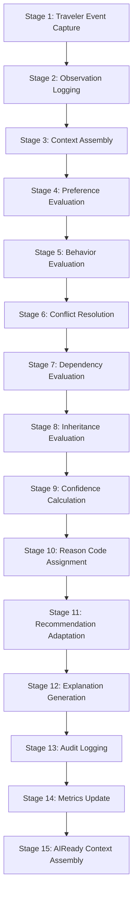

### Stage Definitions

#### Stage 1: Traveler Event Capture
* **Inputs:** Raw HTTP/gRPC request payload.
* **Outputs:** Canonical `TravelerEvent`.
* **Validation:** Schema validation, correlation ID generation.
* **Latency Budget:** ≤ 1 ms.
* **Failure Handling:** Silent drop; log warning. Never block user session.
* **Context Enrichment:** Attach `correlation_id`, `timestamp`, `client_version`.

#### Stage 2: Observation Logging
* **Inputs:** `TravelerEvent`.
* **Outputs:** `LearningObservationDTO`.
* **Validation:** Action type validation, traveler existence check.
* **Latency Budget:** ≤ 2 ms.
* **Failure Handling:** Write to local retry buffer; async background processing.
* **Context Enrichment:** Attach `observation_id`, `ttl_expiry`.

#### Stage 3: Context Assembly (TravelerPersonalizationContextFactory)
* **Inputs:** `traveler_id`, `correlation_id`.
* **Outputs:** `TravelerPersonalizationContext`.
* **Validation:** Profile existence, consent verification, version reconciliation.
* **Latency Budget:** ≤ 5 ms.
* **Failure Handling:** Return context with system defaults.
* **Context Enrichment:** Profile data, preference snapshot, behavior summary, persona, intent.

#### Stage 4: Preference Evaluation
* **Inputs:** `TravelerPersonalizationContext`.
* **Outputs:** Resolved `TravelerPreferenceDTO` collection.
* **Validation:** Category schema validation, version consistency.
* **Latency Budget:** ≤ 3 ms.
* **Failure Handling:** Return explicit-only preferences.
* **Context Enrichment:** Merged preference set with type flags.

#### Stage 5: Behavior Evaluation
* **Inputs:** `TravelerPersonalizationContext` (behavior segment).
* **Outputs:** `TravelerBehaviorDTO` with active patterns.
* **Validation:** Pattern threshold verification.
* **Latency Budget:** ≤ 2 ms.
* **Failure Handling:** Return empty behavior set.
* **Context Enrichment:** Pattern matches, habit identifiers, persona classification.

#### Stage 6: Conflict Resolution
* **Inputs:** Merged preference set.
* **Outputs:** Conflict-free preference set.
* **Validation:** Priority hierarchy compliance.
* **Latency Budget:** ≤ 2 ms.
* **Failure Handling:** Default to explicit preferences.
* **Context Enrichment:** Conflict events, resolution reason codes.

#### Stage 7: Dependency Evaluation
* **Inputs:** Conflict-resolved preferences.
* **Outputs:** Dependency-adjusted preferences.
* **Validation:** Dependency graph cycle detection.
* **Latency Budget:** ≤ 1 ms.
* **Failure Handling:** Return input unchanged.
* **Context Enrichment:** Dependency chain trace.

#### Stage 8: Inheritance Evaluation
* **Inputs:** Dependency-adjusted preferences.
* **Outputs:** Inheritance-propagated preferences.
* **Validation:** Override detection validation.
* **Latency Budget:** ≤ 1 ms.
* **Failure Handling:** Return input unchanged.
* **Context Enrichment:** Inheritance chain trace.

#### Stage 9: Confidence Calculation
* **Inputs:** Final preference set with implicit candidates.
* **Outputs:** Updated `PreferenceConfidenceDTO` map.
* **Validation:** Score range `[0.00, 1.00]`, level classification.
* **Latency Budget:** ≤ 1 ms.
* **Failure Handling:** Retain prior confidence levels.
* **Context Enrichment:** Confidence scores, level classifications.

#### Stage 10: Reason Code Assignment
* **Inputs:** Personalization decision context.
* **Outputs:** `ReasonCodeDTO` per adaptation.
* **Validation:** Code must exist in registry.
* **Latency Budget:** ≤ 1 ms.
* **Failure Handling:** Assign `PREF_DEFAULT_FALLBACK`.
* **Context Enrichment:** Reason code mappings.

#### Stage 11: Recommendation Adaptation
* **Inputs:** Raw intelligence DTO + `TravelerPersonalizationContext`.
* **Outputs:** `RecommendationAdaptationDTO`.
* **Validation:** Output schema conformance.
* **Latency Budget:** ≤ 3 ms.
* **Failure Handling:** Return unmodified raw DTO.
* **Context Enrichment:** Adaptation details, strategy applied.

#### Stage 12: Explanation Generation
* **Inputs:** Reason codes, evidence references, locale.
* **Outputs:** `PreferenceExplanation`.
* **Validation:** Template existence, locale availability.
* **Latency Budget:** ≤ 2 ms.
* **Failure Handling:** Return fallback text.
* **Context Enrichment:** Explanation payload.

#### Stage 13: Audit Logging
* **Inputs:** Decision context, change logs.
* **Outputs:** Signed `PreferenceAuditDTO`.
* **Validation:** SHA-256 signature verification.
* **Latency Budget:** ≤ 2 ms (async).
* **Failure Handling:** Write to local secure buffer; raise alert.
* **Context Enrichment:** Audit token.

#### Stage 14: Metrics Update
* **Inputs:** Operational outcomes.
* **Outputs:** Counter/histogram updates.
* **Validation:** None.
* **Latency Budget:** ≤ 1 ms (async).
* **Failure Handling:** Drop silently.
* **Context Enrichment:** None.

#### Stage 15: AIReady Context Assembly
* **Inputs:** Adapted DTO + explanation + audit token.
* **Outputs:** `AIReadyPersonalizationContext`.
* **Validation:** Final schema validation.
* **Latency Budget:** ≤ 1 ms.
* **Failure Handling:** Revert to unpersonalized canonical DTO.
* **Context Enrichment:** Final immutable payload.

### Pipeline Latency Budget Summary

| Stage | Budget | Cumulative |
|---|---|---|
| Event Capture | ≤ 1 ms | 1 ms |
| Observation | ≤ 2 ms | 3 ms |
| Context Assembly | ≤ 5 ms | 8 ms |
| Preference Eval | ≤ 3 ms | 11 ms |
| Behavior Eval | ≤ 2 ms | 13 ms |
| Conflict Resolution | ≤ 2 ms | 15 ms |
| Dependency Eval | ≤ 1 ms | 16 ms |
| Inheritance Eval | ≤ 1 ms | 17 ms |
| Confidence Calc | ≤ 1 ms | 18 ms |
| Reason Codes | ≤ 1 ms | 19 ms |
| Adaptation | ≤ 3 ms | 22 ms |
| Explanation | ≤ 2 ms | 24 ms |
| Audit (async) | ≤ 2 ms | — |
| Metrics (async) | ≤ 1 ms | — |
| Assembly | ≤ 1 ms | 25 ms |
| **Total Sync** | — | **≤ 25 ms** |

---

## 8. Strategy Registry

### [1] AccessibilityStrategy
* **Purpose:** Modifies route options, terminal navigation, and seat reservations for accessibility needs.
* **Selection Rules:** Active when `accessibility_preference = true` OR verified medical profile.
* **Priority:** 10/10.
* **Fallback:** `ComfortFirstStrategy`.
* **Configuration:** `policies/definitions/conflict_policy.yaml` → `persona_priority_map.accessibility_needs`.

### [2] BusinessTravelerStrategy
* **Purpose:** Optimizes travel time, seat availability, and corporate booking pathways.
* **Selection Rules:** Active when `travel_objective = CORPORATE` OR business persona match.
* **Priority:** 8/10.
* **Fallback:** `FastJourneyStrategy`.
* **Configuration:** `policies/definitions/preference_policy.yaml`.

### [3] FamilyTravelerStrategy
* **Purpose:** Prioritizes seat clustering, ease of transfers, and child/elderly preferences.
* **Selection Rules:** Active when `passenger_count >= 2`.
* **Priority:** 7/10.
* **Fallback:** `ComfortFirstStrategy`.
* **Configuration:** `policies/definitions/preference_policy.yaml`.

### [4] BudgetTravelerStrategy
* **Purpose:** Selects low-cost routes and lowest-tier classes.
* **Selection Rules:** Inferred from budget traveler persona match.
* **Priority:** 7/10.
* **Fallback:** `FastJourneyStrategy`.
* **Configuration:** `policies/definitions/preference_policy.yaml`.

### [5] MedicalTravelerStrategy
* **Purpose:** Selects lower berths, close restroom paths, and step-free routes.
* **Selection Rules:** Triggered by active medical preference record.
* **Priority:** 10/10.
* **Fallback:** `AccessibilityStrategy`.
* **Configuration:** `policies/definitions/conflict_policy.yaml`.

### [6] TouristStrategy
* **Purpose:** Highlights scenic routes, layover experiences, and leisure destinations.
* **Selection Rules:** Active when tourist intent matches OR leisure mode toggled.
* **Priority:** 5/10.
* **Fallback:** `FastJourneyStrategy`.
* **Configuration:** `policies/definitions/preference_policy.yaml`.

### [7] MinimalWalkingStrategy
* **Purpose:** Restricts walking routes inside stations to minimum distances.
* **Selection Rules:** Inferred from `walking_tolerance = LOW` or elevator-heavy usage.
* **Priority:** 7/10.
* **Fallback:** `ComfortFirstStrategy`.
* **Configuration:** `policies/definitions/preference_policy.yaml`.

### [8] ComfortFirstStrategy
* **Purpose:** Prioritizes premium trains and AC coach classes.
* **Selection Rules:** Default for leisure travelers with high budget profiles.
* **Priority:** 6/10.
* **Fallback:** `FastJourneyStrategy`.
* **Configuration:** `policies/definitions/preference_policy.yaml`.

### [9] FastJourneyStrategy
* **Purpose:** Prioritizes shortest route durations and express trains.
* **Selection Rules:** Default for commuter personas.
* **Priority:** 6/10.
* **Fallback:** `ComfortFirstStrategy`.
* **Configuration:** `policies/definitions/preference_policy.yaml`.

### [10] LowStressStrategy
* **Purpose:** Prioritizes safety buffers, confirmations, and direct routes.
* **Selection Rules:** Active when delay indicators exceed medium severity.
* **Priority:** 6/10.
* **Fallback:** `ComfortFirstStrategy`.
* **Configuration:** `policies/definitions/preference_policy.yaml`.

---

## 9. Scenario Registry

### [1] Daily Commuter
* **Trigger:** Active routine on ≥ 3 consecutive weeks; identical route; frequency ≥ 6/week.
* **Decision Flow:** Persona = `WEEKLY_COMMUTER` → `FastJourneyStrategy` → preferred train/time window → commute-optimized booking.
* **Personalization Flow:** Apply departure window, boarding station, platform preferences.
* **Recommendation Changes:** Sort by departure time match; prioritize preferred train; pre-select preferred class.
* **Explanation:** "Personalized for your daily commute on [Route]."

### [2] Weekend Traveler
* **Trigger:** Weekend departure; non-routine booking; single or double passenger.
* **Decision Flow:** Evaluate leisure vs. visit intent → `ComfortFirstStrategy` or `FastJourneyStrategy`.
* **Personalization Flow:** Apply comfort preference, arrival window.
* **Recommendation Changes:** Surface scenic route options; suggest comfort upgrades.
* **Explanation:** "Options tailored for your weekend journey."

### [3] Family Vacation
* **Trigger:** Booking with ≥ 3 passengers; weekend/holiday departure.
* **Decision Flow:** `FamilyTravelerStrategy` → seat clustering → extended transfer windows.
* **Personalization Flow:** Apply family seating, walking tolerance, group boarding.
* **Recommendation Changes:** Filter for contiguous berths; extend connection times.
* **Explanation:** "Seats arranged together for your family."

### [4] Business Trip
* **Trigger:** Solo booking; corporate billing details; short lead time.
* **Decision Flow:** `BusinessTravelerStrategy` → time-optimized → invoice generation.
* **Personalization Flow:** Apply business departure window, preferred class, delay tolerance.
* **Recommendation Changes:** Prioritize express trains; auto-attach GST billing.
* **Explanation:** "Optimized for your business schedule."

### [5] Medical Travel
* **Trigger:** Active medical preference flag.
* **Decision Flow:** `MedicalTravelerStrategy` → lower berth lock → restroom proximity → step-free guidance.
* **Personalization Flow:** Apply medical seat constraints, walking tolerance override.
* **Recommendation Changes:** Lock lower berth; filter step-free paths; minimize transfers.
* **Explanation:** "Adapted for your medical travel requirements."

### [6] Senior Citizen
* **Trigger:** Senior citizen quota eligibility; lower berth preference.
* **Decision Flow:** `AccessibilityStrategy` → quota validation → berth priority.
* **Personalization Flow:** Apply senior quota, lower berth, minimal walking.
* **Recommendation Changes:** Auto-select senior citizen quota; prioritize lower berths.
* **Explanation:** "Personalized with senior citizen priority."

### [7] Tourist
* **Trigger:** Leisure intent; multi-day journey; non-routine destination.
* **Decision Flow:** `TouristStrategy` → scenic routes → layover suggestions.
* **Personalization Flow:** Apply tourism preferences, language preference.
* **Recommendation Changes:** Surface scenic routes; suggest destination activities.
* **Explanation:** "Scenic route options for your journey."

### [8] Wheelchair Traveler
* **Trigger:** Explicit wheelchair accessibility flag.
* **Decision Flow:** `AccessibilityStrategy` → step-free only → elevator paths → platform accessibility.
* **Personalization Flow:** Override walking tolerance to LOW; enforce step-free validation.
* **Recommendation Changes:** Filter all routes for step-free access; prioritize accessible coaches.
* **Explanation:** "All routes verified for wheelchair accessibility."

### [9] Night Journey
* **Trigger:** Departure after 20:00 OR arrival after 22:00.
* **Decision Flow:** `ComfortFirstStrategy` → AC class preference → berth selection.
* **Personalization Flow:** Apply comfort preference, berth type preference.
* **Recommendation Changes:** Prioritize sleeper/AC classes; suggest berth preferences.
* **Explanation:** "Night journey options with comfortable berth selections."

### [10] Long Distance Traveler
* **Trigger:** Journey duration > 12 hours.
* **Decision Flow:** `ComfortFirstStrategy` → transfer minimization → catering trains.
* **Personalization Flow:** Apply comfort, transfer tolerance, delay tolerance.
* **Recommendation Changes:** Minimize transfers; surface catering-enabled trains.
* **Explanation:** "Long-distance options prioritizing comfort and convenience."

---

## 10. Policy Registry

### [1] Preference Policy
```yaml
preference_policy:
  max_active_implicit_preferences: 50
  max_explicit_preferences: 500
  default_expiration_days: 90
  allow_implicit_cross_device_sync: true
```

### [2] Confidence Policy
```yaml
confidence_policy:
  min_confidence_to_apply: 0.70
  promotion_threshold: 0.70
  demotion_threshold: 0.40
  expiration_threshold: 0.20
  initial_confidence_weight: 0.50
  observation_impact_increment: 0.10
  daily_decay_constant: 0.05
```

### [3] Learning Policy
```yaml
learning_policy:
  min_observations_for_promotion: 5
  max_learning_sessions_per_hour: 60
  learning_rule_reload_mode: DETERMINISTIC_SYNC
  session_timeout_hours: 2
  observation_window_days: 30
```

### [4] Consent Policy
```yaml
consent_policy:
  opt_in_required_for_implicit: true
  allow_granular_opt_out: true
  consent_reverification_interval_days: 365
  suspend_learning_on_expired_consent: true
```

### [5] Privacy Policy
```yaml
privacy_policy:
  encryption_standard: AES_256_GCM
  hash_algorithm: SHA_256
  redact_pii_fields: ["pnr", "mobile", "email", "name"]
  forget_me_execution_target_seconds: 2
```

### [6] Conflict Policy
```yaml
conflict_policy:
  explicit_always_wins: true
  implicit_swap_margin: 0.20
  persona_priority_map:
    accessibility_needs: 10
    medical_traveler: 10
    business_traveler: 8
    weekly_commuter: 7
    family_traveler: 7
    budget_seeker: 5
```

### [7] Retention Policy
```yaml
retention_policy:
  raw_observation_ttl_days: 30
  audit_log_retention_days: 1095
  inactive_profile_ttl_days: 365
  checkpoint_retention_days: 1095
```

### [8] Explanation Policy
```yaml
explanation_policy:
  require_evidence_links: true
  fallback_template: "Default settings applied."
  supported_locales: ["en", "hi"]
  max_explanation_length: 500
```

### [9] Audit Policy
```yaml
audit_policy:
  immutable_write_retries: 3
  retry_backoff_base_ms: 100
  require_correlation_id: true
  signature_algorithm: SHA_256
```

### [10] Metrics Policy
```yaml
metrics_policy:
  collection_interval_seconds: 60
  publish_format: PROMETHEUS_METRICS
  enable_business_kpis: true
```

### [11] Health Policy
```yaml
health_policy:
  heartbeat_interval_seconds: 10
  degradation_threshold_ms: 250
  critical_threshold_ms: 1000
  liveness_check_timeout_ms: 5000
```

### [12] Reason Code Policy
```yaml
reason_code_policy:
  fallback_code: PREF_DEFAULT_FALLBACK
  require_audit_link: true
  require_explanation_mapping: true
```

---

## 11. Dependency Governance

### Allowed Imports

| Source Package | May Import From |
|---|---|
| `gateway/` | `interfaces/`, `dto/`, `coordinator/`, `validators/`, `errors.py` |
| `coordinator/` | `interfaces/`, `dto/`, `context/`, `pipeline/` |
| `context/` | `interfaces/`, `dto/`, `repositories/`, `validators/` |
| `pipeline/` | `interfaces/`, `dto/`, `config/` |
| `preferences/` | `interfaces/`, `dto/`, `repositories/`, `cache/`, `policies/` |
| `behavior/` | `interfaces/`, `dto/`, `repositories/`, `cache/` |
| `observations/` | `interfaces/`, `dto/`, `repositories/`, `validators/` |
| `learning/` | `interfaces/`, `dto/`, `repositories/`, `policies/`, `confidence/` |
| `confidence/` | `interfaces/`, `dto/`, `repositories/`, `policies/` |
| `conflict/` | `interfaces/`, `dto/`, `policies/` |
| `inheritance/` | `interfaces/`, `dto/`, `policies/` |
| `dependency/` | `interfaces/`, `dto/`, `policies/` |
| `recommendation/` | `interfaces/`, `dto/`, `strategies/`, `policies/` |
| `adaptation/` | `interfaces/`, `dto/` |
| `reason_codes/` | `interfaces/`, `dto/`, `repositories/`, `policies/` |
| `explanation/` | `interfaces/`, `dto/`, `reason_codes/`, `policies/` |
| `policies/` | `interfaces/`, `dto/`, `config/`, `repositories/` |
| `strategies/` | `interfaces/`, `dto/`, `policies/` |
| `scenarios/` | `interfaces/`, `dto/`, `strategies/`, `policies/` |
| `repositories/` | `dto/` |
| `dto/` | Python stdlib only |
| `interfaces/` | `dto/` |
| `config/` | Python stdlib only |
| `cache/` | `repositories/`, `dto/` |
| `audit/` | `interfaces/`, `dto/`, `repositories/`, `events/` |
| `metrics/` | `interfaces/`, `dto/`, `repositories/` |
| `health/` | `interfaces/` |
| `events/` | `dto/` |
| `validators/` | `interfaces/`, `dto/`, `repositories/` |
| `telemetry/` | `interfaces/` |

### Forbidden Imports

| Package | Must NEVER Import |
|---|---|
| Any `personalization/` package | `intelligence/`, `journey/`, `booking/`, `traveler/` internals |
| `adaptation/` | Prior milestone implementation code (read-only adapter pattern only) |
| `dto/` | Any engine, repository, or infrastructure package |
| `interfaces/` | Any implementation package |
| `repositories/` | Any engine package |
| `config/` | Any engine or repository package |

### Architecture Rules
* **No Circular Dependencies:** Enforced via architecture tests in `tests/architecture/`.
* **Layer Ownership:** Foundation (dto, interfaces, config, repositories) → Engine → Policy → Pipeline → Coordination → Gateway.
* **Dependency Injection:** All engines receive dependencies via constructor injection; no service locator pattern.
* **Context Ownership:** `TravelerPersonalizationContext` is owned by `context/`; no other package may construct it.
* **Repository Ownership:** Only `repositories/` may access data stores; engines access data through repository interfaces.

---

## 12. Cache Governance

| Cache Name | Purpose | Producer | Consumer | TTL | Refresh | Invalidation | Fallback |
|---|---|---|---|---|---|---|---|
| `profileCache` | Fast profile reads | `ProfileRepository` | `ContextFactory` | 30 min | Read-through | Profile update event | Direct DB read |
| `preferenceCache` | Preference lookups | `PreferenceRepository` | `PreferenceEngine` | 1 hour | Read-through | Preference update event | Direct DB read |
| `behaviorCache` | Behavior snapshots | `BehaviorRepository` | `BehaviorEngine` | 24 hours | Daily cron | New observation stream | System defaults |
| `observationCache` | Not cached | — | — | — | — | — | — |
| `learningCache` | Learning sessions | `LearningRepository` | `LearningEngine` | 2 hours | Sliding window | Rule reload | Re-evaluate |
| `confidenceCache` | Confidence scores | `ConfidenceRepository` | `ConfidenceEngine` | 2 hours | On update | Score recalculation | Prior score |
| `reasonCodeCache` | Code definitions | `ReasonCodeRepository` | `ReasonCodeEngine` | 24 hours | Startup load | Deployment event | Fallback code |
| `policyCache` | Policy values | `PolicyRepository` | `PolicyResolver` | 24 hours | Startup load | Admin update event | Local fallback |
| `configurationCache` | System config | `ConfigurationRepository` | All services | 24 hours | Startup pull | Config update event | Env variables |
| `explanationCache` | Templates | `ExplanationEngine` | Gateway | 10 min | Read-through | Re-recommendation | Fresh lookup |

---

## 13. Configuration Governance

### Hierarchy
```
1. Global Defaults (hardcoded in config/defaults.py)
   └── 2. YAML Policy Files (policies/definitions/*.yaml)
       └── 3. Environment Variables (.env)
           └── 4. Runtime Overrides (admin API)
```

### Versioning
* All configuration files use semantic versioning in YAML metadata headers.
* Configuration schema changes require a version bump and migration script.

### Migration
* Schema changes produce migration scripts stored in `config/migrations/`.
* Migrations run at startup before service initialization.

### Rollback
* Previous configuration versions are retained for 5 versions.
* Rollback requires redeployment with prior version tag.

### Environment Overrides
* Environment variables override YAML values using the pattern: `PERSONALIZATION_{SECTION}_{KEY}`.
* Example: `PERSONALIZATION_CONFIDENCE_MIN_CONFIDENCE_TO_APPLY=0.75`.

### Validation
* JSON Schema validation runs at startup and on any dynamic reload.
* Invalid configurations prevent service startup.

### Runtime Reload
* Policy and configuration caches support invalidation via admin event.
* Reload triggers re-validation before activation.

---

## 14. Feature Flags

| Flag | Purpose | Default | Rollback | Owner |
|---|---|---|---|---|
| `ENABLE_PREFERENCE_LEARNING` | Controls implicit preference learning loops. | `true` | Disabling freezes all implicit preferences at current values. | Learning Team |
| `ENABLE_IMPLICIT_PREFERENCES` | Controls whether implicit preferences are applied to recommendations. | `true` | Disabling uses explicit preferences only. | Preference Team |
| `ENABLE_REASON_CODES` | Controls reason code assignment in pipeline. | `true` | Disabling assigns `PREF_DEFAULT_FALLBACK` to all decisions. | Explainability Team |
| `ENABLE_ADAPTIVE_RECOMMENDATIONS` | Controls recommendation adaptation stage. | `true` | Disabling returns raw intelligence DTOs unmodified. | Adaptation Team |
| `ENABLE_PERSONALIZED_GUIDANCE` | Controls guidance personalization for station navigation. | `true` | Disabling uses standard guidance from 5.5. | Adaptation Team |
| `ENABLE_CONFLICT_RESOLUTION` | Controls the conflict resolution stage. | `true` | Disabling uses first-match preference resolution. | Resolution Team |
| `ENABLE_INHERITANCE_ENGINE` | Controls preference inheritance propagation. | `true` | Disabling uses standalone preference values. | Preference Team |
| `ENABLE_EXPLANATION_ENGINE` | Controls human-readable explanation generation. | `true` | Disabling returns fallback explanation text. | Product Team |

---

## 15. Error Taxonomy

| Error | Severity | Retry Policy | Recoverability | Error Code |
|---|---|---|---|---|
| `ProfileUnavailable` | ERROR | No retry | Initialize new profile with defaults | `PERS-001` |
| `PreferenceConflict` | WARNING | No retry | Apply conflict resolution policies | `PERS-002` |
| `MissingConsent` | WARNING | Retry once after status check | Suspend learning for profile | `PERS-003` |
| `InvalidObservation` | WARNING | No retry | Silent drop; log | `PERS-004` |
| `ConfidenceTooLow` | INFO | No retry | Retain candidate status | `PERS-005` |
| `PolicyViolation` | ERROR | No retry | Fall back to unpersonalized DTO | `PERS-006` |
| `LearningRejected` | INFO | No retry | Reset confidence to 0; block for 30 days | `PERS-007` |
| `ReasonCodeUnavailable` | WARNING | No retry | Assign `PREF_DEFAULT_FALLBACK` | `PERS-008` |
| `BehaviorUnavailable` | INFO | No retry | Use default persona settings | `PERS-009` |
| `ContextUnavailable` | WARNING | Retry up to 3 times | Use default environment | `PERS-010` |
| `ConfigurationError` | CRITICAL | Startup retry | Block startup if schema invalid | `PERS-011` |
| `AuditFailure` | CRITICAL | Exponential backoff (5 retries) | Write to local buffer; alert | `PERS-012` |
| `MetricsFailure` | WARNING | No retry | Drop silently | `PERS-013` |
| `HealthDegraded` | CRITICAL | Diagnostics check | Route through fallback modules | `PERS-014` |
| `ExplanationFailure` | WARNING | No retry | Return fallback text | `PERS-015` |
| `InheritanceSkipped` | INFO | No retry | Use standalone values | `PERS-016` |

---

## 16. Observability

### Structured Logging
* **Format:** JSON with standard fields: `timestamp`, `severity`, `correlation_id`, `traveler_id`, `subsystem`, `message`.
* **Levels:** DEBUG, INFO, WARNING, ERROR, CRITICAL.
* **PII Redaction:** All log outputs pass through PII filter before emission.

### Tracing
* **Standard:** OpenTelemetry.
* **Spans:** One span per pipeline stage; parent-child span hierarchy.
* **Context Propagation:** `correlation_id` propagated via HTTP/gRPC headers.

### Correlation IDs
* **Generation:** UUID v4 at Gateway entry.
* **Propagation:** Attached to all DTOs, events, audit entries, and log lines.

### Metrics
* **Engine:** Prometheus-compatible.
* **Collection Interval:** 60 seconds.
* **Counters:** `personalization_requests_total`, `personalization_errors_total`, `observation_ingested_total`.
* **Histograms:** `pipeline_latency_seconds`, `stage_latency_seconds`, `profile_resolution_seconds`.
* **Gauges:** `active_profiles_count`, `active_learning_sessions_count`.

### Business KPIs
* **Preference Accuracy:** Accepted personalizations / Total offered.
* **Override Rate:** Manual overrides / Total personalizations.
* **Reset Rate:** Profile resets / Total active profiles.
* **Learning Latency:** Observation → preference update elapsed time.
* **Personalization Coverage:** Personalized requests / Total requests.

### Audit Events
* All preference changes emit `PreferenceAuditDTO` to append-only ledger.
* SHA-256 signed chain verification.

### Telemetry
* Client version, originating IP, device context captured in `TravelerPersonalizationContext`.

### Performance Monitoring
* Automated latency budget alerts when stage exceeds 150% of budget.
* Dashboard integration via Prometheus/Grafana.

---

## 17. Health Framework

### Readiness/Liveness Strategy

| Subsystem | Liveness Check | Readiness Check | Degradation Threshold | Critical Threshold | Fallback |
|---|---|---|---|---|---|
| **Preference Engine** | Profile read latency | Cache + DB connectivity | 250 ms | 1000 ms | Explicit preferences only |
| **Behavior Engine** | Heartbeat response | Behavior cache warmth | 250 ms | 1000 ms | Empty behavior set |
| **Learning Engine** | Session queue depth | Rule registry loaded | Queue > 100 | Queue > 500 | Frozen preferences |
| **Conflict Engine** | Rule match latency | Policy registry loaded | 20 ms | 100 ms | Explicit wins |
| **Reason Code Engine** | Code registry loaded | Template cache warm | — | — | Default fallback code |
| **Explanation Engine** | Template availability | Locale files loaded | — | — | Fallback text |
| **Audit Engine** | Write buffer depth | DB write latency | Buffer > 50 | Buffer > 200 | Local disk write |
| **Metrics Engine** | Counter availability | Prometheus endpoint | — | — | Drop metrics |
| **Health Monitor** | Self-check | All subsystem checks | — | — | Report DEGRADED |

### Aggregation Logic
* `OK`: All subsystems report OK.
* `DEGRADED`: Any subsystem reports DEGRADED; pipeline continues with fallbacks.
* `CRITICAL`: Any subsystem reports CRITICAL; pipeline enters pass-through mode.

---

## 18. Test Strategy

### Unit Tests
* **Scope:** Each engine, resolver, calculator, validator in isolation.
* **Framework:** `pytest`.
* **Coverage Target:** ≥ 90% line coverage per engine module.
* **Location:** `tests/unit/`.

### Integration Tests
* **Scope:** End-to-end pipeline execution; gateway → coordinator → factory → pipeline → output.
* **Framework:** `pytest` with fixtures.
* **Location:** `tests/integration/`.

### Contract Tests
* **Scope:** DTO serialization/deserialization roundtrips; interface compliance.
* **Framework:** `pytest` with Pydantic validation.
* **Location:** `tests/contract/`.

### Scenario Tests
* **Scope:** Full personalization flow for each scenario (daily commuter, medical travel, etc.).
* **Framework:** `pytest` with scenario fixtures.
* **Location:** `tests/scenario/`.

### Pipeline Tests
* **Scope:** Stage isolation testing; stage failure recovery; latency budget verification.
* **Framework:** `pytest`.
* **Location:** `tests/pipeline/`.

### Architecture Tests
* **Scope:** Dependency rule enforcement; forbidden import detection; layer boundary verification.
* **Framework:** `pytest` with AST analysis.
* **Location:** `tests/architecture/`.

### Boundary Tests
* **Scope:** Verify no imports from prior milestone internals; adapter-only access verification.
* **Framework:** `pytest`.
* **Location:** `tests/architecture/`.

### Privacy Tests
* **Scope:** Consent enforcement; Forget Me execution; PII redaction verification.
* **Framework:** `pytest`.
* **Location:** `tests/privacy/`.

### Consent Tests
* **Scope:** Opt-in verification; consent version checks; learning suspension.
* **Framework:** `pytest`.
* **Location:** `tests/privacy/`.

### Performance Tests
* **Scope:** Latency budget validation; throughput under load.
* **Framework:** `pytest` with timing assertions.
* **Location:** `tests/performance/`.

---

## 19. Performance Targets

| Operation | Target | Measurement | Validation |
|---|---|---|---|
| **Profile Resolution** | ≤ 5 ms | Redis benchmark | Load test (10,000 concurrent) |
| **Preference Resolution** | ≤ 8 ms | Multi-rule match simulation | Stress test |
| **Learning Cycle** | ≤ 10 ms | Rule evaluation time | Batch processing benchmark |
| **Recommendation Adaptation** | ≤ 3 ms | DTO transformation time | Unit benchmark |
| **Explanation Generation** | ≤ 4 ms | Template parsing time | Locale test suite |
| **Full Pipeline (sync)** | ≤ 25 ms | End-to-end timing | Integration test |
| **Memory per Request** | ≤ 2 MB | Heap allocation tracking | Profiler analysis |
| **Concurrency** | 5,000 QPS | Stress test | Staging environment |
| **Audit Write (async)** | ≤ 2 ms | Buffer queue depth | Write latency monitoring |
| **Metrics Update (async)** | ≤ 1 ms | Counter increment time | Scrape verification |

---

## 20. Implementation Batches

### Batch 1: Foundation (Week 1-2)
* **Deliverables:**
  * `dto/` — All 16 DTO definitions with Pydantic models.
  * `interfaces/` — All 22 interface definitions with Protocol classes.
  * `config/` — ConfigurationRegistry, feature flags, defaults.
  * `errors.py` — Centralized error taxonomy.
  * `context/factory.py` — TravelerPersonalizationContextFactory.
  * `validators/` — ProfileValidator, ConsentValidator, ContextValidator.
  * `repositories/` — Repository interfaces and in-memory implementations.
* **Dependencies:** None (foundation layer).
* **Risk:** Low.
* **Verification:** Contract tests pass; all DTOs serialize/deserialize correctly.

### Batch 2: Core Engines (Week 3-4)
* **Deliverables:**
  * `preferences/engine.py` — PreferenceEngine.
  * `behavior/engine.py` — BehaviorEngine.
  * `observations/engine.py` — ObservationEngine.
  * `repositories/` — Concrete repository implementations.
  * `cache/manager.py` — CacheManager.
* **Dependencies:** Batch 1 (DTOs, interfaces, repositories).
* **Risk:** Medium.
* **Verification:** Unit tests pass; preference resolution correct; behavior patterns detected.

### Batch 3: Intelligence Engines (Week 5-6)
* **Deliverables:**
  * `learning/engine.py` — LearningEngine.
  * `confidence/engine.py` — ConfidenceEngine.
  * `conflict/engine.py` — ConflictResolutionEngine.
  * `inheritance/engine.py` — PreferenceInheritanceEngine.
  * `dependency/engine.py` — PreferenceDependencyEngine.
* **Dependencies:** Batch 2 (core engines, repositories).
* **Risk:** High (complex rule logic, confidence calculations).
* **Verification:** Unit tests with 10,000 mock scenarios; determinism verification (identical inputs → identical outputs).

### Batch 4: Adaptation & Explanation (Week 7-8)
* **Deliverables:**
  * `recommendation/engine.py` — RecommendationAdaptationEngine.
  * `reason_codes/engine.py` — ReasonCodeEngine.
  * `explanation/engine.py` — ExplanationEngine.
  * `policies/` — PolicyResolver, PolicyRegistry, all YAML definitions.
  * `strategies/` — All 10 strategy implementations + registry.
  * `scenarios/` — All 10 scenario definitions + registry.
  * `adaptation/` — Read-only adapters for prior milestones.
* **Dependencies:** Batch 3 (intelligence engines).
* **Risk:** Medium.
* **Verification:** Scenario tests pass; explanation outputs match templates; reason codes assigned correctly.

### Batch 5: Infrastructure & Quality (Week 9-10)
* **Deliverables:**
  * `pipeline/orchestrator.py` — PipelineOrchestrator.
  * `gateway/gateway.py` — PersonalizationGateway.
  * `coordinator/coordinator.py` — PersonalizationCoordinator.
  * `audit/engine.py` — AuditEngine with SHA-256 signing.
  * `metrics/engine.py` — MetricsEngine with Prometheus.
  * `health/engine.py` — HealthEngine.
  * `telemetry/adapter.py` — OpenTelemetry bridge.
  * `events/publisher.py` — EventPublisher.
  * Integration tests, pipeline tests, architecture tests, privacy tests, performance tests.
  * Documentation and walkthrough.
* **Dependencies:** Batches 1-4.
* **Risk:** Medium.
* **Verification:** Full pipeline integration tests pass; latency budgets verified; architecture tests enforce boundaries.

---

## 21. Implementation Readiness Dashboard

| Subsystem | Design | Dependencies | Interfaces | Repos | DTOs | Config | Cache | Tests | Complexity | Risk | Batch | Status |
|---|---|---|---|---|---|---|---|---|---|---|---|---|
| **Gateway** | ✓ | Coordinator, Validators | `IPersonalizationGateway` | — | Request/Response | Feature flags | — | Integration | Low | Low | 5 | READY |
| **Coordinator** | ✓ | Factory, Pipeline | `IPersonalizationCoordinator` | — | Context | — | — | Integration | Low | Low | 5 | READY |
| **ContextFactory** | ✓ | Profile, Pref, Behavior repos | `IPersonalizationContextFactory` | ProfileRepo, PrefRepo, BehaviorRepo | Context | — | profileCache | Unit + Integration | Medium | Medium | 1 | READY |
| **Pipeline** | ✓ | All engines | `IPipelineOrchestrator` | — | Context | Stage config | — | Pipeline | Medium | Medium | 5 | READY |
| **PreferenceEngine** | ✓ | PrefRepo, CacheManager | `IPreferenceEngine` | PrefRepo | PreferenceDTO | — | preferenceCache | Unit | Medium | Low | 2 | READY |
| **BehaviorEngine** | ✓ | BehaviorRepo, Cache | `IBehaviorEngine` | BehaviorRepo | BehaviorDTO | — | behaviorCache | Unit | Medium | Low | 2 | READY |
| **ObservationEngine** | ✓ | ObservationRepo | `IObservationEngine` | ObservationRepo | ObservationDTO | — | — | Unit | Low | Low | 2 | READY |
| **LearningEngine** | ✓ | LearningRepo, Confidence | `ILearningEngine` | LearningRepo | DecisionDTO | Rules YAML | learningCache | Unit + Stress | High | High | 3 | READY |
| **ConfidenceEngine** | ✓ | ConfidenceRepo, Policy | `IConfidenceEngine` | ConfidenceRepo | ConfidenceDTO | Policy YAML | confidenceCache | Unit | Medium | Medium | 3 | READY |
| **ConflictEngine** | ✓ | PolicyResolver | `IConflictResolutionEngine` | PolicyRepo | PreferenceDTO | Policy YAML | policyCache | Unit + Matrix | High | High | 3 | READY |
| **InheritanceEngine** | ✓ | PreferenceEngine | `IPreferenceInheritanceEngine` | — | PreferenceDTO | Chain defs | — | Unit | Medium | Medium | 3 | READY |
| **DependencyEngine** | ✓ | InheritanceEngine | `IPreferenceDependencyEngine` | — | PreferenceDTO | Graph defs | — | Unit | Medium | Medium | 3 | READY |
| **ReasonCodeEngine** | ✓ | ReasonCodeRepo, Policy | `IReasonCodeEngine` | ReasonCodeRepo | ReasonCodeDTO | Registry | reasonCodeCache | Unit | Low | Low | 4 | READY |
| **RecommendationEngine** | ✓ | StrategyRegistry, Policy | `IRecommendationAdaptationEngine` | — | AdaptationDTO | — | — | Unit + Scenario | Medium | Medium | 4 | READY |
| **ExplanationEngine** | ✓ | ReasonCodeEngine | `IExplanationEngine` | — | ExplanationDTO | Templates | explanationCache | Unit + Locale | Low | Low | 4 | READY |
| **PolicyResolver** | ✓ | PolicyRepo, ConfigRepo | `IPolicyResolver` | PolicyRepo, ConfigRepo | PolicyValue | YAML defs | policyCache | Unit | Medium | Low | 4 | READY |
| **StrategyRegistry** | ✓ | PolicyResolver | `IStrategyRegistry` | — | StrategyDef | — | — | Unit | Low | Low | 4 | READY |
| **ScenarioRegistry** | ✓ | StrategyRegistry | `IScenarioRegistry` | — | ScenarioDef | YAML defs | — | Scenario | Low | Low | 4 | READY |
| **CacheManager** | ✓ | CacheRepo | `ICacheManager` | CacheRepo | — | TTL config | Self | Unit | Low | Low | 2 | READY |
| **AuditEngine** | ✓ | AuditRepo, EventPublisher | `IAuditEngine` | AuditRepo | AuditDTO | Audit policy | — | Crypto + Unit | Medium | Medium | 5 | READY |
| **MetricsEngine** | ✓ | MetricsRepo | `IMetricsEngine` | MetricsRepo | MetricsDTO | Metrics policy | — | Unit | Low | Low | 5 | READY |
| **HealthEngine** | ✓ | All engines | `IHealthEngine` | — | HealthStatus | Health policy | — | Unit | Low | Low | 5 | READY |
| **Validators** | ✓ | ProfileRepo, Policy | Interface per type | ProfileRepo | ValidationResult | — | — | Unit | Low | Low | 1 | READY |
| **TelemetryAdapter** | ✓ | OpenTelemetry SDK | — | — | Spans | — | — | Unit | Low | Low | 5 | READY |
| **EventPublisher** | ✓ | None | — | — | DomainEvents | — | — | Unit | Low | Low | 5 | READY |

---

## 22. Operational Runbook

### Graceful Degradation Flows


### Recovery Procedures

| Failure | Detection | Recovery Action | Escalation |
|---|---|---|---|
| Database connection loss | Health heartbeat (10s) | Activate cache-only mode | Alert on-call after 30s |
| Audit write failure | Buffer depth > 200 | Write to local disk partition | CRITICAL alert immediate |
| Cache failure | Cache miss rate > 50% | Direct DB reads | WARNING alert after 60s |
| Configuration corruption | Startup validation | Block startup; rollback to prior version | CRITICAL alert immediate |
| Consent service unreachable | Request timeout | Disable personalization | WARNING alert after 60s |

---

## 23. Quality Gates

### CI/CD Pipeline Gates

| Gate | Tool | Threshold | Blocking |
|---|---|---|---|
| **Linting** | Ruff | Zero errors | Yes |
| **Type Checking** | MyPy (strict mode) | Zero errors | Yes |
| **Unit Test Coverage** | pytest-cov | ≥ 90% line coverage | Yes |
| **Integration Tests** | pytest | 100% pass | Yes |
| **Contract Tests** | pytest | 100% pass | Yes |
| **Architecture Tests** | pytest (AST analysis) | 100% pass | Yes |
| **Dependency Validation** | Custom import checker | Zero forbidden imports | Yes |
| **Performance Tests** | pytest with timing | All within budget | Yes |
| **Privacy Tests** | pytest | 100% pass | Yes |
| **Documentation** | Markdown lint | Zero errors | No (warning) |

### GitHub Actions Workflow
```yaml
# .github/workflows/personalization-ci.yml
name: Personalization CI
on:
  push:
    paths: ['apps/ai-service/app/personalization/**']
  pull_request:
    paths: ['apps/ai-service/app/personalization/**']
jobs:
  quality:
    runs-on: ubuntu-latest
    steps:
      - uses: actions/checkout@v4
      - name: Ruff Lint
        run: ruff check apps/ai-service/app/personalization/
      - name: MyPy Type Check
        run: mypy apps/ai-service/app/personalization/ --strict
      - name: Unit Tests
        run: pytest apps/ai-service/app/personalization/tests/unit/ --cov --cov-fail-under=90
      - name: Integration Tests
        run: pytest apps/ai-service/app/personalization/tests/integration/
      - name: Architecture Tests
        run: pytest apps/ai-service/app/personalization/tests/architecture/
      - name: Privacy Tests
        run: pytest apps/ai-service/app/personalization/tests/privacy/
      - name: Performance Tests
        run: pytest apps/ai-service/app/personalization/tests/performance/
```

---

## 24. Documentation Standard

All future walkthroughs for Milestone 5.6 must include:

1. **Architecture Verification:** Confirm Architecture Freeze v1.0 compliance; list all subsystems modified.
2. **Repository-Relative Paths:** All file references use `apps/ai-service/app/personalization/` relative paths.
3. **Benchmark Methodology:** Performance test methodology, environment details, and results.
4. **Coverage Breakdown:** Per-package test coverage percentages.
5. **GitHub Actions Summary:** CI/CD pipeline execution results.
6. **Known Limitations:** Document known gaps or incomplete features.
7. **Out-of-Scope:** Explicitly list what was not implemented and why.
8. **Future Work:** Capabilities reserved for future phases.

---

## 25. Architecture Consistency Review

| Check | Status | Notes |
|---|---|---|
| Discovery fully represented | ✓ | All 48 domain entities mapped to DTOs, repositories, and engines |
| Architecture Freeze preserved | ✓ | Zero modifications to `intelligence/`, `journey/`, `booking/`, `traveler/` |
| Canonical DTOs only | ✓ | 16 canonical DTOs defined with Pydantic models |
| No provider leakage | ✓ | Adaptation layer uses read-only adapters; no direct external API access |
| SOLID maintained | ✓ | Single responsibility per engine; interface segregation; dependency inversion |
| DDD maintained | ✓ | Bounded contexts: Personalization, Behavioral Intelligence, Learning, Policy, Audit |
| Event-driven architecture maintained | ✓ | EventPublisher with domain events; async audit/metrics |
| Context ownership complete | ✓ | `context/` package owns `TravelerPersonalizationContext` construction |
| Repository ownership complete | ✓ | 12 repositories defined with clear read/write models |
| Strategy Registry complete | ✓ | 10 strategies with selection rules, priorities, and fallbacks |
| Policy Registry complete | ✓ | 12 policies in YAML with schema validation |
| Cache governance complete | ✓ | 10 cache definitions with TTL, refresh, invalidation, fallback |
| Scenario Registry complete | ✓ | 10 scenarios with triggers, flows, and explanations |
| Planning implementation-ready | ✓ | 5 batches defined; readiness dashboard 100% READY |

---

## 26. Definition of Done

This planning phase is complete when:

1. ✓ Every subsystem (27) has defined ownership, responsibilities, and failure modes.
2. ✓ Every interface (22) is specified with inputs, outputs, and failure behaviour.
3. ✓ Every DTO (16) is defined with validation, serialization, and versioning.
4. ✓ Every repository (12) has read model, write model, caching, and ownership.
5. ✓ Context Factory is fully specified.
6. ✓ Pipeline (15 stages) is complete with latency budgets.
7. ✓ Strategy Registry (10 strategies) is complete.
8. ✓ Scenario Registry (10 scenarios) is complete.
9. ✓ Policy Registry (12 policies) is complete.
10. ✓ Cache governance (10 caches) is complete.
11. ✓ Configuration governance is complete.
12. ✓ Feature flags (8) are defined.
13. ✓ Error taxonomy (16 errors) is complete.
14. ✓ Quality gates are defined.
15. ✓ Architecture Freeze v1.0 is preserved.

---

## 27. Dependency Injection Composition Root

The Dependency Injection (DI) Composition Root establishes a clean, unified location for orchestrating service instantiation, dependency mapping, and lifecycle management. It enforces deterministic initialization order and guarantees that services are only accessible once their dependencies are fully resolved.

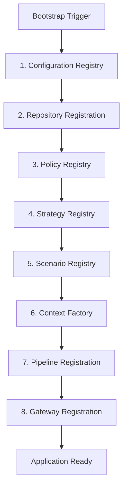

### Composition Root Registrations

#### [1] Configuration Registry
* **Purpose:** Single source of environment, global defaults, and dynamic properties.
* **Dependencies:** None.
* **Lifetime:** Singleton.
* **Initialization Order:** 1st.
* **Failure Behaviour:** Blocks application startup immediately; exits with status code `10`.

#### [2] Repository Registration
* **Purpose:** Instantiates and binds database abstractions (`profile`, `preference`, `observation`, `audit`, etc.) to their adapters.
* **Dependencies:** `ConfigurationRegistry`.
* **Lifetime:** Singleton.
* **Initialization Order:** 2nd.
* **Failure Behaviour:** Startup crash; logs `PERS-011` (ConfigurationError) to stderr.

#### [3] Policy Registry
* **Purpose:** Loads and parses the YAML policy matrices and exposes validating interfaces.
* **Dependencies:** `ConfigurationRegistry`, `PolicyRepository`.
* **Lifetime:** Singleton.
* **Initialization Order:** 3rd.
* **Failure Behaviour:** Startup failure; logs validation trace errors and aborts.

#### [4] Strategy Registry
* **Purpose:** Resolves and holds operational personalization strategies (e.g. AccessibilityStrategy).
* **Dependencies:** `PolicyResolver`.
* **Lifetime:** Singleton.
* **Initialization Order:** 4th.
* **Failure Behaviour:** Graceful initialization failure fallback to `ComfortFirstStrategy`.

#### [5] Scenario Registry
* **Purpose:** Holds and indexes traveler context scenarios mapping triggers to overrides.
* **Dependencies:** `PolicyResolver`, `StrategyRegistry`.
* **Lifetime:** Singleton.
* **Initialization Order:** 5th.
* **Failure Behaviour:** System alerts raised; logs scenario loading warning, defaults to no scenario mapping.

#### [6] Context Factory
* **Purpose:** Builds the mutable context representation from database aggregates.
* **Dependencies:** `TravelerProfileRepository`, `PreferenceRepository`, `BehaviorRepository`, `Validators`.
* **Lifetime:** Transient (created per incoming request/event).
* **Initialization Order:** 6th.
* **Failure Behaviour:** Instantiates default unpersonalized context; logs warning.

#### [7] Pipeline Registration
* **Purpose:** Connects all 15 stages of the pipeline in order under the `PipelineOrchestrator`.
* **Dependencies:** All core engines, `PolicyResolver`, `AuditEngine`, `MetricsEngine`.
* **Lifetime:** Singleton.
* **Initialization Order:** 7th.
* **Failure Behaviour:** Blocks application startup if any engine dependency is missing.

#### [8] Gateway Registration
* **Purpose:** Instantiates public facing boundary wrapper routing calls to the internal coordinator.
* **Dependencies:** `PersonalizationCoordinator`, `Validators`.
* **Lifetime:** Singleton.
* **Initialization Order:** 8th.
* **Failure Behaviour:** Blocks bootstrap phase; terminates listener interfaces.

---

## 28. Application Startup Sequence

To ensure system reliability, the application bootstrapper runs sequential checks at startup. If a check fails, the bootstrap sequence halts immediately to prevent partial execution states.

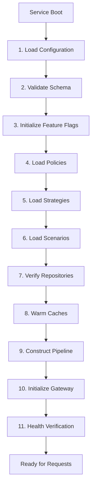

### Startup Validation Steps

1. **Configuration Load:** Ingests local files and system environment variables. Validation: Ensure no missing keys for critical runtime paths.
2. **Schema Validation:** Verifies JSON/YAML policy layouts. Validation: Schema syntax matching via JSON Schema validators.
3. **Feature Flag Initialization:** Establishes feature switches state. Validation: Confirms local flags don't conflict with tenant properties.
4. **Policy Registry Load:** Loads default and overrides YAML configurations. Validation: Enforces that `min_confidence_to_apply` lies within `[0.00, 1.00]`.
5. **Strategy Registry Load:** Maps all strategy routes. Validation: Verifies priority and fallback assignments.
6. **Scenario Registry Load:** Registers user contexts. Validation: Checks trigger schema constraints.
7. **Repositories Verification:** Tests repository connection pools. Validation: Executes simple `ping` queries against target engines.
8. **Cache Initialization:** Warms startup caches. Validation: Ensures Redis or in-memory tables are responsive.
9. **Pipeline Construction:** Verifies engine injection. Validation: Unit tests dependency registration lists.
10. **Gateway Initialization:** Starts network adapters. Validation: Port availability checks.
11. **Health Verification:** Executes end-to-end self-test. Validation: Ensures health engine reports `OK` status before binding interface ports.

---

## 29. Application Shutdown Sequence

When the service receives a termination signal (`SIGTERM` or `SIGINT`), it triggers a graceful shutdown sequence to ensure that all active requests are finished, queues are flushed, and resources are closed cleanly.

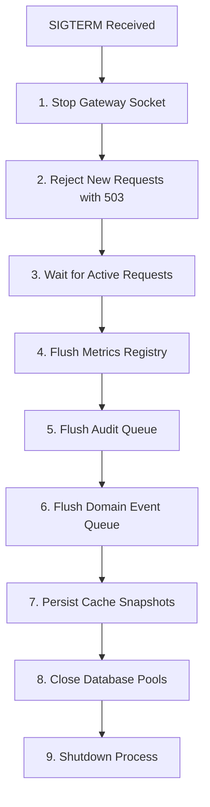

### Shutdown Policies
* **Graceful Window Timeout:** Default graceful shutdown timeout is `15 seconds`.
* **New Request Rejection:** The Gateway rejects incoming queries instantly by responding with a `503 Service Unavailable` status and the header `Retry-After: 30`.
* **Active Requests Completion:** Active request processing is given up to `10 seconds` of the Graceful Window to resolve.
* **Audit and Event Flush:** Queued transaction logs are written directly to disk via block buffer write routines to prevent data loss.
* **Forced Shutdown Behaviour:** If active items remain after the `15-second` timer expires, the process dumps thread allocations to diagnostic logs and exits immediately using status code `130`.

---

## 30. Central Retry Policy Matrix

All cross-system calls and database transactions conform to the centralized retry policy matrix to handle transient errors without dropping transactions.

| Subsystem / Interface | Retry Count | Backoff Strategy | Base Backoff (ms) | Max Backoff (ms) | Target Timeout (ms) | Recoverability / Fallback Action | Escalation Trigger |
|---|---|---|---|---|---|---|---|
| **Repositories** | 3 | Exponential | 50 ms | 1000 ms | 200 ms | Cache-only read lookup / default profile | Raise system warning alert |
| **Cache Manager** | 1 | Linear | 10 ms | 50 ms | 20 ms | Bypass cache, read repository directly | Log cache warning metric |
| **Audit Engine** | 5 | Exponential | 100 ms | 5000 ms | 500 ms | Flush to local secure disk buffer | Critical alert immediate |
| **Metrics Engine** | 1 | None | — | — | 10 ms | Drop metric update silently | Count fail metrics counter |
| **Configuration** | 3 | Exponential | 200 ms | 2000 ms | 5000 ms | Fallback to compiled defaults | Abort process start |
| **Policy Resolver** | 2 | Linear | 20 ms | 100 ms | 150 ms | Return hardcoded defaults | Raise configuration warning |
| **Adapters (5.2-5.5)**| 2 | Linear | 50 ms | 200 ms | 300 ms | Return unmodified raw intelligence DTO | Use default unpersonalized route |
| **Gateway Socket** | 3 | Linear | 100 ms | 500 ms | 1000 ms | Reject request with `503` | Raise network infrastructure alert |
| **Pipeline** | 0 (No Retry)| None | — | — | 25 ms | Fallback stage results, proceed | Log stage-level execution error |
| **Context Factory** | 2 | Linear | 20 ms | 100 ms | 150 ms | Instantiate context with system defaults | Raise profile warning metric |

---

## 31. Circuit Breaker Strategy

To prevent cascading failures across services, the system wraps all network, cache, and database integrations in circuit breakers.

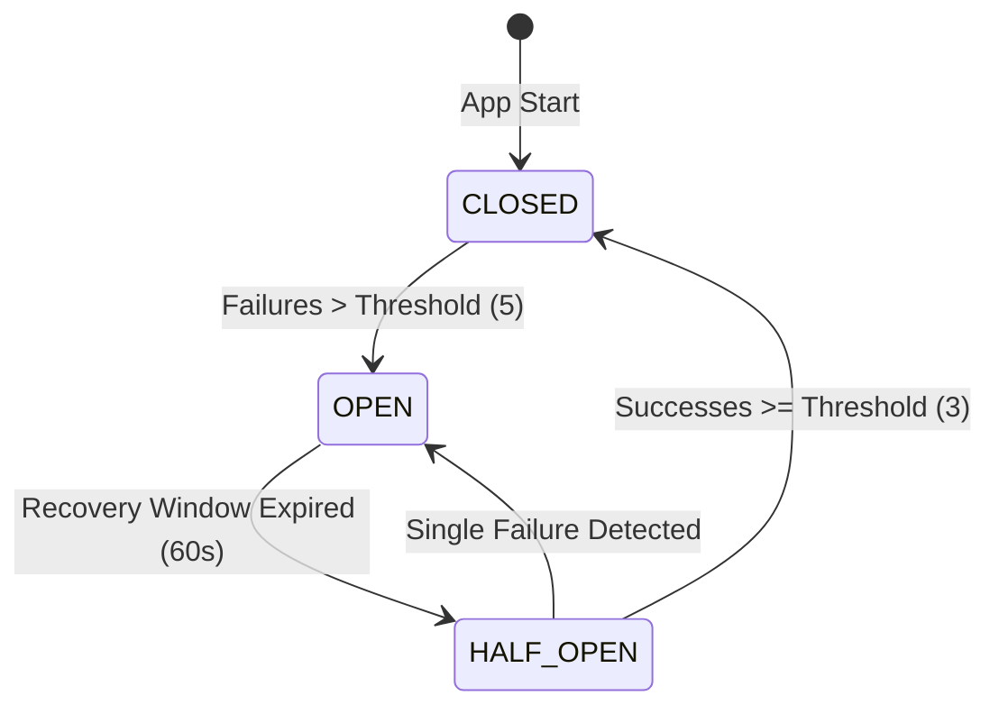

### Circuit Breaker States
1. **CLOSED:** Requests pass through. Metrics monitor error counts. Transition to `OPEN` triggers if error count exceeds `5` consecutive failures or error rate is $> 50\%$ over a 10-second sliding window.
2. **OPEN:** Short-circuit execution. All calls fail fast and trigger their respective fallback logic without hitting the underlying resource. The engine remains `OPEN` for a **Recovery Window of 60 seconds**.
3. **HALF_OPEN:** Probe request processing. The circuit breaker allows up to `3` check queries to bypass the block. If all `3` succeed, the circuit resets to `CLOSED`. Any failure instantly returns the circuit to `OPEN` for another 60-second window.

### Subsystem Application

* **Repositories:** CLOSED state tracks connection timeouts. If OPEN, profiles default to cached snapshots or system defaults.
* **Cache Manager:** Monitors Redis network failures. If OPEN, cache queries are bypassed, routing directly to database connection pools.
* **Audit Engine:** Monitors audit persistence errors. If OPEN, audit records are written to local disk partition buffers.
* **Metrics Engine:** Monitors metric socket writes. If OPEN, metrics increments drop silently to protect system memory.
* **Adapters (5.2-5.5):** Monitors integration service endpoints. If OPEN, adapter transforms are disabled, returning unmodified raw intelligence DTOs.
* **Policy Resolver:** Monitors external policy store updates. If OPEN, properties freeze at their last cached configuration.
* **Configuration Registry:** Monitors configuration service pulls. If OPEN, the registry freezes settings at startup values.

---

## 32. State Transition Diagrams

### [1] Preference State Machine
* **Initial State:** `DRAFT`
* **Terminal States:** `EXPIRED`, `PURGED`
* **Valid Transitions:**
  * `DRAFT` $\rightarrow$ `CANDIDATE` (evidential match recorded)
  * `DRAFT` $\rightarrow$ `ACTIVE` (explicit user setting input)
  * `CANDIDATE` $\rightarrow$ `ACTIVE` (confidence score $\ge 0.70$)
  * `CANDIDATE` $\rightarrow$ `EXPIRED` (confidence score falls below $0.20$)
  * `ACTIVE` $\rightarrow$ `DECAYED` (daily decay applied, confidence $< 0.70$)
  * `DECAYED` $\rightarrow$ `ACTIVE` (new observation recorded, confidence $\ge 0.70$)
  * `DECAYED` $\rightarrow$ `EXPIRED` (confidence score falls below $0.20$)
  * `ACTIVE` $\rightarrow$ `PURGED` (user explicitly clears preference)
  * `DECAYED` $\rightarrow$ `PURGED` (user explicitly clears preference)
* **Invalid Transitions:**
  * `CANDIDATE` $\rightarrow$ `DECAYED` (must be promoted to `ACTIVE` first)
  * `EXPIRED` $\rightarrow$ `ACTIVE` (must restart lifecycle from `DRAFT`)
* **Recovery Behaviour:** If database synchronization fails, recovery rolls back the status property to the last verified checkpoint state.

### [2] Learning Session State Machine
* **Initial State:** `OPEN`
* **Terminal States:** `CONSOLIDATED`, `ABORTED`
* **Valid Transitions:**
  * `OPEN` $\rightarrow$ `ACTIVE` (observations appended)
  * `OPEN` $\rightarrow$ `ABORTED` (invalid event schema or security error)
  * `ACTIVE` $\rightarrow$ `CLOSED` (inactivity timeout limit of 2 hours reached)
  * `ACTIVE` $\rightarrow$ `CONSOLIDATED` (session commits changes to profile)
  * `CLOSED` $\rightarrow$ `CONSOLIDATED` (processing sweeps complete)
  * `CLOSED` $\rightarrow$ `ABORTED` (corrupt event payloads detected during processing)
* **Invalid Transitions:**
  * `CONSOLIDATED` $\rightarrow$ `ACTIVE` (closed sessions cannot be modified)
* **Recovery Behaviour:** Unfinished or interrupted sessions are automatically closed and processed via fallback cron schedules.

### [3] Observation State Machine
* **Initial State:** `LOGGED`
* **Terminal States:** `EXPIRED`
* **Valid Transitions:**
  * `LOGGED` $\rightarrow$ `PROCESSED` (evaluated by learning engine rules)
  * `PROCESSED` $\rightarrow$ `AGGREGATED` (behavior patterns updated)
  * `AGGREGATED` $\rightarrow$ `EXPIRED` (30-day TTL reached, record deleted)
* **Invalid Transitions:**
  * `LOGGED` $\rightarrow$ `EXPIRED` (must be processed and aggregate-swept before deletion)
* **Recovery Behaviour:** Damaged observation files trigger automated rollback to last hour's partition.

### [4] Personalization Request State Machine
* **Initial State:** `RECEIVED`
* **Terminal States:** `COMPLETED`, `FAILED`
* **Valid Transitions:**
  * `RECEIVED` $\rightarrow$ `VALIDATED` (schema and consent checks pass)
  * `RECEIVED` $\rightarrow$ `FAILED` (validation fail or missing consent)
  * `VALIDATED` $\rightarrow$ `ADAPTED` (pipeline completes adaptation stages)
  * `VALIDATED` $\rightarrow$ `FAILED` (pipeline timeout or critical engine error)
  * `ADAPTED` $\rightarrow$ `COMPLETED` (explanation attached, audit log signed)
* **Invalid Transitions:**
  * `ADAPTED` $\rightarrow$ `VALIDATED` (no pipeline backtracking allowed)
* **Recovery Behaviour:** Pipeline timeout triggers fallback adaptation using unmodified inputs.

### [5] Audit Entry State Machine
* **Initial State:** `DRAFT`
* **Terminal States:** `COMMITTED`
* **Valid Transitions:**
  * `DRAFT` $\rightarrow$ `SIGNED` (payload SHA-256 generated)
  * `SIGNED` $\rightarrow$ `COMMITTED` (ledger write confirmed)
  * `SIGNED` $\rightarrow$ `DRAFT` (ledger write failure, queue for retry)
* **Invalid Transitions:**
  * `COMMITTED` $\rightarrow$ `DRAFT` (immutable ledger cannot be altered)
* **Recovery Behaviour:** Failed writes retried via secure memory buffer queue.

### [6] Health Status State Machine
* **Initial State:** `OK`
* **Terminal States:** None
* **Valid Transitions:**
  * `OK` $\rightarrow$ `DEGRADED` (latency budget exceeded or fallback trigger active)
  * `DEGRADED` $\rightarrow$ `CRITICAL` (critical dependency down or error rate $> 10\%$)
  * `DEGRADED` $\rightarrow$ `OK` (diagnostics pass)
  * `CRITICAL` $\rightarrow$ `DEGRADED` (core services recover)
  * `CRITICAL` $\rightarrow$ `OK` (all systems clear)
* **Invalid Transitions:** None (any health state transition is valid depending on real-time diagnostics).
* **Recovery Behaviour:** CRITICAL health state automatically switches Gateway routing to bypass mode.

---

## 33. Sequence Diagrams

### [1] Personalization Request Sequence
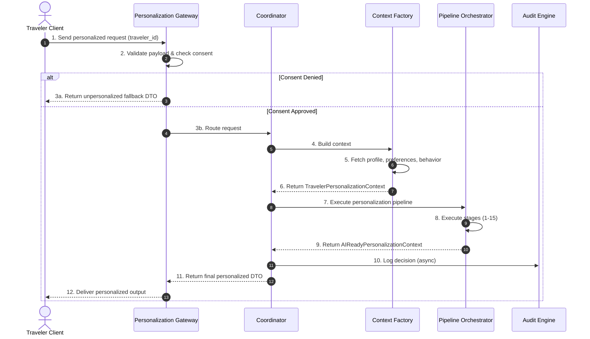

### [2] Learning Pipeline Sequence
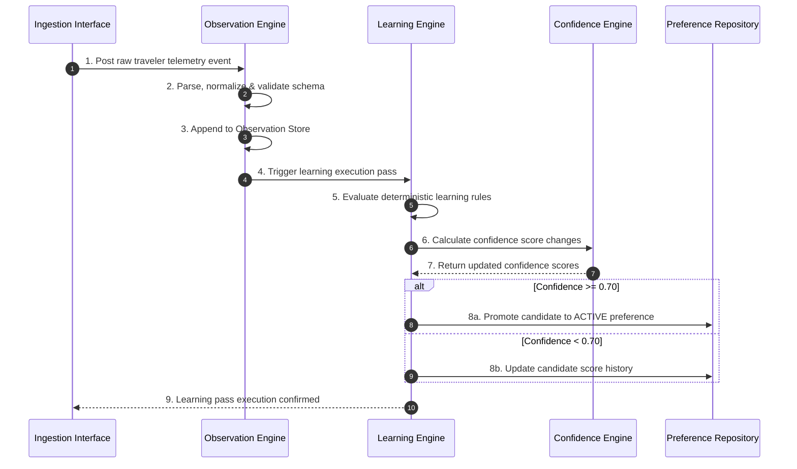

### [3] Recommendation Adaptation Sequence
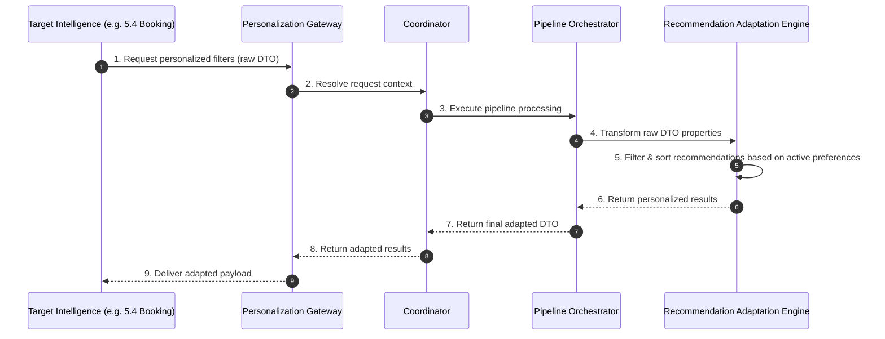

### [4] Failure Recovery Sequence
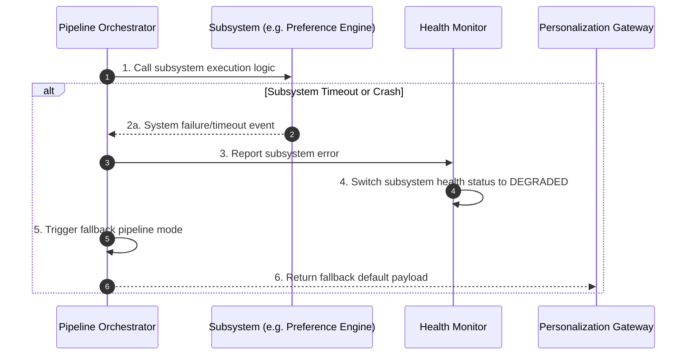

### [5] Application Startup Sequence
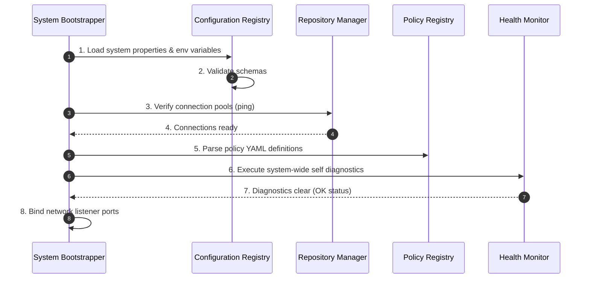

### [6] Application Shutdown Sequence
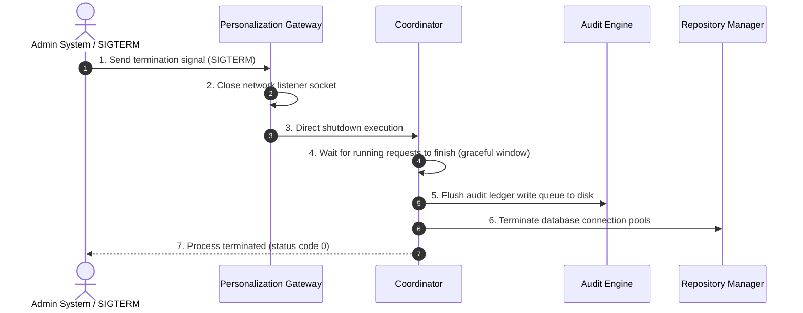

### [7] Audit Pipeline Sequence
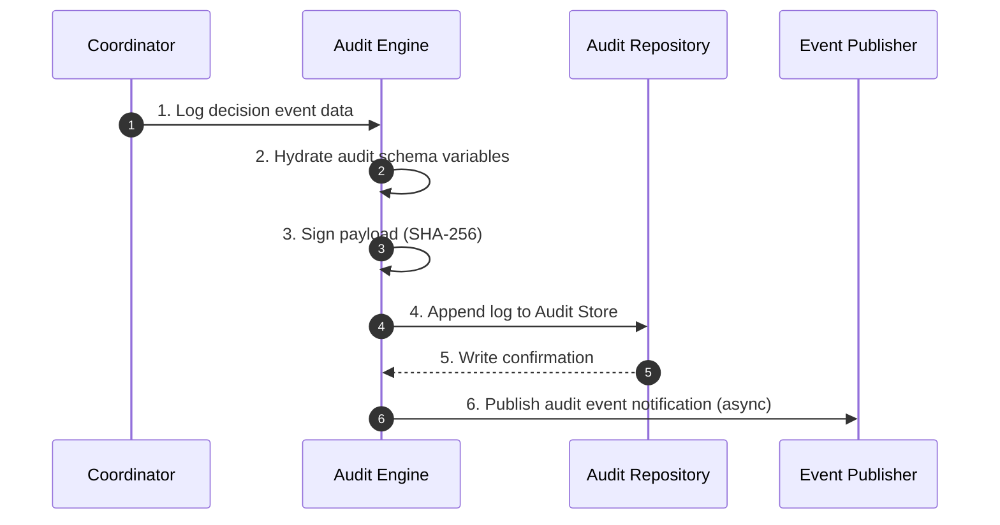

---

## 34. Repository Transaction Governance

To preserve data integrity and prevent concurrency anomalies (dirty reads, non-repeatable reads), all database actions conform to strict repository transaction policies.

| Repository | Atomic Operations | Eventually Consistent Operations | Append-Only Operations | Read-Only Operations | Isolation Level | Concurrency Management | Rollback Behaviour |
|---|---|---|---|---|---|---|---|
| **TravelerProfile** | Create profile, update version, delete profile | Clean up metadata flags | None | Profile lookup, validation check | `SERIALIZABLE` | Optimistic locking on profile version | Full atomic transaction abort; release lock |
| **Preference** | Insert preference, update value + version | Archive old superseded records | None | Read active preferences, category query | `REPEATABLE READ` | Optimistic locking on preference version | Restore target preference record to last version |
| **Behavior** | Create pattern, update streak count | Batch behavior aggregations | None | Read patterns, read habits | `READ COMMITTED` | Row-level locking on update | Retain prior metrics values; log rollback |
| **Observation** | None (No updates allowed) | TTL retention deletion | Insert new observation records | Fetch traveler observations | `READ COMMITTED` | None (insert only) | Abort insert; log warning |
| **Learning** | Close learning session, commit session decisions | Session timeouts | None | Fetch active sessions, read rules | `READ COMMITTED` | Optimistic locking | Full session rollback; session status to `ABORTED` |
| **Confidence** | Write confidence score | Decay sweeps | None | Read confidence, check level | `READ COMMITTED` | None (write-heavy override) | Revert update; keep prior confidence value |
| **ReasonCode** | None (Read-only runtime) | None | None | Fetch code definitions | `READ COMMITTED` | None | None |
| **Policy** | None (Read-only runtime) | None | None | Fetch active policies | `READ COMMITTED` | None | None |
| **Configuration** | Update config variable | None | None | Fetch configuration parameters | `REPEATABLE READ` | Optimistic locking | Restore prior configuration settings state |
| **Audit** | None (Insert only) | None | Write audit record | Fetch audit trail, verify signatures | `SERIALIZABLE` | None (insert only) | Revert write; write to local retry queue |
| **Metrics** | None | Increment counter, record histogram | None | Fetch metric counts | `READ COMMITTED` | None | Drop update silently |
| **Cache** | Put key-value, delete key | None | None | Get key value | `READ COMMITTED` | None | Bypass cache, route request to DB |

---

## 35. Implementation Rollback Plan

### Batch 1 Rollback Plan (DTOs, Interfaces, Config, Context Factory)
* **Rollback Trigger:** Build failure in integration tests or compilation check errors.
* **Rollback Steps:**
  1. Revert Git commits matching Batch 1 scope.
  2. Restore configuration schema definition to the base blueprint state.
  3. Revert `apps/ai-service/app/personalization/` packages to their initial empty structure.
* **Verification:** Run `pytest apps/ai-service/app/personalization/tests/contract/` to confirm all validation errors are resolved.
* **Recovery Validation:** Re-run configuration loader validations.
* **Expected Downtime:** Zero (pre-release dev branch).
* **Success Criteria:** Zero DTO parsing or interface implementation compiler errors.

### Batch 2 Rollback Plan (Core Engines & Repositories)
* **Rollback Trigger:** Database connection pooling issues or transaction locks in staging.
* **Rollback Steps:**
  1. Abort any active database migration scripts.
  2. Revert repository adapter code changes in Git.
  3. Flush caching layers.
* **Verification:** Run database ping routines to verify connection stability.
* **Recovery Validation:** Verify profile and preference repositories resolve queries without locking.
* **Expected Downtime:** Zero.
* **Success Criteria:** Database writes execute without lock escalation anomalies.

### Batch 3 Rollback Plan (Intelligence Engines)
* **Rollback Trigger:** Pipeline test failures, non-deterministic outputs, or decay calculations drift.
* **Rollback Steps:**
  1. Rollback rule parser configurations in `policies/definitions/`.
  2. Restore baseline confidence parameters.
  3. Revert learning engine evaluation updates in Git.
* **Verification:** Execute unit tests using inputs from the deterministic test cases catalog.
* **Recovery Validation:** Verify that identical pipeline inputs yield identical recommendation adjustments.
* **Expected Downtime:** Zero.
* **Success Criteria:** Confidence calculation drift evaluates within $+0.00$ tolerance.

### Batch 4 Rollback Plan (Adaptation, Strategies, Explanations)
* **Rollback Trigger:** Latency budget violations ($> 25\text{ ms}$ cumulative) or localization errors.
* **Rollback Steps:**
  1. Disable strategies registration entries in configuration.
  2. Revert adapters changes to raw intelligence boundaries.
  3. Clear templates cache.
* **Verification:** Measure adapter processing durations during test runs.
* **Recovery Validation:** Confirm that the system drops back to unpersonalized fallback DTOs if the processing budget is exceeded.
* **Expected Downtime:** Zero.
* **Success Criteria:** Cumulative pipeline processing latency checks evaluate $\le 25\text{ ms}$.

### Batch 5 Rollback Plan (Pipeline, Audit, Metrics, Health)
* **Rollback Trigger:** Critical failure in final end-to-end integration tests.
* **Rollback Steps:**
  1. Disable Gateway socket connections.
  2. Rollback the composition root updates to the prior batch version.
  3. Flush the audit writing queue.
* **Verification:** Validate clean project compilation state in CI/CD pipeline.
* **Recovery Validation:** Verify that the system executes standard health heartbeats and self-test runs cleanly.
* **Expected Downtime:** Zero.
* **Success Criteria:** Health checks report `OK` status with zero runtime compilation warnings.

---

## 36. Release Readiness Checklist

This checklist must be fully verified and signed off before deploying Milestone 5.6 to production:

- [ ] **Architecture:** All 27 subsystems successfully resolved in Composition Root. No modifications made to prior milestones.
- [ ] **Interfaces:** All 22 interfaces implemented and verified using contract test suites.
- [ ] **DTOs:** All 16 DTO structures validate schemas correctly with zero serialization warnings.
- [ ] **Repositories:** Connection pool sizes, transactional rollbacks, and optimistic locking logic verified under load.
- [ ] **Policies:** Policy registry parses YAML definitions correctly. Schema assertions pass.
- [ ] **Strategies:** Fallback execution verified for all 10 strategies under simulated adapter failures.
- [ ] **Scenarios:** Trigger matching and execution verified for all 10 deterministic test cases.
- [ ] **Caching:** Cache TTL settings, write-through strategies, and cache-breaker fallbacks verified.
- [ ] **Configuration:** Environment override patterns tested. Dynamic reload behavior validated.
- [ ] **Testing:** Unit, integration, contract, scenario, pipeline, boundary, and performance tests pass.
- [ ] **Coverage:** Unit test coverage matches or exceeds target of $90\%$ per engine module.
- [ ] **Performance:** Cumulative sync pipeline execution latency verified $\le 25\text{ ms}$ under 5,000 QPS load.
- [ ] **Security:** Zero unencrypted PII values stored in databases or logs. AES-256-GCM configurations verified.
- [ ] **Privacy:** User opt-in checks and "Forget Me" purge logic (hard delete execution $\le 2\text{ s}$) verified.
- [ ] **Observability:** Prometheus endpoints scrape metrics correctly. OpenTelemetry spans map pipeline stages.
- [ ] **Documentation:** Runbook instructions, error catalogs, and package ownership matrices verified.
- [ ] **CI/CD:** Ruff, MyPy, and PyTest execution steps pass cleanly on CI/CD pipelines.
- [ ] **Deployment:** Staging environment deployments validated. Database migrations run cleanly.
- [ ] **Monitoring:** Alerts configured for latency threshold warnings and audit buffer saturation.
- [ ] **Sign-off:** Architectural audit verified. Ready for deployment.

---

## 37. Implementation Governance

To ensure the technical quality of the platform, the implementation team must adhere strictly to these rules:

1. **Batch-by-Batch Implementation:** Batches must be implemented sequentially from Batch 1 through Batch 5. Parallel development of architectural layers is forbidden.
2. **No Parallel Architectural Changes:** Refactoring the core architecture during batch implementation is prohibited.
3. **Every Batch Must Compile:** The codebase must remain in a compilable state at the end of every change block.
4. **Every Batch Must Pass Quality Checks:** Code must pass Ruff linting, MyPy type checks, PyTest execution, and Architecture dependency tests before proceeding to the next batch.
5. **No TODO Placeholders:** Implementing placeholder comments or stub code is prohibited.
6. **No Dead Code:** Unused files, dead branches, and orphaned functions must be removed immediately.
7. **No Duplicate Logic:** Core algorithms must remain centralized. No duplicating logic across adapters.
8. **No Temporary Implementations:** Quick-fix code bypasses are prohibited.
9. **No Mocked Production Code:** Mocks are permitted only within test files. Production logic must execute real workflows.
10. **No Architecture Shortcuts:** The priority hierarchy, transaction boundaries, and caching rules must be enforced as defined.

---

## 38. Git Governance

Every completed implementation batch must follow this deployment workflow:

1. **Run Quality Checkers:** Execute Ruff, MyPy, PyTest, and Architecture validation checks locally.
2. **Verify Coverage:** Confirm that unit test coverage targets are met ($90\%$ per module).
3. **Verify Git Status:** Run `git status` to ensure all untracked files are accounted for. No dirty working tree configurations are permitted before moving forward.
4. **Commit Changes:** Create a descriptive commit message detail specifying the completed batch features.
5. **Push to Remote:** Push branch modifications to the central repository.
6. **Record Commit SHA:** Save the commit SHA index into the walkthrough documentation.

---

## 39. Walkthrough Standard

Every completed batch must generate an update to the walkthrough artifact (`walkthrough.md`) structured as follows:

```markdown
# Milestone 5.6 Walkthrough: Batch [X] Complete

## Executive Summary
Brief summary of the target objectives achieved in this batch.

## Architecture Verification
Confirm Architecture Freeze v1.0 compliance. Confirm no changes outside apps/ai-service/app/personalization/.

## Files Created / Modified
* [NEW] [file name](file:///path/to/file)
* [MODIFY] [file name](file:///path/to/file)

## Subsystems Completed
Detail completed subsystems.

## Interfaces & DTOs Implemented
Verify implemented interfaces and serialization structures.

## Repositories Implemented
Verify data store adapters.

## Pipeline & Engine Progress
Verify calculations correctness.

## Testing & Quality Summary
* Ruff Check: [PASSED/FAILED]
* MyPy Check: [PASSED/FAILED]
* PyTest Check: [PASSED/FAILED]
* Architecture Check: [PASSED/FAILED]
* Unit Test Coverage: [X]%

## Git Metadata
* Commit SHA: `[SHA-1]`
* Working Tree: Clean

## Known Limitations & Future Work
Any temporary limitations or features scheduled for future batches.
```

---

## 40. Implementation Quality Gates

Before starting the next batch, ALL quality gates must report GREEN.

```
✓ Ruff check passes with zero warnings
✓ MyPy strict type checks pass cleanly
✓ PyTest runs pass 100% of tests
✓ Architecture boundary checks confirm zero import violations
✓ Dependency checks confirm zero circular imports
✓ Unit test coverage targets are met (90% per module)
✓ GitHub Actions CI status reports SUCCESS
✓ Git working tree reports CLEAN (no uncommitted edits)
```

If any check fails, implementation must halt immediately until the issue is resolved.

---

## 41. Final Planning Validation

The architectural planning refinement audit has verified:

* **✓ Discovery completely represented:** Mapped all 48 domain entities, state machines, and policies.
* **✓ Planning complete:** 27 subsystems, 22 interfaces, 16 DTOs, and 12 repositories specified.
* **✓ Every subsystem defined:** Purpose, inputs, outputs, and failure behaviors mapped.
* **✓ Every interface defined:** Protocol class specifications established.
* **✓ Every DTO defined:** Validation, serialization, and lifecycle mappings complete.
* **✓ Every repository defined:** Isolation levels and transaction rules established.
* **✓ Every strategy defined:** 10 strategies mapped with fallback logic.
* **✓ Every scenario defined:** 10 user scenarios mapped with explanations.
* **✓ Every policy defined:** Central registry configurations complete.
* **✓ Every cache defined:** Cache invalidation policies defined.
* **✓ Every feature flag defined:** Rollback paths and owners mapped.
* **✓ Every implementation batch defined:** 5 sequential batches mapped.
* **✓ Every rollback plan defined:** Rollback steps mapped for all batches.
* **✓ Every quality gate defined:** CI/CD checker gates established.
* **✓ Architecture Freeze preserved:** Isolation boundaries enforced.

***

## PLANNING FREEZE APPROVED

Architecture Freeze v1.0 PRESERVED

Milestone 5.6 Implementation AUTHORIZED

Proceed with Batch 1 Implementation immediately.

