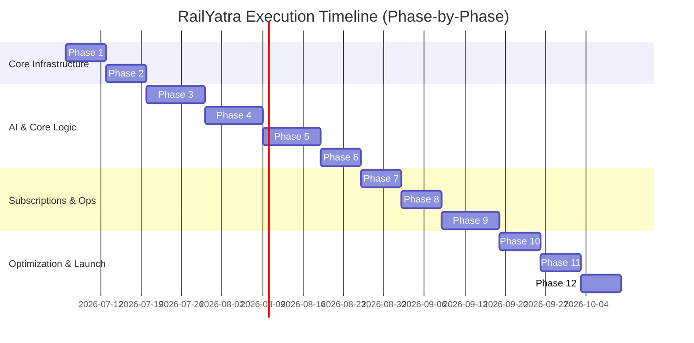

# RailYatra Implementation Roadmap

This document outlines the detailed execution roadmap for building **RailYatra (RailGPT AI)**. The roadmap is divided into 12 distinct phases. Each phase represents a production-ready milestone that must satisfy strict gates before merging to the `develop` and `main` branches.

---

## Roadmap Phases Overview

---

## Production Quality Gates (At the end of every phase)

No branch merges or transitions are allowed without checking and publishing the following reports:
1. **Architecture Review**: Checked against Clean Architecture, SOLID principles, and loose-coupling abstractions.
2. **Test Report**: Unit, integration, and E2E checks with code coverage statistics.
3. **Performance Report**: Lighthouse audit metrics (Core Web Vitals) and HTTP request latency summaries.
4. **Security Review**: JWT parsing security checks, rate limits verification, and credential checks.
5. **Git Summary**: Detail branch names, commits, push validations, and file differentials.

---

## Detailed Phase Breakdown

### Phase 1: Foundation & Design System (Active)
- Scaffold NestJS, Next.js, and FastAPI services in a monorepo.
- Initialize PostgreSQL schema, Prisma client, Redis configuration, and Qdrant container nodes.
- Setup global theme variables (Royal Blue, Indigo, Emerald) and base layout.

### Phase 2: Authentication & User Platform
- Add token authentication (JWT, HttpOnly cookies) and User profile management.
- Design landing, authentication, and user setting interfaces.

### Phase 3: AI Core Platform
- Setup multi-agent graph pipelines (`LangGraph`).
- Implement short-term conversational session memory in Redis.

### Phase 4: Journey Intelligence Engine
- Develop waitlist and delay prediction APIs.
- Build PNR status panels and Recharts analytics.

### Phase 5: Search & Planning
- Autocomplete APIs for station indexing.
- Build the main dashboard featuring upcoming trips and interactive timelines.

### Phase 6: Recommendation Engine
- Create scoring logic (Duration, Cost, Reliability, and Preference weights).
- Construct explainability cards highlighting recommendation confidence reasons.

### Phase 7: Premium Platform & Feature Gating
- Subscription middleware integration.
- Feature Flag framework implementation for gradual rollouts.

### Phase 8: Notifications & Real-Time
- WebSocket engine for live train push notifications.
- Dispatchers for email/SMS.

### Phase 9: Admin Panel & Analytics
- Multi-dashboard interfaces for monitoring performance telemetry and managing billing.

### Phase 10: AI Optimization & RAG
- Connect vector databases to enhance context answers.
- Add safety checks to filter out injection attempts.

### Phase 11: Production Hardening & Testing
- Reach target unit, integration, and E2E test coverages.
- Perform load-testing simulations.

### Phase 12: Deployment & Launch
- Deploy final multi-stage staging containers.
- Establish health checks, liveness/readiness probes, and monitoring alarms.
